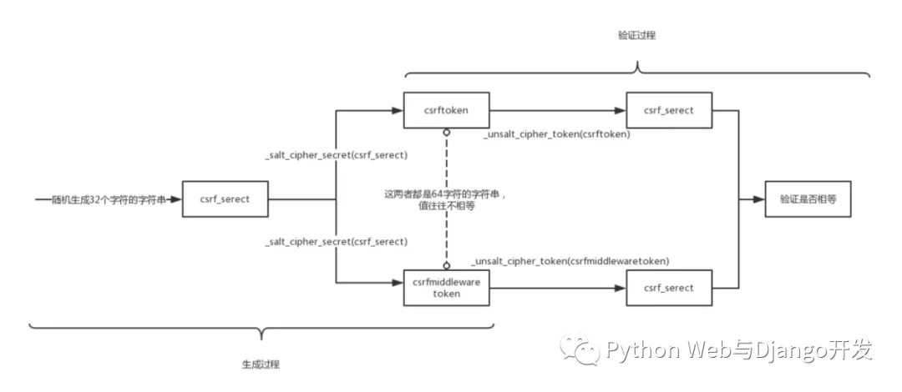

## 简单说说看 Django的CSRF防御机制

Django的CSRF保护主要是通过`django.middleware.csrf.CsrfViewMiddleware`中间件来实现的。主要流程如下:

- Django 第一次响应来自某个客户端的get请求时，会在服务器端随机生成一个 csrftoken(一串64位的随机字符串)，把这个 token 放请求头的 cookie 里返回给用户。
- 所有通过POST方式提交的表单在渲染时中必须包含一个 csrfmiddlewaretoken 隐藏字段 （在模板中通过标签生成)。
- 当用户通过POST提交表单时，Django会从请求头cookie取`csrftoken`这一项的值，再从POST表单里取`csrfmiddlewaretoken`交由中间件进行校验两者是否一致。如果一致表明这是一个合法请求，否则返回403 Forbidden.


注意`csrftoken`和`csrfmiddlewaretoken`并不是简单相等的两个字符串，而是通过算法判断是否一致相等的，如下图所示。



## Django中使用AJAX发送POST请求时如何通过CSRF认证？

\1. 第一种方式直接在发送数据中加入csrfmiddlewaretoken

```
<script>
  $("#btn").on("click",function () {
        $.ajax({
            url:"/some_url/",
            type:"POST",
            data:{
                csrfmiddlewaretoken:{{ csrf_token }}, //写在模板中，才会被渲染
            },
            success:function (data) {
            }
        })
    })
</script>
```

2.通过jquery选择器获取csrfmiddlewaretoken

```
<script>
  $("#btn").on("click",function () {
        $.ajax({
            url:"/some_url/",
            type:"POST",
            data:{
                csrfmiddlewaretoken:$('[name="csrfmiddlewaretoken"]').val(),
            },
            success:function (data) {
            }
        })
    })
</script>
```


\3. 使用jquery.cookie.js调用请求头cookie中的csrftoken

```
<script src="/static/jquery.cookie.js"></script> //必须先引入它
<script>
    $("#btn").on("click",function () {
     $.ajax({
        url:"/some_url/",
        type:"POST",
        headers:{"X-CSRFToken":$.cookie('csrftoken')},
        data:$("#f1").serialize()
    }
    )
   })
</script>
```


**更多阅读**

[Django基础(17): 如何上传处理文件及Ajax文件上传示范(附GitHub源码)](http://mp.weixin.qq.com/s?__biz=MjM5OTMyODA4Nw==&mid=2247484102&idx=1&sn=7bd1df46dee7ba89c2c13716449a6221&chksm=a73c62fe904bebe8ae74ac967cb1f9d039abd9eba3b95ccdf2585de4ee5ad3134a30e6ed429f&scene=21#wechat_redirect)

[Django实战: 利用AJAX技术实现博文实时搜索](http://mp.weixin.qq.com/s?__biz=MjM5OTMyODA4Nw==&mid=2247483810&idx=1&sn=d554570c8bd12560ec669aa67c0ee21a&chksm=a73c619a904be88c197d6eac09466bc7ab214a57e26b11bb09da9a33fa1cef349277448c8325&scene=21#wechat_redirect)


**13. 什么情况下需要使用select_related和prefetch_related方法以及两者的区别**

当你查询单个主对象或主对象列表并需要在模板或其它地方中使用到每个对象的关联对象信息

时，请一定记住使用select_related和prefetch_related一次性获取所有对象信息，从而提升


数据库查询效率，避免重复查询。两个方法都是Django ORM优化数据查询必须要熟练掌握

的方法。


两者的区别是：

- 对单对单(OneToOne)或单对多外键(ForeignKey)字段，使用select_related方法
- 对于多对多字段(ManyToMany)和反向外键关系，使用prefetch_related方法
- select_related方法执行一次数据库查询，prefetch_related方法执行两次数据库查询
- 使用Prefetch方法可以给prefetch_related方法额外添加额外条件和属性。


更多阅读

[Django基础(29):select_related和prefetch_related的用法与区别](http://mp.weixin.qq.com/s?__biz=MjM5OTMyODA4Nw==&mid=2247484306&idx=1&sn=48a89cdf74edff43d727c61ac14b480a&chksm=a73c63aa904beabc1975f9e38bafb36ac9fff041b0a468fa66c82279b03c1fdbf9364731e0c6&scene=21#wechat_redirect)

```
14. 如何从数据表中获取一个随机对象？
```

**可以使用order_by('?').first()随机获取一个对象**

```
def get_random_object():
    return MyModel.objects.order_by("?").first()
```

更多阅读

[Django ORM Cookbook精选摘录(上)](http://mp.weixin.qq.com/s?__biz=MjM5OTMyODA4Nw==&mid=2247484366&idx=1&sn=fda7882ce5e378325a5d9137d303e98d&chksm=a73c63f6904beae01ad9048eb74ff5e616bd271eff3640fdb3b12f5486b72f70a85a121f7ec3&scene=21#wechat_redirect)


**15. 说说看aggregate和annotate方法的作用并举几个例子**

aggregate的中文意思是聚合, 源于SQL的聚合函数。Django的aggregate()方法作用是对一组值

(比如queryset的某个字段)进行统计计算，并以字典(Dict)格式返回统计计算结果。

django的aggregate方法支持的聚合操作有AVG / COUNT / MAX / MIN /SUM 等。


Student.objects.aggregate(Avg('age‘), Max('age‘), Min('age‘))

\# 同时获取学生年龄均值, 最大值和最小值, 返回字典

{ 'age__avg': 12, 'age__max': 18, 'age__min': 6, }


Hobby.objects.aggregate(Max('student__age'))

\# 根据Hobby反查学生最大年龄。查询字段student和age间有双下划线哦。

{ 'student__age__max': 12 }


annotate的中文意思是注释，一个更好的理解是分组(Group By)。如果你想要对数据集先进行分组然后再进行某些聚合操作或排序时，需要使用annotate方法来实现。与aggregate方法不同的是，annotate方法返回结果的不仅仅是含有统计结果的一个字典，而是包含有新增统计字段的查询集(queryset）.


\# 按学生分组，统计每个学生爱好数量，并自定义字段名

Student.objects.annotate(hobby_count_by_student=Count('hobbies'))


\# 按爱好分组，再统计每组学生数量。

Hobby.objects.annotate(Count('student'))


\# 按爱好分组，再统计每组学生最大年龄。

Hobby.objects.annotate(Max('student__age'))


\# 先按爱好分组，再统计每组学生数量, 然后筛选出学生数量大于1的爱好。

Hobby.objects.annotate(student_num=Count('student')).filter(student_num__gt=1)


\# 先按爱好分组，筛选出以'd'开头的爱好，再统计每组学生数量。

Hobby.objects.filter(name__startswith="d").annotate(student_num=Count('student‘))


更多阅读

[Django基础(24): aggregate和annotate方法使用详解与示例](http://mp.weixin.qq.com/s?__biz=MjM5OTMyODA4Nw==&mid=2247484189&idx=1&sn=f5402c86aeaacab1eeaa2a021bb60e79&chksm=a73c6325904bea33513a0426971e70c43779b9519b5f9eace0ef2d96d9b082a834c34d88c899&scene=21#wechat_redirect)


**16. Django中如何使用redis做缓存?**

安装好redis后，你需要安装django-redis才能在django中使用redis。django-redis安装命令如下:

pip install django-redis


settings.py中加入以下内容配置缓存。your_host_ip换成你的服务器地址,yourpassword换成你的服务器登陆密码。

CACHES = {

  'default': {

​    'BACKEND': 'django_redis.cache.RedisCache',

​    'LOCATION': 'redis://your_host_ip:6379',

​    "OPTIONS": {

​      "CLIENT_CLASS": "django_redis.client.DefaultClient",

​       "PASSWORD": "yourpassword",

​    },

  },

}

你还可以在settings.py设置缓存默认过期时间（非必须)

REDIS_TIMEOUT=7*24*60*60


更多阅读

[Django中如何使用Redis进行缓存详细教程（含Windows系统下安装redis)](http://mp.weixin.qq.com/s?__biz=MjM5OTMyODA4Nw==&mid=2247484343&idx=1&sn=9c948fbf3389f5e0f0761164eadcf463&chksm=a73c638f904bea99909afdf53792f0eb66a8bb374b64c16a8ab9297157ac71885d31037d1c63&scene=21#wechat_redirect)


## Django项目上传到代码库时是否需要忽略数据库迁移文件?

数据库迁移文件位于每个app文件夹的migrations文件夹里，这些文件记录了模型的创建与改动。每次当你创建模型或对模型字段进行修改，然后运行python manage.py makemigrations命令时都会有新的迁移文件产生。Django官方文档特别说明这些迁移文件属于Django项目代码中很重要的一部分，不应删除或忽略，所以建议上传。


## 如何在模板中获取当前访问url地址

在模板中你可以使用{{ request.path }}获取当前url，如果要获取带querystring的完整url你可以使用{{ request.get_full_path }}。如果你要获取完整绝对路径，你可以使用 {{ request.build_absolute_uri }}。具体使用方法如下所示:

```
https://jackeygao.io/search/?keyword=django
```

| Method                     | Output                                      |
| :------------------------- | :------------------------------------------ |
| request.path               | /search/                                    |
| request.get_full_path      | search/?keyword=django                      |
| request.build_absolute_uri | https://jackeygao.io/search/?keyword=django |


##  使用F方法更新一个对象或多个对象的某个字段有什么优点?

通常情况下我们在更新数据时需要先从数据库里将原数据取出后放在内存里，然后编辑某些字段或属性，最后提交更新数据库。使用F方法则可以帮助我们避免将所有数据先载入内存，而是直接生成SQL语句更新数据库。


假如我们需要对所有产品的价格涨20%，我们通常做法如下。当产品很少的时候，对网站性能没影响。但如果产品数量非常多，把它们信息全部先载入内存会造成很大性能浪费。

```
products = Product.objects.all()
for product in products:
    product.price *= 1.2
    product.save()
```

使用F方法可以解决上述问题。我们直接可以更新数据库，而不必将所有产品载入内存。

```
from django.db.models import F

Product.objects.update(price=F('price') * 1.2)
```

我们也可以使用F方法更新单个对象的字段，如下所示：

```
product = Product.objects.get(pk=5009)
product.price = F('price') * 1.2
product.save()
```

但值得注意的是当你使用F方法对某个对象字段进行更新后，需要使用refresh_from_db()方法后才能获取最新的字段信息（非常重要！)。如下所示：

```
product.price = F('price') + 1
product.save()
print(product.price)            # <CombinedExpression: F(price) + Value(1)>
product.refresh_from_db()
print(product.price)            # Decimal('13.00')
```

## 说说 nginx 和 uWISG 服务器之间如何配合工作的？

- 首先浏览器发起 http 请求到 nginx 服务器，Nginx 根据接收到请求包，进行 url 分析,

  判断访问的资源类型。如果是静态资源，直接读取静态资源返回给浏览器。

- 如果请求的是动态资源就转交给 uwsgi服务器。

- uwsgi 服务器根据自身的uwsgi 和 WSGI 协议，找到对应的 Django 框架。

- Django 框架下的应用进行逻辑处理后，将返回值发送到 uwsgi 服务器。

- uwsgi 服务器再返回给 nginx，最后 nginx将返回值返回给浏览器进行渲染显示给用户。