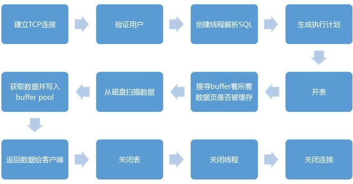

# 向MySQL发送一个请求的时候，MySQL到底做了些什么？

eng.net/view/7552.html)

通过《[MySQL体系结构详解](http://c.biancheng.net/view/7939.html)》一节的介绍，大家对 MySQL 的整体架构已经有了一定的了解，本节我们主要介绍数据库收到请求后的具体工作流程。下面是一张简单的数据库执行流程图：

下面从数据库架构的角度介绍数据库的工作流程：

#### 1. 连接层

1）连接处理：客户端同数据库服务层通过连接管理模块建立 TCP 连接，并请求一个连接线程。如果连接池中有空闲的连接线程，则分配给这个连接，如果没有，在没有超过最大连接数的情况下，创建新的连接线程负责这个客户端。

> 连接管理模块负责监听对 MySQL Server 的各种请求，接收连接请求，转发所有连接请求到线程管理模块。每一个连接上 MySQL Server 的客户端请求都会被分配（或创建）一个连接线程为其单独服务。而连接线程的主要工作就是负责 MySQL Server 与客户端的通信，接收客户端的命令请求，传递 Server 端的结果信息等。线程管理模块则负责管理维护这些连接线程。包括线程的创建，线程的缓存等。

2）授权认证：在真正的操作之前，还需要调用用户模块进行授权检查，来验证用户是否有权限。通过后，连接线程开始接收并处理来自客户端的请求。

> 用户模块所实现的功能，主要包括用户的登录连接权限控制和用户的授权管理。它就像 MySQL 的大门守卫一样，决定是否给来访者“开门”。

在 MySQL 中，将客户端请求分为了两种类型：一种是 query（SQL语句），需要调用 Parser（查询解析器）才能够执行的请求；一种是 command（命令），不需要调用 Parser 就可以直接执行的请求。

#### 2. SQL层

连接线程接收到 SQL 语句之后，将语句交给 Parser 进行语法分析和语义分析。之后根据类型的不同，有些会直接处理，有些会分发给其他模块来处理。

如果是一个 query 类型的请求，会将控制权交给 Query 解析器。

Query 解析器首先分析是不是一个 Select 类型的 query。是则调用查询缓存模块，让它检查该 query 在 Query Cache（查询缓存）中是否已经存在，如果有结果可以直接返回给客户端。没有结果则将控制权交给 Optimizer（查询优化器），进行查询的优化。

如果是表变更语句，则分别交给 Insert 处理器、Delete 处理器、Update 处理器、Create 处理器，以及 Alter 处理器这些小模块来负责。

#### 3. 存储引擎层

在各个模块收到 Query 解析或其它模块分发过来的请求后，首先会通过访问控制模块检查连接用户是否有访问目标表以及目标字段的权限，如果有，就会调用表管理模块请求相应的表，并获取对应的锁。

> 表变更管理模块主要是负责完成一些 DML 和 DDL 的 query，如：update，delete，insert，create table，alter table 等语句的处理。

当表变更管理模块“获取”打开的表之后，就会根据该表的相关信息，判断表的存储引擎类型和其他相关信息。根据表的存储引擎类型，提交请求给存储引擎接口模块，调用对应的存储引擎实现模块，进行相应处理。

 

不过，对于表变更管理模块来说，可见的仅是存储引擎接口模块所提供的一系列“标准”接口，底层存储引擎实现模块的具体实现，对于表变更管理模块来说是透明的。他只需要调用对应的接口，并指明表类型，之后接口模块会根据表类型调用正确的存储引擎来进行相应的处理。

 

当一条 query 或者一个 command 处理完成（成功或者失败）之后，控制权都会交还给连接线程模块。

如果处理成功，则将处理结果（可能是一个 ResultSet，也可能是成功或者失败的标识）通过连接线程反馈给客户端。

如果处理过程中发生错误，也会将相应的错误信息发送给客户端，然后连接线程模块会进行相应的清理工作，并继续等待后面的请求。之后重复上面的过程，或者与客户端断开连接，最后关闭连接，释放连接线程。