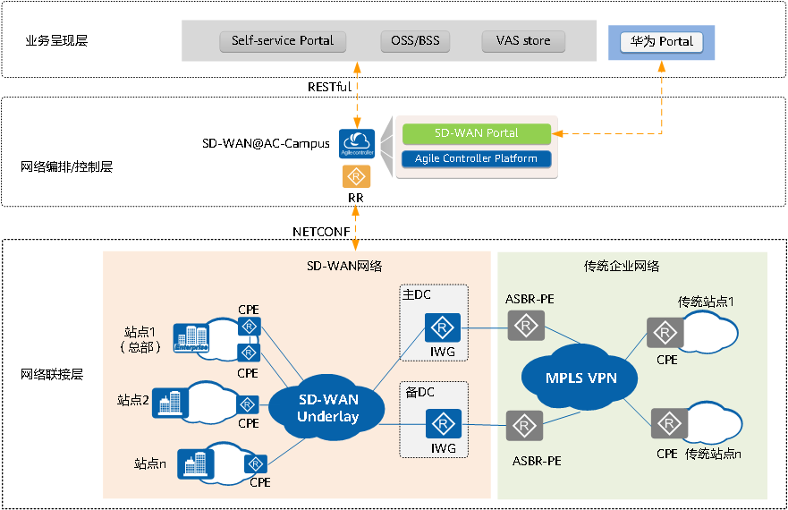

# 华为SD-WAN解决方案

针对传统企业网络面临的专线成本昂贵且带宽利用率低、业务体验难保障、业务部署慢和运维困难诸多问题，华为推出了SD-WAN（Software-Defined WAN）解决方案。华为SD-WAN解决方案是一种更简化、更灵活、业务体验更佳的广域互联方案，可以提供分支与分支、分支与总部/数据中心之间全场景随需互联的能力，通过应用级智能选路、带宽选路、智能加速和智能运维，重塑企业专线全流程，构建极致的业务体验。

华为SD-WAN解决方案架构如**图 1 华为SD-WAN解决方案架构图**所示。

**图1** 华为SD-WAN解决方案架构图

华为SD-WAN解决方案架构由上到下分为3个部分。

- 业务呈现层

  业务呈现层有两种形式：

  - 一种是华为自研的面向运营商、MSP或大企业客户的Portal界面，包含了SD-WAN端到端的业务配置和处理流程。
  - 一种是面向运营商OSS/BSS、第三方Portal、第三方App Store，SD-WAN@AC-Campus提供的Open API机制，实现客户对于SD-WAN方案的集成和界面的灵活定制。

- 网络编排/控制层

  SD-WAN@AC-Campus作为华为SD-WAN解决方案最核心的部分，南向通过HTTP2.0通道以及NETCONF协议管理，实现对CPE（Customer Premise Equipment，客户终端设备）、RR（Route Reflector，路由反射器）、IWG（Interworking Gateway，互通网关）设备的统一管理，业务自动下发和Overlay网络的统一控制。北向开放RESTful接口与业务呈现层实现互联对接。

  RR作为网络控制层的一部分，在SD-WAN@AC-Campus的指导下，基于用户定义的Overlay拓扑策略，实现全网CPE之间的VPN路由和隧道信息按需发放，转控分离的架构极大的提高了网络的可扩展性。在部署时，可以单独部署专门的RR设备；也采用RR和站点共部署模式，选择由大型站点的高性能CPE设备承担RR的路由反射器功能。

- 网络联接层

  企业总部和分支可以采用NetEngine AR新一代SD-WAN CPE作为企业网关，每个CPE支持一个或多个WAN连接。SD-WAN Underlay网络可以是MPLS或Internet网络，分支侧网关可以采用MPLS链路、Internet链路或LTE链路灵活组合接入SD-WAN Underlay网络，与总部/数据中心建立连接，通过Overlay技术构建全联接网络。

  如果企业网络中仍存在未迁移到SD-WAN网络的传统企业网络站点，SD-WAN网络中的站点需要和传统站点互通，可以部署专门的IWG与ASBR-PE（Autonomous System Boundary Router，自制系统边界路由器）对接。IWG支持OptionA和OptionB两种跨域方案与ASBR-PE对接，OptionA跨域方案中IWG设备与ASBR-PE之间通过L3 VXLAN隧道对接；OptionB跨域方案中IWG设备通过MP-EBGP与ASBR-PE交换VPN-IPv4路由，达到SD-WAN网络中的站点和传统企业网络中的站点互通的目的。