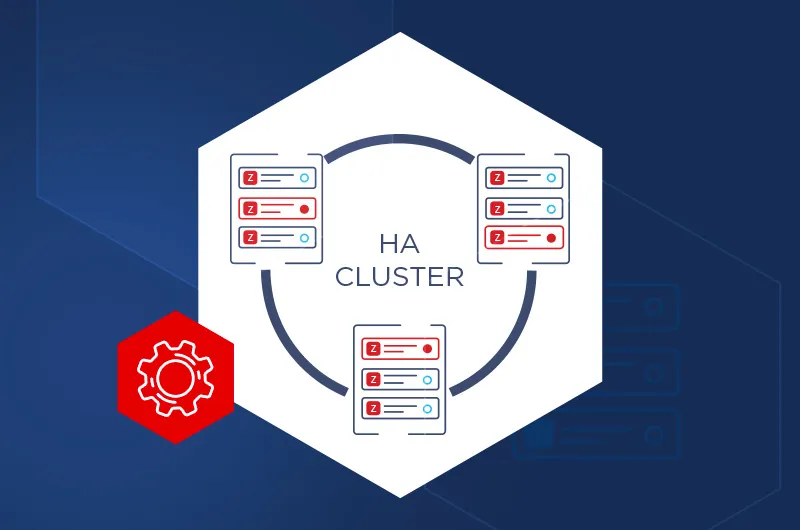
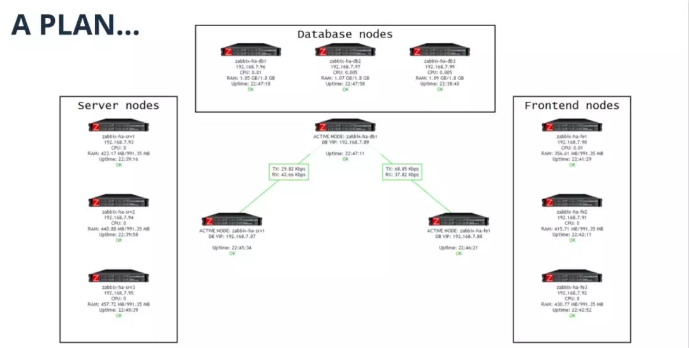
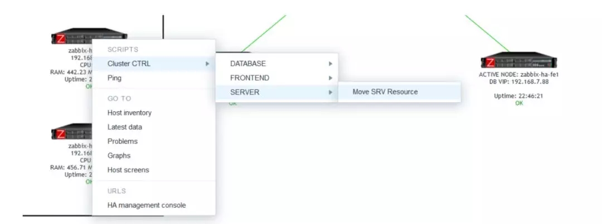
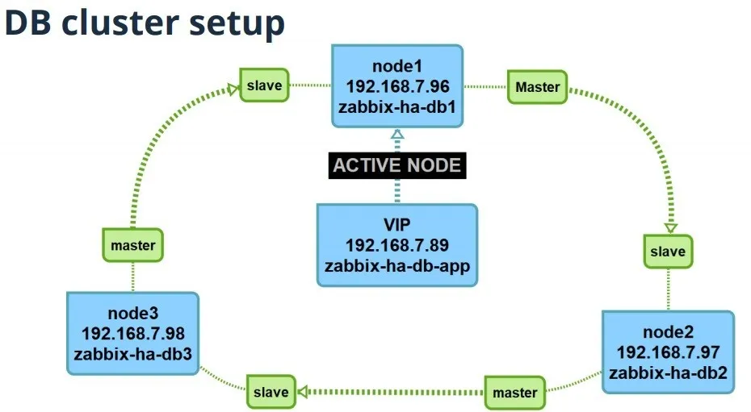
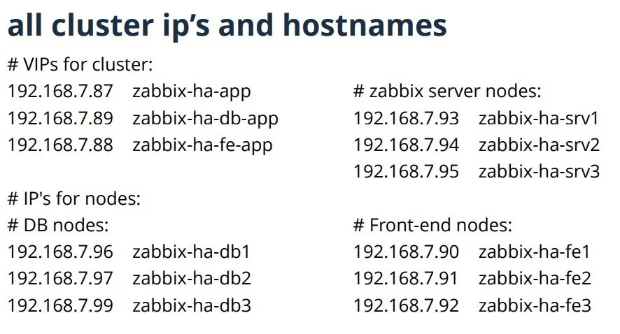
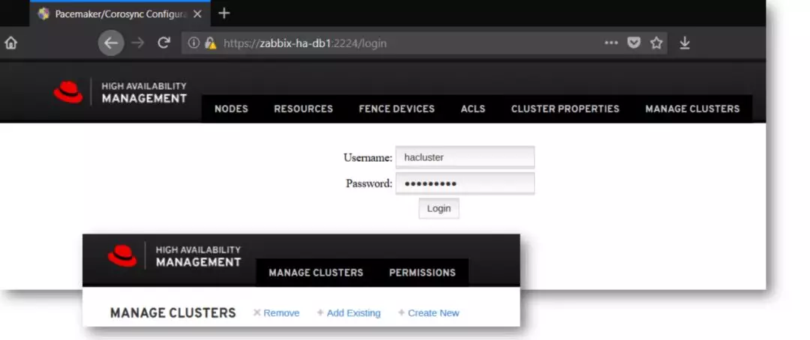
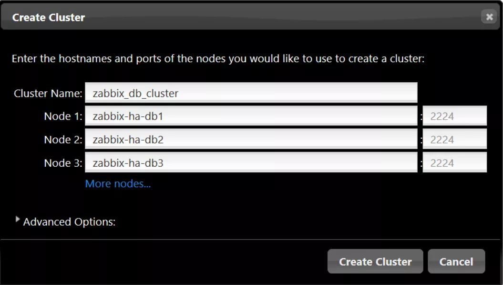
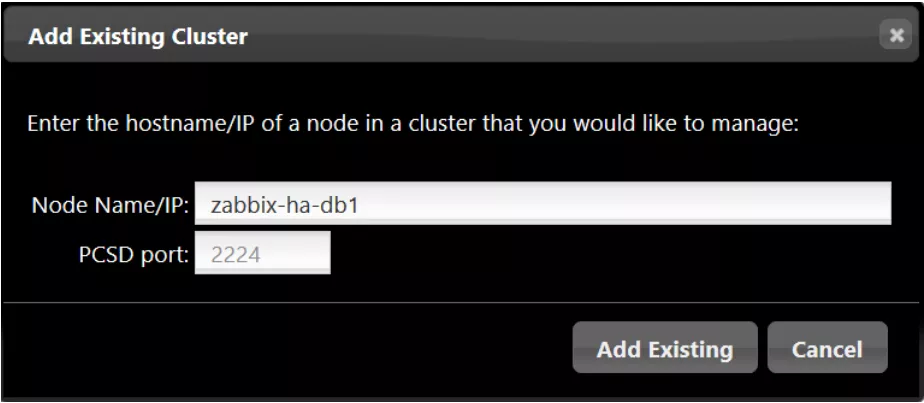
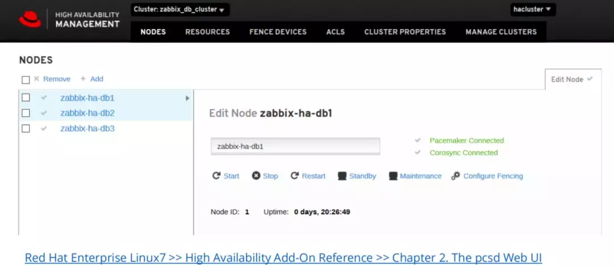
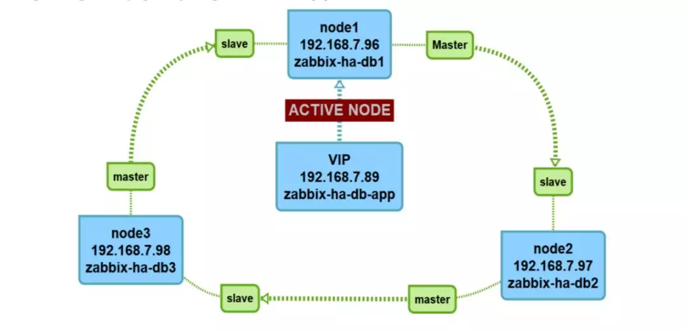

# Zabbix的HA集群搭建





## 参考文档

https://mp.weixin.qq.com/s/5bXJg6Ee-o2ZIuz5jsXtOQ


## 文章简介

大家好！我是Zabbix原厂培训师Edmunds Vesmanis 。我主要负责Zabbix培训工作，一个小的培训课程分享给大家。您将了解如何部署一个非常简单的HA解决方案。我将其称为Zabbix HA集群3-3-3，它表示数据库的3个节点、服务器的3个节点和前端的3个节点。


## HA集群是什么？搭建HA集群的原因？

Zabbix在监控海量数据的设备时。单一Zabbix已经无法满足冗余的要求，这时使用HA集群架构是非常有必要的。

使用HA架构集群可以让切换宕机恢复事情变得更简单。而且这套HA经得住测试，目前来说在欧洲市场常见的，经过时间检验的解决方案。

使用的开放源码组件。其组件来源于Centos的系统。


### 集群架构图



这里可以看到，有3个数据库节点、3个服务器节点和3个前端节点。对于每个集群，都有一个虚拟IP (VIP)，用于显示当前哪些节点处于活动状态。如果基本资源死亡或连接失败，节点将自动切换。手动控制也可以在出现问题或执行更新时进行覆盖。

其思想是，用户可以通过Zabbix随时切换节点。因此，如果出现错误，或者只是想关闭第一个服务器节点，那么可以单击第二个节点并将资源转移到它。这可以通过Zabbix接口完成。




您需要的是正式的开箱即用的模板，不需要额外的脚本。您所需要做的只是添加您的VIP地址和一个链接到默认的链接模板。当然，您必须拥有Zabbix代理，并且必须在所有节点上启用远程命令。

为了理解MySQL复制是如何工作的，让我们来看看这个有3个节点的循环主-从设置。



复制通过二进制日志进行，并且可以是异步的。假设需要更新或测试，并且中间节点被禁用，因此可以处理第一个节点。复制将停止。例如，如果将二进制日志的有效期设置为3天，并且将节点关闭3天，然后重新激活，则复制仍将被推到所有节点。无论禁用哪个节点，复制都将在重新激活后继续其停止的位置。

如何才能做到这一点?首先，准备集群。将有9个虚拟机，每个虚拟机在主机文件中都有一个独立的IP和一个有意义的主机名。此外，我们有3个vip与主机名分配给他们，这样会理解起来更加简单。

 注意：请记住，您有一个最低限度的冗余值，所以您不希望依赖于其他系统，如DNS或DHCP。推荐使用IP直连方式。



准备每一台虚拟机环境：

1. 时钟同步;
2. 本地化;
3. 防火墙(最好要关闭它);

4. SELinux(总是一个麻烦制造者，所以我们只是禁用它);

5. 主机文件;

6. 存储(最好为DB、日志、应用程序和配置使用单独的块设备);

7. 所有节点上的Zabbix代理(启用远程命令，设置适当的IP地址)。


## 数据库集群

首先创建数据库集群。它可以在客户端中完成，也可以在图形化界面中完成。

 在所有数据库节点上安装HA软件：

```shell
#安装HA组件:
yum groupinstall 'High Availability' -y
## 或者:
yum groupinstall ha –y

## 为集群创建一个用户:
echo <CLUSTER_PASSWORD> | passwd --stdin hacluster

# 在每个节点上完成后，使用相同的密码对节点进行身份验证:
# Authenticate cluster nodes:
pcs cluster auth zabbix−ha−db1 zabbix−ha−db2 zabbix−ha−db3 \
username: hacluster
password: <CLUSTER_PASSWORD>


zabbix-ha-db1: Authorized
zabbix-ha-db2: Authorized
zabbix-ha-db3: Authorized
```


接下来的步骤将只在一个节点上执行—哪个节点并不重要，因为节点将同步。

创建数据库集群并添加资源。在这个最小的设置中，我们唯一的资源是DB集群的一个VIP地址:

~~~shell
# 创建一个DB集群:
pcs cluster setup --name zabbix_db_cluster \
zabbix-ha-db1 zabbix-ha-db2 zabbix-ha-db3 –force

## 创建一个源的虚拟IP（VIP）
pcs resource create virtual_ip ocf:heartbeat:IPaddr2 \
ip=192.168.7.89 op monitor interval=5s --group zabbix_db_cluster

 

## 检查：
pcs status

## 重启启动集群服务:
## “群集当前不在此节点上运行”错误应对方案
pcs cluster stop --all && pcs cluster start --all

# 添加防火墙策略规则:
firewall-cmd --permanent --add-service=high-availability && firewall-cmd --reload

## 防止虚拟VIP资源在恢复后移动：
pcs resource defaults resource-stickiness=100

##如果你不使用防火墙策略，同样的禁止 STONITH:
pcs property set stonith-enabled=false

## 保证其他的资源不会启动
## STONITH = Shoot the other node in the head!
~~~


这是图形化界面配置：

即使我有一段时间不知道它，但是有一个GUI。如果你想知道一两年前做了什么，现在又发生了什么，这是很有帮助的，因为你不需要每天都做设置。



通过界面可用于创建集群。您需要输入主机名和端口，还可以使用一些高级选项。



如果您已经有了一个集群，那么您可以在您的图形化界面，并从现有的集群中添加一个节点。



您可以立即看到集群的组成、组件是否连接以及正常运行时间。你有控制权，你不需要再手动敲命令了。



注意：有关如何使用pcsd Web UI配置高可用性集群的更多信息可以在这里找到。

https://access.redhat.com/documentation/en-us/red_hat_enterprise_linux/7/html/high_availability_add-on_reference/ch-pcsd-haar


## 数据库安装

数据库机器安装Mariadb数据库，所有数据库节点配置进行同步配置。


### 安装数据库

~~~shell
# 安装MariaDB在三个节点上
yum install mariadb-server –y

# 调整/配置数据库设置:
cp ./zabbixdb.cnf /etc/my.cnf.d/

# 启动数据库并加入开机自启:
systemctl start mariadb
systemctl enable mariadb

# 加密安装mysql和创建mysql密码:
mysql_secure_installation
~~~


### 配置数据库

~~~
cat zabbixdb.cnf

[mysqld]
# ZABBIX specific settings and tuning
default-storage-engine = InnoDB
innodb = FORCE
innodb_file_per_table = 1
innodb_buffer_pool_size = 512M # 50-75% of total RAM
innodb_buffer_pool_instances = 8 # For MySQL 5.5 - 4, for 5.6+ - 8
innodb_flush_log_at_trx_commit = 2
innodb_flush_method = O_DIRECT
innodb_io_capacity = 800 # HDD disks 500-800, SSD disks - 2000
sync-binlog = 0
query-cache-size = 0
server_id = 96 # for id settings IPs last number used
report_host = zabbix-ha-db1
log-slave-updates
log_bin = /var/lib/mysql/log-bin
log_bin_index = /var/lib/mysql/log-bin.index
relay_log = /var/lib/mysql/relay-bin
relay_log_index = /var/lib/mysql/relay-bin.index
binlog_format = mixed
binlog_cache_size = 64M
max_binlog_size = 1G
expire_logs_days = 5
binlog_checksum = crc32
max_allowed_packet = 500M
~~~


必须设置在每个db节点上：

~~~shell
vi /etc/my.cnf.d/zabbixdb.cnf

## 必须设置在每个db节点上
server_id = 96 ## Last number of IP
report_host = zabbix-ha-db1 ## Hostname
~~~


记住这个方案



复制设置:node1 (zabbix-ha-db1)

~~~shell
## 登陆到mysql:
mysql –uroot –p<MYSQL_ROOT_PASSWORD>
MariaDB [(none)]> STOP SLAVE;
MariaDB [(none)]> GRANT REPLICATION SLAVE ON *.* TO 'replicator'@'<NODE2_IP>' 
identified by '<REPLICATOR_PASSWORD>';
Query OK, 0 rows affected (0.00 sec)
MariaDB [(none)]> SHOW MASTER STATUS\G

*************************** 1. row ***************************
File: log-bin.000001
Position: 245
Binlog_Do_DB:
Binlog_Ignore_DB:
1 row in set (0.00 sec)
~~~


复制设置:node2 (zabbix-ha-db2)

\## 登陆到mysql:

mysql –uroot  –p<MYSQL_ROOT_PASSWORD>

STOP SLAVE;

CHANGE MASTER TO MASTER_HOST  ='<NODE1_IP>', MASTER_USER = 'replicator',

MASTER_PASSWORD =  '<REPLICATOR_PASSWORD>', MASTER_LOG_FILE='log-bin.000001',

MASTER_LOG_POS = 245;

GRANT REPLICATION SLAVE ON *.* TO  'replicator'@'<NODE3_IP>' identified by

'<REPLICATOR_PASSWORD>';

RESET MASTER;

START SLAVE;

  

SHOW SLAVE STATUS\G

*************************** 1. row  ***************************

Slave_IO_State: Waiting for master to  send event

Master_Host: <NODE1_IP>

Master_User: replicator

...

Master_Log_File: log-bin.000001

Read_Master_Log_Pos: 245

...

Slave_IO_Running: Yes

Slave_SQL_Running: Yes

...

Last_IO_Errno: 0

Last_IO_Error:

 

MariaDB [(none)]> SHOW MASTER STATUS\G

*************************** 1. row  ***************************

File: log-bin.000001

Position: 245

Binlog_Do_DB:

Binlog_Ignore_DB:

SHOW SLAVE STATUS\G

*************************** 1. row ***************************

Slave_IO_State: Waiting for master to send event

Master_Host: <NODE2_IP>

Master_User: replicator

...

Slave_IO_Running: Yes

Slave_SQL_Running: Yes

...

Last_IO_Errno: 0

Last_IO_Error:


Replicaton setup: node3 (zabbix-ha-db3)

MariaDB [(none)]> SHOW MASTER STATUS\G

*************************** 1. row ***************************

File: log-bin.000001

Position: 245

Binlog_Do_DB:

Binlog_Ignore_DB:

复制设置:node1 (zabbix-ha-db1)

STOP SLAVE;

CHANGE MASTER TO MASTER_HOST ='<NODE3_IP>', MASTER_USER = 'replicator', 

MASTER_PASSWORD = '<REPLICATOR_PASSWORD>', MASTER_LOG_FILE='log-bin.000001', 

MASTER_LOG_POS =245;

START SLAVE;

SHOW SLAVE STATUS\G

*************************** 1. row ***************************

Slave_IO_State: Waiting for master to send event

Master_Host: <NODE3_IP>

Master_User: replicator

...

Last_IO_Errno: 0

Last_IO_Error:

准备 Zabbix 数据库:节点1 (zabbix-ha-db1)

\##从现在开始，所有MySQL查询都可以在任何节点上执行 

\## 所有查询将被复制到其他节点!

\## 我们将使用节点1 ,

... 

\## 登陆到mysql，创建Zabbix DB用户:

create database zabbix character set utf8 collate utf8_bin;

grant all privileges on zabbix.* to zabbix@'%' identified by '<DB_ZABBIX_PASS>';

quit

\## 导入schamesql文件和一些必要的conf: 

\## 复制sql文件create.sql.gz 。

\## 位置 /usr/share/doc/zabbix-server-mysql-*/create.sql.gz

zcat create.sql.gz | mysql -uzabbix -p<DB_ZABBIX_PASS> zabbix

\## 这个时候你可以去设置数据库分区了

\## 那其他的数据库呢... :)

\## 集群复制同步会自动复制mysql 服务配置。

Mysql复制调试命令：

SHOW BINARY LOGS;

SHOW SLAVE STATUS;

SHOW MASTER STATUS\g

RESET MASTER; ## 删除索引文件中列出的所有二进制日志文件。

\##只有一个数字后缀为.000001的空二进制日志文件

RESET MASTER TO 1234; ## 重置复制到特定的二进制日志位置

PURGE BINARY LOGS BEFORE '2019-10-11 00:20:00';

\## 编号未复位，可在复制时安全使用

\## 复制同步启动.

FLUSH BINARY LOGS;  ## 将重置状态的二进制日志和重新开始编号


## Server 集群

~~~shell
## 安装HA组件: 
yum groupinstall ha –y

## 创建集群用户:
echo zabbix123 | passwd --stdin hacluster

## 安装Zabbix-server应用:
yum install -y zabbix-server

## 不加入开机自启，zabbix-server应用将被HA组件管理。
## 复制默认的zabbix-server的应用配置:
cp zabbix_server.conf /etc/zabbix/zabbix_server.conf

##修改参数
vi zabbix_server.conf
...
SourceIP=192.168.7.87 #VIP for zabbix-server cluster
...
DBHost=192.168.7.89 # VIP of the DB's 
DBName=zabbix
DBUser=zabbix
DBPassword=<DB_ZABBIX_PASS>
...

## 部署到所有服务器节点
## 确认集群节点:
pcs cluster auth zabbix-ha-db1 zabbix-ha-db2 zabbix-ha-db3
username: hacluster
password: <CLUSTER_PASSWORD>

## 创建Zabbix-server集群:
pcs cluster setup --name zabbix_server_cluster \
zabbix-ha-srv1 zabbix-ha-srv2 zabbix-ha-srv3 --force

## 禁用防火墙:
pcs property set stonith-enabled=false

## 重启集群:
pcs cluster stop --all && pcs cluster start --all
~~~


### server cluster: 资源配置

~~~shell
## 防止VIP资源在恢复后移动
pcs resource defaults   resource-stickiness=100

## zabbix服务器应用程序的VIP:
pcs resource create virtual_ip_server   ocf:heartbeat:IPaddr2 ip=192.168.7.87 op
monitor interval=5s --group   zabbix_server_cluster

## 控制zabbix服务器守护进程:
pcs resource create ZabbixServer   systemd:zabbix-server op monitor interval=10s --
group zabbix_server_cluster

## 添加托管:资源必须在相同的节点上运行:
pcs constraint colocation add   virtual_ip_server ZabbixServer INFINITY –force

## 在特定的顺序:
pcs constraint order virtual_ip_server then ZabbixServer

## 设置启动/停止超时操作
pcs resource op add ZabbixServer start   interval=0s timeout=60s
pcs resource op add ZabbixServer stop   interval=0s timeout=120s
~~~


### server cluster: 检查

~~~shell
[root@zabbix-ha-srv1 ~]# pcs status
Cluster name: zabbix_server_cluster
Stack: corosync
Current DC: zabbix-ha-srv2 (version 1.1.20-5.el7_7.1-3c4c782f70) - partition 
with quorum
...

3 nodes configured
2 resources configured
Online: [ zabbix-ha-srv1 zabbix-ha-srv2 zabbix-ha-srv3 ]
Full list of resources:
Resource Group: zabbix_server_cluster
virtual_ip_server (ocf::heartbeat:IPaddr2): Started zabbix-ha-srv1
ZabbixServer (systemd:zabbix-server): Started zabbix-ha-srv1
~~~


## 前端集群

server cluster: 资源配置

\##安装HA组件: 

yum groupinstall ha –y

\## 创建集群用户:

echo zabbix123 | passwd --stdin hacluster

\## 安装Zabbix前端:

yum install -y zabbix-web-mysql

\## 不加入开机自启，zabbix-web应用将被HA组件管理

cat /etc/zabbix/web/zabbix.conf.php ##修改前端php文件

\## 准备zabbix-FE配置:

$DB['TYPE'] = 'MYSQL';

$DB['SERVER'] = '192.168.7.89';

$DB['PORT'] = '0';

$DB['DATABASE'] = 'zabbix';

$DB['USER'] = 'zabbix';

$DB['PASSWORD'] = 'zabbix123';

...

$ZBX_SERVER = '192.168.7.87';

$ZBX_SERVER_PORT = '10051';

$ZBX_SERVER_NAME = 'ZABBIX-HA';

\## 部署到同一位置的所有FE节点: /etc/zabbix/web/

vi /etc/httpd/conf.d/serverstatus.conf

\## 为apache创建资源启用服务器状态页

Listen 127.0.0.1:8080

<VirtualHost localhost:8080>

<Location /server-status>

RewriteEngine Off

SetHandler server-status

Allow from 127.0.0.1

Order deny,allow

Deny from all

</Location>

</VirtualHost>

vi /etc/httpd/conf/httpd.conf +/Listen 80

\##将apache设置为仅在VIP上侦听

\## 修改为:

...

Listen 192.168.7.88:80

...

\## Or...

\## 确认前端集群:

pcs cluster auth zabbix-he-fe1 zabbix-ha-fe2 zabbix-ha-fe3

username: hacluster

password: <CLUSTER_PASSWORD>

\## 创建前端集群:

pcs cluster setup --name zabbix_fe_cluster \

zabbix-ha-fe1 zabbix-ha-fe2 zabbix-ha-fe3 --force

\## 重启集群:

pcs cluster stop --all && pcs cluster start –all

\## 禁用防火墙:

pcs property set stonith-enabled=false

Frontend cluster: 资源配置

\## VIP 对 FE

pcs resource create virtual_ip_fe ocf:heartbeat:IPaddr2 ip=192.168.7.88 op 

monitor interval=5s --group zabbix_fe_cluster

\## 对 Apache调整:

pcs resource create zabbix_fe ocf:heartbeat:apache \

configfile=/etc/httpd/conf/httpd.conf \

statusurl="http://localhost:8080/server-status" op \

monitor interval=30s --group zabbix_fe_cluster

\## 添加托管:资源必须在同一节点上运行:

pcs constraint colocation add virtual_ip_fe zabbix_fe INFINITY

\## 在特定的顺序:

pcs constraint order virtual_ip_fe then zabbix_fe

pcs resource defaults resource-stickiness=100

\## 设置启动/停止超时操作

pcs resource op add zabbix_fe start interval=0s timeout=60s

pcs resource op add zabbix_fe stop interval=0s timeout=120s


## 获取更多HA集群架构信息

google...

https://access.redhat.com/documentation/en-us/

\## 查找: Red Hat Enterprise Linux >> 7 >>

High Availability Add-On Reference

https://clusterlabs.org/

联系 Zabbix sales :)