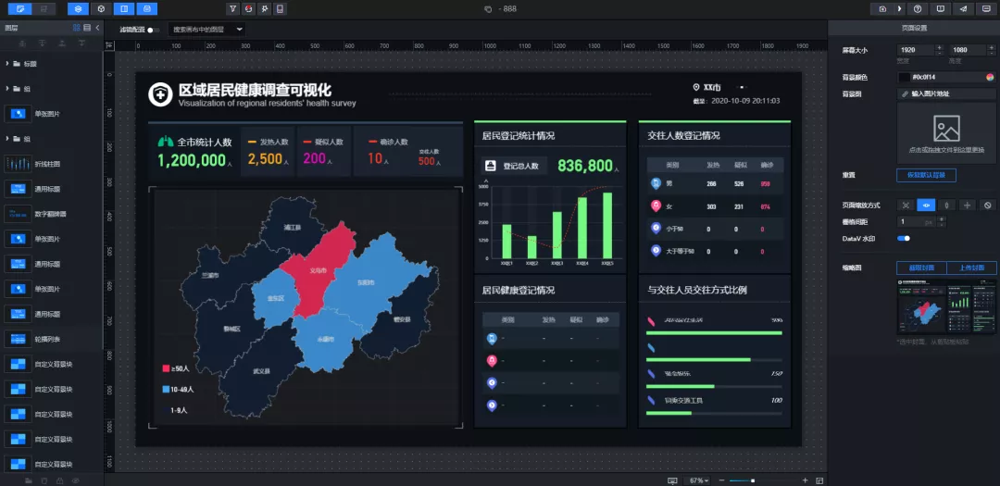
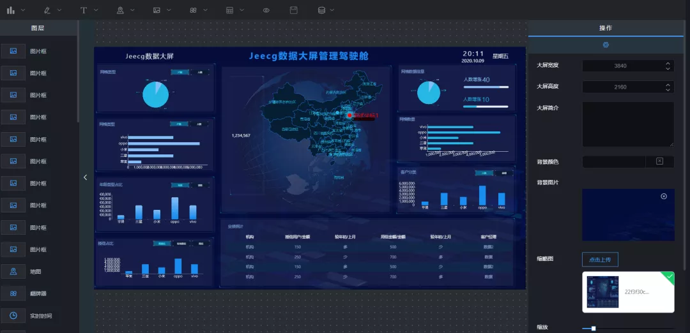
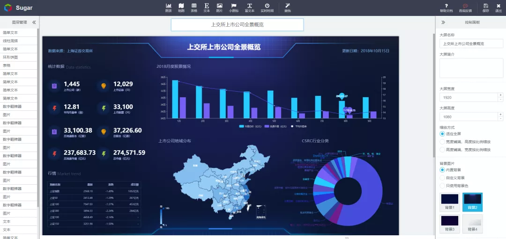
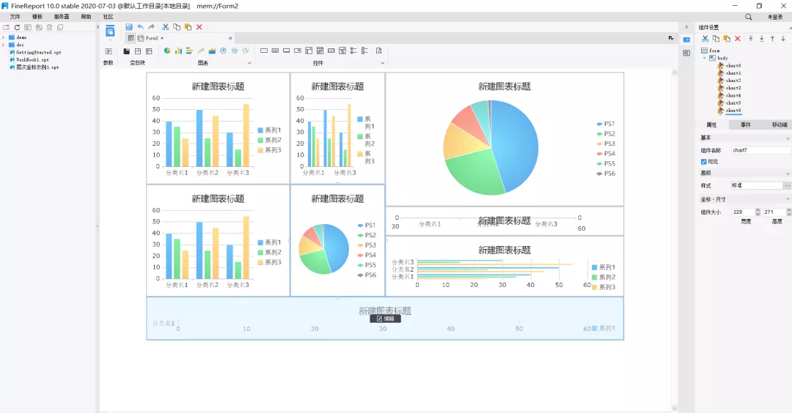

# 四款可视化工具，解决99%的可视化大屏需求

[SQL数据库开发](javascript:void(0);) *2021-12-06 08:10*

**点击关注上方“****SQL数据库开发****”，**

**设为“置顶或星标****”，第一时间送达干货**

**SQL专栏**

[SQL基础知识第二版](http://mp.weixin.qq.com/s?__biz=MzA3MTg4NjY4Mw==&mid=2457300844&idx=1&sn=134dd477109fcff6593012b85e5d7c80&chksm=88a57d58bfd2f44ed56dacc801d7bc27fe941470bbaf5734f749289829c781d8f26ee011bdd8&scene=21#wechat_redirect)
[SQL高级知识第二版](http://mp.weixin.qq.com/s?__biz=MzA3MTg4NjY4Mw==&mid=2457310325&idx=1&sn=f133bed8878a13be338c3fcaaf76c42b&chksm=88a58641bfd20f57c4ec00b1280926caea1f0b3851a95a35a03a7a7a9225b633d6e3d4d164d0&scene=21#wechat_redirect)

##### 1. 阿里云DataV

使用手机号或邮箱注册账号，会获得7天的体验期。阿里云DataV有强大的组件库，可以制作不同的样式，还可以链接数据库或API接口，炫酷的可视化大屏可以轻松完成。

###### 缺点：

（1）试用期比较短，试用期过了，需要几千或者几万的续期费用，对于工薪阶层来说，这是一笔不小的费用。

（2）数据源的配置有点复杂，用户的学习成本有点高。

地址：https://www.aliyun.com/product/bigdata/datav

**2. 积木报表**jimureport

积木报表是 JeecgBoot 旗下的一款免费制作报表和大屏的软件，主打开源。跟阿里和百度一样，手机号一键注册，便可永久使用，重要的是：免费！免费！免费！

积木报表采用类word风格，可以随意拖动组件，想怎么设计怎么设计，可以像百度和阿里一样，设计出炫酷的可视化大屏！

###### 缺点：

等你来发现呦！

##### 

##### 地址：http://www.jimureport.com/

##### 3. 百度Sugar

跟阿里一样，手机号一键注册，会有30天的体验期，制作效果同样炫酷。

###### 缺点：

（1）试用期不长，试用期一过，需要花钱续费；

##### 

##### 地址：https://cloud.baidu.com/product/sugar.html

##### 4. 帆软

帆软是业内做报表比较久的一家公司，使用类excel风格的界面，可添加图表和数据源，也可实现大屏效果。

###### 缺点：

（1）只能拖动块的固定排版，对于大屏的随意排版、随意拖动不大方便；

（2）需下载软件，本地制作，软件占用空间较大，打开比较慢；

（3）需要安装许多插件才可以实现一些动态效果；

地址：https://www.fanruan.com/finereport

*来源：https://www.cnblogs.com/jeecg158/p/13810484.html*

最后给大家分享我写的SQL两件套：**《SQL基础知识第二版》**和**《SQL高级知识第二版》**的PDF电子版。里面有各个语法的解释、大量的实例讲解和批注等等，非常通俗易懂，方便大家跟着一起来实操。

有需要的读者可以下载学习，在下面的公众号「**数据前线**」(非本号)后台回复关键字：**SQL**，就行

**数据前线**

#### `后台回复关键字：**1024**，获取一份精心整理的技术干货后台回复关键字：**进群**，带你进入高手如云的交流群**推荐阅读**简单易懂，SQL中JOIN ON的执行原理可怕，中国生育率已经低于日本！分析一波：中国月入过万的，究竟有多少人？17 张程序员专属壁纸，使用频率很高一个员工的离职成本有多恐怖！`