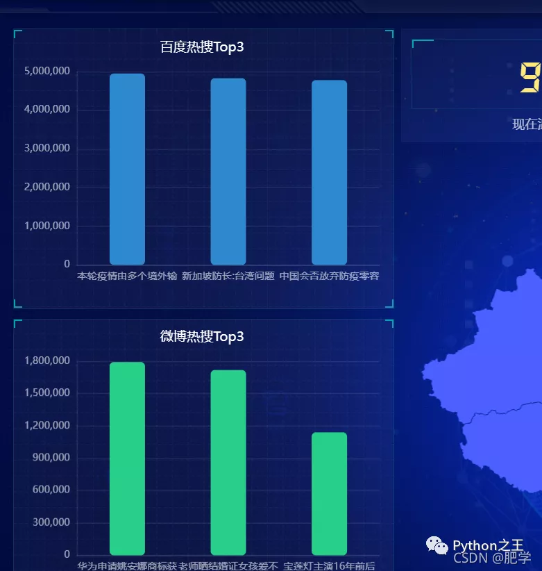
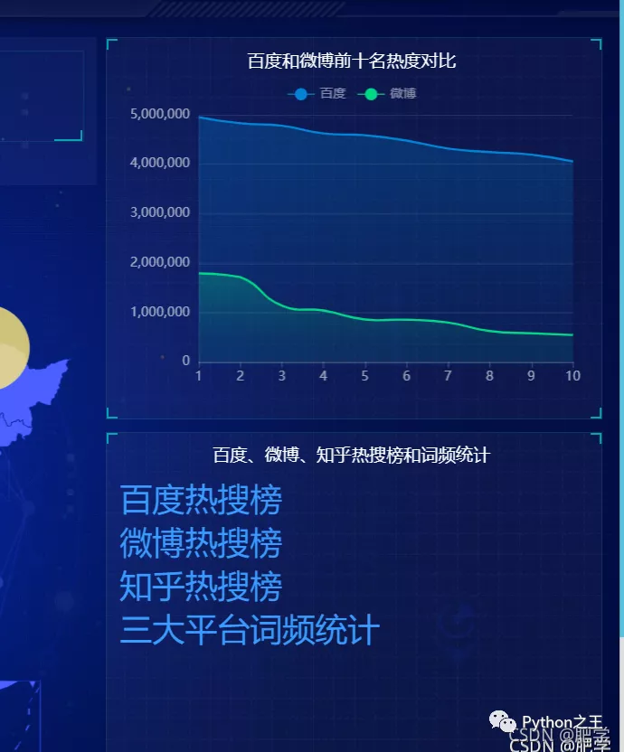
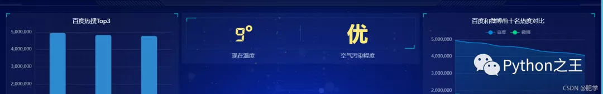

# python综合程序设计 | 做一个可视化大屏

[Python之王](javascript:void(0);) *11月12日*

收录于话题#数据分析37个内容


# 预览





# 一、实验目的

通过该实验把Python语言中基本知识和第三方库得到综合应用。完成可视化热搜榜和国内疫情新增图，提高学生的编程能力和分析问题、解决问题的能力。

# 二、设备与环境

硬件：多媒体计算机 软件：Windows7或Windows10 操作系统、Python3.X 软件。

# 三、实验内容

1、 实验内容 ① 使用python web框架flask搭建web项目 ② 使用爬虫技术完成信息获取 ③ 使用python基础知识库完成数据转换并做数据分析 ④ 使用jieba库对热搜做词频分析 ⑤ 使用jQuery框架和HTML、css、JavaScript和echarts完成前端页面设计

2、最后结果输出。要求：输出格式要界面直观、清晰大方、格式规范。

# 四、实验结果及分析

## **1、实验运行过程及分析**

```python
#构建首页页面路由路径，并加载index.html页面和传送数据
@app.route('/Hot_Bot')
def Hot_Bot():
    data=hotBot()
    return render_template('index.html',form=data,title=data.title)

#构建词频页面和路由路径，并加载test.html页面和传送数据
@app.route('/cipin')
def cipin():
    data=spider.sum_hot_word()
    print(data)
    return render_template("test.html",form=data)
爬虫阶段以微博和知乎为例：

def weibo():
    hot=[]
    name=[]
    value=[]
    url='https://weibo.com/ajax/statuses/hot_band'
    header={<!-- -->
        'cookie': 'UOR=mp.weixin.qq.com,s.weibo.com,mp.weixin.qq.com; SINAGLOBAL=753710676249.8569.1621750150925; SUB=_2AkMXpEktf8NxqwJRmP4Tz2zkZYh3wwHEieKh-Lj2JRMxHRl-yT9jqhAztRB6PCRnwgM0JsVYPTwi5DuGI3N0YpgPChkI; SUBP=0033WrSXqPxfM72-Ws9jqgMF55529P9D9WhpfXwV9S99niOF07XLn8y7; WBPSESS=kErNolfXeoisUDB3d9TFH-1YhWD5pAkKF4olmR2WdEz_79spnMzQbf2Kt92964Tdvd3fcKY1c8a_Sd6CbCiw6P0wyFuEu1GQri6NrQ6_oBLuAYd8HR3zZI8_M6QfSsHD; ULV=1635245354703:3:1:1:6287771993091.978.1635245354698:1626916415441; XSRF-TOKEN=_LdujowesXEM4itQidVLNlJj',
        'accept - encoding': 'gzip, deflate, br',
        'user - agent': 'Mozilla/5.0 (Windows NT 10.0; Win64; x64) AppleWebKit/537.36 (KHTML, like Gecko) Chrome/95.0.4638.54 Safari/537.36',
        'referer': 'https://www.baidu.com/link?url=oBKJ9ZCKdgcrDL-WKTnXNgHhk2kNw6JfV0tShTgwv3KYkUracwd2FG6kuIrShm5b2aJDHZKZVgYG8QgZWSM-Ha&amp;wd=&amp;eqid=f74c877700049c31000000066177abe3'
    }
    req = requests.get(url,headers=header).text
    soup = BeautifulSoup(req, "lxml")
    #hot_word = re.findall('word.*?,',req)
    hot_word=json.loads(req)['data']['band_list']
        for i in range(len(hot_word)):
        hot.append({<!-- -->"name":hot_word[i]['word'][0:10],"value":hot_word[i]["num"]})
        name.append(hot_word[i]['word'])
        value.append(hot_word[i]["num"])
    return hot[0:3],name,value
def zhihu():
    hot = []
        browser=webdriver.Chrome('chromedriver.exe')
    browser.get('https://www.zhihu.com/topsearch')
    browser.refresh()
    elements=browser.find_elements_by_class_name('TopSearchMain-title')
    for i in elements:
        hot.append(i.text)
    return hot
以词频分析为例展示部分前端页面代码：
&lt;div id="main" style="width: 600px;height: 800px;"&gt;&lt;/div&gt;
&lt;script&gt;
   var ectest = echarts.init(document.getElementById("main"));
                    var ec_right2_option = {<!-- -->
              // backgroundColor: '#515151',
              title: {<!-- -->
                  text: "今日疫情热搜",
                  textStyle: {<!-- -->
                      color: 'white',
                  },
                  left: 'left'
              },
              tooltip: {<!-- -->
                  show: false
              },
              series: [{<!-- -->
                  type: 'wordCloud',
                  // drawOutOfBound:true,
                  gridSize: 1,
                  sizeRange: [12, 55],
                  rotationRange: [-45, 0, 45, 90],
                  // maskImage: maskImage,
                  textStyle: {<!-- -->
                      normal: {<!-- -->
                          color: function () {<!-- -->
                              return 'rgb(' +
                                  Math.round(Math.random() * 255) +
                                  ', ' + Math.round(Math.random() * 255) +
                                  ', ' + Math.round(Math.random() * 255) + ')'
                          }
                      }
                  },
                                   right: null,
                  bottom: null,
                                    data: ddd
              }]
          }

          ectest.setOption(ec_right2_option);

&lt;/script&gt;
```

## **2、运行结果**

下面展示主页面：中间是国内疫情新增图并动态显示人数，左上为百度热搜榜top3、左下为微博热搜榜top3、中上为当天天气情况、右上为微博和百度热搜热度对比。右下为三大平台的热搜地址和词频统计。

下图为百度、微博、知乎三大平台的热搜词频统计图。


## **3、心得体会**

通过本次课程设计我又温习了一次python的一些基础知识而且对前端技术有了进一步的了解使我更加清晰了以后的方向。而且也认识到在构建项目的时候对整体架构的重要性，最重要的是更深的认识到python技术对于构建网站的优缺点和python语言的实用性。对以后的发展起到了良好的引导作用。同时也认识到了自己的薄弱项，比如在前端页面设计的时候对jQuery和JavaScript技术的应用很不熟练还有对echarts的图表选择也比较简单，在选取疫情城市坐标标记的时候对symbolSize 的设定也没有把控好直接导致了最终产品没有达到预期效果，而且对python的基础知识掌握也不是特别的牢固对于jieba库的使用还有待提高。后续我会补上薄弱项，为争取做一名全栈技术人员而奋斗。

# 源码领取


**Python之王**

CSDN博客专家，Gitchat作者。个人技术栈：Python，Java，前端。

375篇原创内容


公众号

公众号回复**可视化疫情**