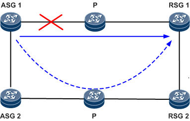
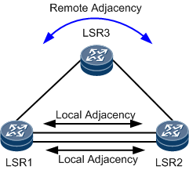

# **1** 配置规范

>  **说明：**
>
> 本文档介绍了NE系列路由器在某些应用场景中的配置规范，此规范要求用户在NE系列路由器部分特性的配置与维护时，必须按照配置规范要求进行业务部署，避免因错误配置、错误使用或可靠性缺失造成业务中断。


## 1.1 基础配置


### 1.1.1 配置用户登录的配置规范


#### 1.1.1.1 设备作为SSH客户端保存SSH公钥数应少于20个

当设备保存的SSH公钥数达到20个，设备作为SSH客户端无法登录新的服务器。

##### 应用场景

设备作为SSH客户端登录SSH服务器。

##### 配置规范

设备作为SSH客户端，保存的SSH公钥数需要少于20个。

##### 非规范配置的风险

**风险描述**

设备保存的SSH公钥数达到20个时，通过**stelnet**命令无法登录到新的SSH服务器。

**风险的判断方法**

在用户视图下，执行**display current-configuration** *| include assign rsa-key*命令，查看客户端公钥数是否达到20个。

从显示信息可以看出，如下客户端公钥数已达到20个。

```
<HUAWEI> display current-configuration | include assign rsa-key
#
ssh client 1.1.1.1 assign rsa-key 1.1.1.1
ssh client 2.2.2.2 assign rsa-key 2.2.2.2
ssh client 3.3.3.3 assign rsa-key 3.3.3.3
ssh client 4.4.4.4 assign rsa-key 4.4.4.4
ssh client 5.5.5.5 assign rsa-key 5.5.5.5
ssh client 6.6.6.6 assign rsa-key 6.6.6.6
ssh client 7.7.7.7 assign rsa-key 7.7.7.7
ssh client 8.8.8.8 assign rsa-key 8.8.8.8
ssh client 9.9.9.9 assign rsa-key 9.9.9.9 
ssh client 1.1.2.1 assign rsa-key 1.1.2.1
ssh client 1.1.3.1 assign rsa-key 1.1.3.1
ssh client 1.1.4.1 assign rsa-key 1.1.4.1
ssh client 1.1.5.1 assign rsa-key 1.1.5.1
ssh client 1.1.6.1 assign rsa-key 1.1.6.1
ssh client 1.1.7.1 assign rsa-key 1.1.7.1
ssh client 1.1.8.1 assign rsa-key 1.1.8.1
ssh client 1.1.9.1 assign rsa-key 1.1.9.1
ssh client 1.1.10.1 assign rsa-key 1.1.10.1
ssh client 1.1.11.1 assign rsa-key 1.1.11.1
ssh client 1.1.12.1 assign rsa-key 1.1.12.1
#
```

**风险的恢复方案**

删除不使用的客户端公钥。

```
<HUAWEI> system-view
[HUAWEI] undo ssh client 1.1.1.2 assign rsa-key
```


#### 1.1.1.2 VTY通道配置ACL的配置规范

当VTY下不配置ACL时可能受到外部攻击，造成CPU使用率高。

##### 应用场景

用户通过Telnet或者SSH方式登录设备。

##### 配置规范

VTY通道中通过配置ACL设置呼入呼出权限限制。

##### 非规范配置的风险

**风险描述**

VTY通道下未配置ACL，设备受到外部报文攻击时，设备CPU使用率高，严重时会影响业务运行。

**风险的判断方法**

在用户视图下执行**display current-configuration**命令，查看VTY下面是否所有通道都配置了**acl** *acl-number* **inbound** | **outbound**。

从显示信息可以看出，VTY 16-20未配置**acl** *acl-number* **inbound** | **outbound**。

```
<HUAWEI> display current-configuration configuration
#
user-interface vty 0 14
 acl 3100 inbound
 authentication-mode aaa
 protocol inbound ssh
user-interface vty 16 20 
 authentication-mode aaa
 protocol inbound ssh
#
```

**风险的恢复方案**

请按照配置规范进行配置。


## 1.2 系统管理


### 1.2.1 NTP


#### 1.2.1.1 NTP需要配置preference参数设置优先选择的服务器

通过**ntp-service unicast-server** *server-ip*命令指定多个不同的NTP服务器时，要为其中一个NTP服务器增加preference参数，将其设置为优选服务器，可以避免本设备在不同的NTP服务器之间反复震荡切换。

##### 应用场景

在系统视图下，执行**ntp-service unicast-server** *server-ip*命令指定多个不同的NTP远端服务器。

##### 配置规范

在系统视图下执行**ntp-service unicast-server** *server-ip* **preference**命令，将其中一个服务器设置为优选服务器。

##### 非规范配置的风险

**风险描述**

当在远端服务器上执行**ntp-service unicast-server** *server-ip*命令，未配置**preference**参数时，NTP客户端会在多个远端服务器之间反复切换，导致NTP客户端时间频繁变化，并记录大量日志。

**风险的判断方法**

在用户视图下，执行**display current-configuration** **configuration** *ntp*命令查询NTP客户端的配置。

从显示信息可以看出，指定的远端服务器个数超过1个并且都没有配置**preference**参数。

```
<HUAWEI> display current-configuration configuration ntp
#
ntp-service unicast-server 10.1.1.1
ntp-service unicast-server 10.1.1.2
#
```

**风险的恢复方案**

请按照配置规范进行配置。


#### 1.2.1.2 NTP MD5/SHA56认证配置规范

NTP设置MD5/SHA56认证方式并且配置**ntp-service authentication enable**命令后必须同时配置多条命令，否则无法和NTP服务器进行时钟同步。

##### 应用场景

设备作为NTP客户端，在系统视图下配置了**ntp-service authentication enable**命令，使能NTP验证功能。

##### 配置规范

在系统视图下，如下命令必须同时配置，才能保证NTP客户端和NTP服务器进行时钟同步。

```
<HUAWEI> system-view
[HUAWEI] ntp-service authentication enable 
[HUAWEI] ntp-service reliable authentication-keyid 169 
[HUAWEI] ntp-service unicast-server 172.0.0.1 authentication-keyid 169
[HUAWEI] ntp-service authentication-keyid 169 authentication-mode md5 cipher Root@123
```

##### 非规范配置的风险

**风险描述**

缺少以下一条或多条配置时，NTP客户端无法和服务器进行时钟同步。

- **ntp-service authentication-keyid** *key-id* **authentication-mode** *mode* **cipher** *password*
- **ntp-service reliable authentication-keyid** *key-id* *key-id*
- **ntp-service unicast-server** *server-ip* **authentication-keyid** *key-id*（该命令仅客户端涉及，服务器端不涉及）

**风险的判断方法**

在用户视图下，执行**display current-configuration** **configuration** *ntp*命令查询NTP客户端的配置。

从显示信息可以看出，设备启用了NTP身份验证功能，缺少密钥的配置。

```
<HUAWEI> display current-configuration configuration ntp
#
ntp-service authentication enable
#
```

**风险的恢复方案**

请按照配置规范进行配置。


### NQA


#### NQA探测周期配置规范

NQA测试例周期配置过短，在测试例一轮探测尚未执行结束，下一轮就开始了，导致测试结果为no result，影响其他联动协议，存在其他协议联动NQA失效的风险。

##### 应用场景

NQA探测。

##### 配置规范

1. 在NQA视图下，执行**stop**命令，停止测试例执行。
2. 在NQA视图下，执行**frequency** *interval*命令，配置NQA探测周期。需确保：探测周期>（探测次数-1）* 探测间隔 + 探测超时时间。
3. 在NQA视图下，执行**start** **now**命令，开始执行测试例。

##### 非规范配置的风险

**风险描述**

在NQA视图下，执行**frequency** *interval*命令配置NQA测试例的探测周期，如果配置的探测周期<（探测次数-1）*探测间隔+探测超时时间，则发生问题时单板重启，NQA联动的其他业务，如路由协议、VRRP等，会出现联动功能失效，从而影响到业务转发。

业务现象如下：

NQA测试结果为no result。

**风险的判断方法**

用户视图下，执行**display current-configuration** **configuration** *nqa*命令查看NQA测试例配置。

从显示信息可以看出，NQA测试例的探测周期为20秒，探测次数为5，探测间隔为6秒，探测超时时间为4秒。探测周期< （探测次数-1）* 探测间隔 + 探测超时时间。因此该测试例探测结果为“no result”。

```
<HUAWEI> display current-configuration configuration nqa
#
nqa test-instance 1 1
 test-type icmp
 destination-address ipv4 127.0.0.1
 frequency 20
 interval seconds 6
 timeout 4
 probe-count 5
 start now
#
```

**风险的恢复方案**

请按照配置规范进行配置。


## 可靠性


### BFD的配置规范


#### BFD for LSP会话报文来回路径需要一致才能保证LSP路径正常切换

配置BFD for LSP会话检测时，从源端设备到宿端设备的LSP路径与回程的LSP或者IP路径不一致。回程LSP或者IP路径故障时，BFD会话Down，导致LSP路径误切换。

##### 应用场景

如[图1-1](https://support.huawei.com/view/contentview/getFileStream?mid=SUPE_DOC&viewNid=EDOC1000124120&nid=EDOC1000124120&partNo=j003&type=htm#fig_dc_vrp_precaution_001401)所示，RouterA与RouterB之间存在两条路径，路径1和路径2。

**图1-1** BFD for LSP会话报文来回路径不一致导致LSP路径误切换组网图


##### 配置规范

在网络部署BFD for LSP会话检测时：

1. 动态BFD for LSP会话，可以考虑配置路由约束方式，保证来回路径一致，例如使用高优先级的静态路由。
2. 静态BFD for LSP会话（不包括BFD for TE-LSP），可以考虑配置路由约束方式，保证来回路径一致，例如使用高优先级的静态路由。
3. 静态BFD for TE-LSP会话，通过严格显式路径约束LSP来回路径，且来回路径均配置BFD for TE-LSP类型会话，保证来回路径一致。

##### 非规范配置的风险

**风险描述**

1. 配置动态BFD for LSP会话检测，去程路径1为LSP路径，回程路径2为IP路径。
2. 配置静态BFD for LSP会话（不包括BFD for TE-LSP），回程路径2为LSP路径，且与RouterA到RouterB的LSP路径不共路。
3. 路径1和路径2都配置BFD for TE-LSP会话，RouterA和RouterB的的TE-LSP没有配置严格的显式路径。

当满足上述任意一个条件时，BFD会话去程和回程路径不一致，回程路径故障时，可能导致去程LSP路径误切换。

业务现象如下：

BFD会话本意用来检测路径1，但是当路径2故障时，由于BFD回程路径不通，会话Down，触发路径1上的LSP误切换到故障路径2上，导致业务流量丢失。

**风险的判断方法**

1. 下面以动态BFD会话去程为LSP路径，回程为IP路由为例。其它情况的判断方法请根据实际组网情况而定，必须确保BFD会话报文的去程和回程路径一致。

2. 在RouterA查询BFD会话邻居信息。

   \# 在用户视图下，执行**display bfd session** **all** **verbose**命令查看RouterA到RouterB的BFD邻居信息。加粗字体为RouterA到RouterB的BFD会话的邻居和下一跳。

   ```
   <HUAWEI> display bfd session all verbose
   ```

   ```
   --------------------------------------------------------------------------------
   ```

   ```
     State : Up                    Name : dyn_16396
   ```

   ```
   --------------------------------------------------------------------------------
   ```

   ```
     Local Discriminator    : 16396            Remote Discriminator   : 16392 
   ```

   ```
     Session Detect Mode    : Asynchronous Mode Without Echo Function
   ```

   ```
     BFD Bind Type          : TE_LSP 
   ```

   ```
     Bind Session Type      : Dynamic  
   ```

   ```
     Bind Peer IP Address   : 2.2.2.2  
   ```

   ```
     NextHop Ip Address     : 10.1.1.2        
   ```

   ```
     ......
   ```

3. 在RouterB查询BFD会话的邻居信息。

   \# 在用户视图下，执行**display bfd session** **all** **verbose**命令查看RouterB到RouterA的BFD邻居信息。加粗字体为RouterB到RouterA的BFD会话的邻居。

   ```
   <HUAWEI> display bfd session all verbose 
   ```

   ```
   --------------------------------------------------------------------------------
   ```

   ```
     (Multi Hop) State : Up                    Name : dyn_16392
   ```

   ```
   --------------------------------------------------------------------------------
   ```

   ```
     Local Discriminator    : 16392            Remote Discriminator   : 16396 
   ```

   ```
     Session Detect Mode    : Asynchronous Mode Without Echo Function
   ```

   ```
     BFD Bind Type          : Peer IP Address  
   ```

   ```
     Bind Session Type      : Entire_Dynamic  
   ```

   ```
     Bind Peer IP Address   : 1.1.1.1             
   ```

   ```
     ......
   ```

4. 在RouterB查询到RouterA的路由信息。

   在用户视图下，执行**display ip routing-table** *ip-address mask* **verbose**命令查询RouterB到RouterA的路由信息。加粗字体为RouterB到RouterA的路由下一跳。BFD会话从RouterA到RouterB的下一跳为10.1.1.2，而从RouterB到RouterA的下一跳为10.2.1.2，BFD会话报文来回路径不一致。

   ```
   <HUAWEI> display ip routing-table 1.1.1.1 32 verbose
   ```

   ```
   Route Flags: R - relay, D - download to fib, T - to vpn-instance, B - black hole route
   ```

   ```
   ------------------------------------------------------------------------------
   ```

   ```
   Routing Table : _public_
   ```

   ```
   Summary Count : 1
   ```

   ```
   Destination: 1.1.1.1/32          
   ```

   ```
        Protocol: ISIS-L2         Process ID: 1              
   ```

   ```
      Preference: 15                    Cost: 10             
   ```

   ```
         NextHop: 10.2.1.2         Neighbour: 0.0.0.0        
   ```

   ```
           State: Inactive Adv           Age: 1d04h15m09s         
   ```

   ```
             Tag: 0                 Priority: high           
   ```

   ```
           Label: NULL               QoSInfo: 0x0           
   ```

   ```
      IndirectID: 0xE600087A    
   ```

   ```
    RelayNextHop: 0.0.0.0          Interface: GigabitEthernet0/5/5
   ```

   ```
        TunnelID: 0x0                  Flags:   
   ```

**风险的恢复方案**

请按照配置规范进行配置。


#### 静态BFD两端设备配置对称实现流量不中断

配置静态BFD会话检测，两端设备配置不对称导致业务切换行为不一致，流量中断。

##### 应用场景

如[图1-2](https://support.huawei.com/view/contentview/getFileStream?mid=SUPE_DOC&viewNid=EDOC1000124120&nid=EDOC1000124120&partNo=j003&type=htm#fig_dc_vrp_precaution_001501)所示，配置静态BFD会话检测RouterA和RouterB之间的链路。

**图1-2** 静态BFD两端设备配置不对称导致流量中断组网图


##### 配置规范

在对称的静态BFD会话上配置对称的本地行为参数：

- 两端设备分别在BFD会话视图下执行**wtr** *wtr-value*命令配置相同的等待恢复时间。
- 两端设备分别在BFD会话视图下执行**process-interface-status**命令配置当前BFD会话与其绑定的接口进行状态联动。
- 两端设备分别在BFD会话视图下执行**process-pst**命令配置允许BFD会话修改端口状态表PST。

##### 非规范配置的风险

**风险描述**

当不满足配置规范的任意一个条件时，两端业务切换行为不一致，流量中断。

**风险的判断方法**

1. 查询静态BFD会话的**wtr** *wtr-value*信息。

   \# 在RouterA的BFD会话视图下，执行**display this**命令进行查询。**discriminator local**必须要求与RouterB上远端描述符匹配。RouterA配置了wtr且时间为2分钟。

   ```
   <HUAWEI> system-view
   ```

   ```
   [HUAWEI] bfd session a
   ```

   ```
   [HUAWEI-bfd-session-a] display this
   ```

   ```
   #
   ```

   ```
   bfd a bind peer-ip 10.1.1.2
   ```

   ```
    discriminator local 1  
   ```

   ```
    discriminator remote 2
   ```

   ```
    wtr 2 
   ```

   ```
    commit
   ```

   ```
   #
   ```

   ```
   return
   ```

   \# 在RouterB的BFD会话视图下，执行**display this**命令进行查询。**discriminator local**必须与RouterA上远端描述符匹配。RouterB没有配置wtr，与RouterA配置不一致。

   ```
   <HUAWEI> system-view
   ```

   ```
   [HUAWEI] bfd session a
   ```

   ```
   [HUAWEI-bfd-session-a] display this
   ```

   ```
   #
   ```

   ```
   bfd a bind peer-ip 10.1.1.1
   ```

   ```
    discriminator local 2
   ```

   ```
    discriminator remote 1  
   ```

   ```
    commit
   ```

   ```
   #
   ```

   ```
   return
   ```

2. 查询静态组播BFD会话的两端设备**process-interface-status**信息。

   \# 在RouterA的BFD会话视图下，执行**display this**命令进行查询。**discriminator local**必须与RouterB上远端描述符相匹配。RouterA配置了端口联动。

   ```
   <HUAWEI> system-view
   ```

   ```
   [HUAWEI] bfd session a
   ```

   ```
   [HUAWEI-bfd-session-a] display this
   ```

   ```
   #
   ```

   ```
   bfd a bind peer-ip default-ip interface GigabitEthernet1/0/0
   ```

   ```
    discriminator local 11  
   ```

   ```
    discriminator remote 12
   ```

   ```
    process-interface-status  
   ```

   ```
    commit
   ```

   ```
   #
   ```

   ```
   return
   ```

   \# 在RouterB的BFD会话视图下，执行**display this**命令进行查询。**discriminator local**必须与RouterA上远端描述符相匹配。RouterB没有配置端口联动，与RouterA配置不一致。

   ```
   <HUAWEI> system-view
   ```

   ```
   [HUAWEI] bfd session a
   ```

   ```
   [HUAWEI-bfd-session-a] display this
   ```

   ```
   #
   ```

   ```
   bfd a bind peer-ip default-ip interface GigabitEthernet1/0/0
   ```

   ```
    discriminator local 12
   ```

   ```
    discriminator remote 11  
   ```

   ```
    commit
   ```

   ```
   #
   ```

   ```
   return
   ```

3. 查询的静态BFD会话的两端**process-pst**信息。

   \# 在RouterA的BFD会话视图下，执行**display this**命令进行查询。**discriminator local**必须与RouterB上远端描述符相匹配。RouterA配置了pst联动。

   ```
   <HUAWEI> system-view
   ```

   ```
   [HUAWEI] bfd session a
   ```

   ```
   [HUAWEI-bfd-session-a] display this
   ```

   ```
   #
   ```

   ```
   bfd a bind peer-ip 10.1.1.2 interface GigabitEthernet1/0/0
   ```

   ```
    discriminator local 11  
   ```

   ```
    discriminator remote 12
   ```

   ```
    process-pst 
   ```

   ```
    commit
   ```

   ```
   #
   ```

   ```
   return
   ```

   \# 在RouterB的BFD会话视图下，执行**display this**命令进行查询。**discriminator local**必须与RouterA上远端描述符相匹配。RouterB没有配置pst联动，与RouterA配置不一致。

   ```
   <HUAWEI> system-view
   ```

   ```
   [HUAWEI] bfd session a
   ```

   ```
   [HUAWEI-bfd-session-a] display this
   ```

   ```
   #
   ```

   ```
   bfd a bind peer-ip 10.1.1.1 interface GigabitEthernet1/0/0
   ```

   ```
    discriminator local 12
   ```

   ```
    discriminator remote 11 
   ```

   ```
    commit
   ```

   ```
   #
   ```

   ```
   return
   ```

**风险的恢复方案**

请按照配置规范进行配置。


#### 1.3.1.3 BFD描述符配置规范

配置静态BFD会话的情况下，在路由相互可达的网络设备上很可能出现配置的BFD会话远端描述符冲突，导致BFD会话震荡。

##### 应用场景

如[图1-3](https://support.huawei.com/view/contentview/getFileStream?mid=SUPE_DOC&viewNid=EDOC1000124120&nid=EDOC1000124120&partNo=j003&type=htm#fig_dc_vrp_precaution_001601)所示，配置静态BFD会话检测网络上两个网络节点RouterA和RouterB间链路。

**图1-3** BFD描述符配置冲突导致BFD会话周期性震荡组网图


##### 配置规范

在部署网络BFD会话检测时，描述符需要统一规划，避免冲突。

##### 非规范配置的风险

**风险描述**

1. RouterB配置静态BFD和RouterA建立会话，并在BFD视图下执行**discriminator** **local** *discr-value*命令配置本地描述符为a；
2. RouterC上配置一个静态BFD会话，并在BFD视图下执行**discriminator** **remote** *discr-value*命令配置其远端描述符也为a。

当满足上述条件时，BFD会话周期性震荡，引起绑定BFD会话的业务震荡。

业务现象如下：

BFD会话会周期性震荡，且查看两端设备中BFD会话Down的原因都是因为邻居Down。

**风险的判断方法**

1. 查询已经配置的静态BFD会话的两端配置信息。

   \# 在RouterB的BFD会话视图下，执行**display this**命令。**discriminator local**必须与RouterA上远端描述符相匹配。

   ```
   <HUAWEI> system-view
   ```

   ```
   [HUAWEI] bfd session a
   ```

   ```
   [HUAWEI-bfd-session-a] display this
   ```

   ```
   #
   ```

   ```
   bfd a bind peer-ip 10.1.1.2
   ```

   ```
    discriminator local 1  
   ```

   ```
    discriminator remote 2
   ```

   ```
    commit
   ```

   ```
   #
   ```

   ```
   return
   ```

   \# 在RouterA的BFD会话视图下，执行**display this**命令。**discriminator local**必须与RouterB上远端描述符相匹配。

   ```
   <HUAWEI> system-view
   ```

   ```
   [HUAWEI] bfd session a
   ```

   ```
   [HUAWEI-bfd-session-a] display this
   ```

   ```
   #
   ```

   ```
   bfd a bind peer-ip 10.1.1.1
   ```

   ```
    discriminator local 2
   ```

   ```
    discriminator remote 1  
   ```

   ```
    commit
   ```

   ```
   #
   ```

   ```
   return
   ```

2. 查询BFD会话的详细信息。

   \# 在用户视图下，执行**display bfd session all verbose**命令查询RouterA的会话详细信息。BFD会话邻居状态为Down。

   ```
   <HUAWEI> display bfd session all verbose 
   ```

   ```
   --------------------------------------------------------------------------------
   ```

   ```
     (Multi Hop) State : Down                  Name : a
   ```

   ```
   --------------------------------------------------------------------------------
   ```

   ```
     Local Discriminator    : 1                Remote Discriminator   : 2 
   ```

   ```
     Session Detect Mode    : Asynchronous Mode Without Echo Function
   ```

   ```
     BFD Bind Type          : Peer IP Address  
   ```

   ```
     
   ```

   ```
     Active Multi           : -                  
   ```

   ```
     Last Local Diagnostic  : Neighbor Signaled Session Down
   ```

   ```
     ……
   ```

   \# 在用户视图下，执行**display bfd session all verbose**命令查询RouterB的会话详细信息。BFD会话邻居状态为Down。

   ```
   <HUAWEI> display bfd session all verbose 
   ```

   ```
   --------------------------------------------------------------------------------
   ```

   ```
     (Multi Hop) State : Down                  Name : a
   ```

   ```
   --------------------------------------------------------------------------------
   ```

   ```
     Local Discriminator    : 2                Remote Discriminator   : 1 
   ```

   ```
     Session Detect Mode    : Asynchronous Mode Without Echo Function
   ```

   ```
     BFD Bind Type          : Peer IP Address  
   ```

   ```
     
   ```

   ```
     Active Multi           : -                  
   ```

   ```
     Last Local Diagnostic  : Neighbor Signaled Session Down
   ```

   ```
   ……
   ```

3. 查询网络中其他设备上的BFD会话配置。

   \# 网络中与RouterA和RouterB有路由连接的其他设备（RouterC）上，在用户视图下执行**display current-configuration configuration bfd-session**命令查询网络中的其他设备上是否存在本地描述符冲突的BFD会话。**discriminator remote**与B设备上远端描述符冲突。

   ```
   <HUAWEI> display current-configuration configuration bfd-session 
   ```

   ```
   #
   ```

   ```
   bfd a bind peer-ip 20.1.1.1
   ```

   ```
    discriminator local 5
   ```

   ```
    discriminator remote 1  
   ```

   ```
    commit
   ```

   ```
   #
   ```

   ```
   return
   ```

**风险的恢复方案**

修改RouterC上的BFD会话的远端描述符为其他值。


#### 1.3.1.4 静态BFD for CR-LSP隧道往返路径需要保持一致才能实现业务正常切换

静态BFD检测CR-LSP时，如果往返路径不一致，可能导致BFD检测Down，触发业务误切换，可能导致业务中断。

##### 应用场景

配置静态BFD for CR-LSP。

##### 配置规范

配置静态BFD for CR-LSP时，配置往返TE隧道的显示路径一致。

##### 非规范配置的风险

**风险描述**

当静态BFD检测的CR-LSP往返路径不一致时，BFD检测可能Down，检测结果不能反映实际的CR-LSP的连通性。

业务现象如下：

BFD检测Down，触发业务误切换，可能导致业务中断。

**风险的判断方法**

1. 在用户视图下，执行**display current-configuration** **bfd-session**命令，查看BFD配置。

   由显示信息可以看出，Tunnel0/0/27的主LSP本地标识符为local1，远端标识符为remote2；Tunnel0/0/27的备LSP本地标识符为local3，远端标识符为remote4。

   ```
   <HUAWEI> display current-configuration configuration bfd-session
   ```

   ```
   #
   bfd tunnel1 bind mpls-te interface Tunnel0/0/27 te-lsp   
    discriminator local 1
    discriminator remote 2 
    process-pst
    commit
   #
   bfd tunnel1-back bind mpls-te interface Tunnel0/0/27 te-lsp backup 
    discriminator local 3 
    discriminator remote 4
    process-pst
    commit
   #
   return
   ```

2. 在用户视图下，执行**display current-configuration** **interface Tunnel**命令，查看TE隧道配置。

   由显示信息可以看出，隧道目的地址为**192.168.1.1**，主LSP的显示路径为**main-to-devicea**，备LSP的显示路径为**backup-to-devicea**。

   ```
   <HUAWEI> display current-configuration interface Tunnel 0/0/27
   #
   interface Tunnel0/0/27
    description huawei
    mtu 1600
    ip address unnumbered interface LoopBack1
    tunnel-protocol mpls te
    destination 192.168.1.1 
    mpls te tunnel-id 27
    mpls te record-route label
    mpls te path explicit-path main-to-devicea
    mpls te path explicit-path backup-to-devicea secondary
    mpls te backup hot-standby mode revertive wtr 60 
    mpls te backup ordinary best-effort 
    mpls te igp shortcut
    mpls te igp metric absolute 10
    mpls te commit
    isis enable 100
    statistic enable #
   return
   ```

3. 在用户视图下，执行**display mpls te tunnel-interface** *tunnel-name*命令，查看隧道的三元组信息。

   由显示信息可以看出，Tunnel 0/0/27的Session ID为27，Ingress LSR ID为192.168.1.2，主LSP ID为3，备LSP ID为32772。

   ```
   <HUAWEI> display mpls te tunnel-interface Tunnel 0/0/27
   ----------------------------------------------------------------
                        Tunnel0/0/27
   ----------------------------------------------------------------
    Tunnel State Desc   :  UP
    Active LSP          :  Primary LSP
    Session ID          :  27 
    Ingress LSR ID    :  192.168.1.2    Egress LSR ID:  192.168.1.1
    Admin State         :  UP               Oper State   :  UP
    Primary LSP State      : UP
    Main LSP State       : READY               LSP ID  : 3 
    Hot-Standby LSP State  : UP
    Main LSP State       : READY               LSP ID  : 32772 
   ```

4. 查询隧道实际经过的路径。查询到的路径用于后面和对端设备查询的路径进行比较。

   执行**display current-configuration** **interface tunnel 0/0/27**命令，查看是否配置了**mpls te record-route**（或**mpls te record-route label**），如果配置了，执行**display mpls te tunnel path** **lsp-id** *ingress-lsr-id* *session-id* *local-lsp-id*命令，查询隧道实际经过的路径。

   否则，执行**tracert lsp te** **tunnel***interface-number* 命令查询。

   ```
   <HUAWEI> display mpls te tunnel path lsp-id 192.168.1.2 27 3
    Tunnel Interface Name : Tunnel0/0/27
    Lsp ID : 192.168.1.2 :27 :3 
    Hop Information 
     Hop 0   192.168.1.2 
     Hop 1   100.0.2.7 
     Hop 2   100.0.2.8 
     Hop 3   192.168.1.1
   ```

   ```
   <HUAWEI> tracert lsp te Tunnel 0/0/27
     LSP Trace Route FEC: TE TUNNEL IPV4 SESSION QUERY Tunnel0/0/1, press CTRL_C to break.
     TTL   Replier            Time    Type      Downstream 
     0                                Ingress   192.168.1.2/[3 ]
     1     192.168.1.1       32 ms   Egress 
   ```

5. 在用户视图下，使用命令行**display explicit-path** *path-name*，查看隧道的显式路径配置。

   - 如果设备上没有配置显式路径或隧道配置中没有使用显式路径，建议配置严格显式路径并在隧道下配置使用。
   - 如果配置的显式路径与隧道实际经过的路径相比，缺少某些跳，建议修改显式路径的配置，将其补充完整。
   - 如果显式路径配置为松散模式，建议修改为严格模式，并将路径补充完整。

   ```
   <HUAWEI> display explicit-path main-to-devicea
   1      62.231.253.26       Strict      Include                       
   2      62.231.253.166      Strict      Include                       
   3      62.231.253.77       Strict      Include
   4      62.231.253.133      Strict      Include                       
   5      62.231.253.53       Strict      Include 
   ```

   ```
   <HUAWEI> display explicit-path backup-to-devicea
   1      62.231.253.162      Strict      Include                       
   2      62.231.253.73       Strict      Include                       
   3      62.231.253.129      Strict      Include 
   ```

6. 根据TE隧道目的地址（192.168.1.1），找到TE隧道尾节点的设备。在TE隧道尾节点设备上，根据头节点静态BFD for CR-LSP的标示符，找到静态BFD for CR-LSP信息。

   用户视图下执行**display bfd configuration** **discriminator** *local-discr-value* **verbose**命令，其中参数*local-discr-value*指定头节点静态BFD for CR-LSP会话中Remote Discriminator的值（2），找到对应TE隧道(Tunnel0/0/28)。

   ```
   <HUAWEI> display bfd configuration discriminator 2 verbose
   --------------------------------------------------------------------------------
     BFD Session Configuration Name : to_3           
   --------------------------------------------------------------------------------
     Local Discriminator    : 2              Remote Discriminator   : 1       
     BFD Bind Type          : TE_LSP                                              
     Bind Session Type      : Static                                              
     Bind Interface         : Tunnel0/0/28    TE LSP Type            : Primary   
     TOS-EXP                : 7                Local Detect Multi     : 3         
     Min Tx Interval (ms)   : 10              Min Rx Interval (ms)   : 10       
     WTR Interval (ms)      : -                Process PST            : Enable    
     Proc Interface Status  : Disable                                             
     Bind Application       : LSPM | L2VPN 
     Session Description    : -                                                   
   --------------------------------------------------------------------------------    
   ```

7. 在TE隧道尾节点设备上，针对上一步获取到的隧道名称（如例子中的Tunnel0/0/28），根据上述步骤，找出该隧道实际经过的路径，并与查到Tunnel0/0/28路径进行比较。

   如果一致（方向相反），则不存在问题。如果不一致，则说明往返路径不一致。

**风险的恢复方案**

修改显式路径，将隧道实际经过的路径调整为与TE隧道头节点上对应隧道的路径一致。


#### 1.3.1.5 内层链路的BFD检测间隔应小于外层链路的检测间隔

多层保护场景下，如果内层链路的BFD检测间隔大于外层链路的检测间隔，当外层链路感知故障时，内层保护尚未切换。

##### 应用场景

配置了多层保护的场景。例如，配置BFD for RSVP、BFD for CR-LSP或BFD for TE的场景。

##### 配置规范

在网络部署BFD会话检测时，存在多层保护场景情况下，对BFD检测间隔的配置遵循内层小外层大的原则。

不同场景下，BFD检测间隔的配置不同。例如：

- BFD for RSVP场景：请参见（可选）调整BFD检测参数。
- 静态BFD for CR-LSP场景：请参见配置入节点BFD参数和配置出节点BFD参数。
- 动态BFD for CR-LSP场景：请参见（可选）调整入节点的BFD检测参数。
- BFD for TE场景：请参见配置入节点BFD参数和配置出节点BFD参数。

##### 非规范配置的风险

**风险描述**

多层保护场景下，内层链路的BFD检测间隔大于外层链路的检测间隔，当Tunnel出现故障时，检测外层Tunnel的BFD会话由于检测间隔小，则先感知到链路故障，通知Tunnel业务做保护切换，因此浪费了内层的检测LSP的保护切换。

内层保护机制浪费、整体切换方案退化为只剩外层冗余保护，切换性能也随之退化。

业务现象如下：

外层链路已经感知故障，而内层保护尚未切换，如果外层链路配置了保护路径，则可能出现保护切换退化为外层保护，因此浪费了内层的保护切换策略。

**风险的判断方法**

如下判断方法适用内层为动态BFD for CR-LSP，外层为静态BFD for TE，且BFD for CR-LSP和BFD for TE绑定同一个Tunnel接口的场景。其它场景下，请根据实际情况来进行判断。

在用户视图下，执行**display bfd session all verbose**命令查看BFD的检测间隔。

从显示信息可以看出，检测内层链路的BFD Bind Type为TE_LSP的会话的检测间隔Detect Interval (ms)为2664，而检测外层链路的BFD Bind Type为TE_TUNNEL的会话的检测间隔Detect Interval (ms)为300，即内层链路的BFD检测间隔大于外层链路的检测间隔。

```
<HUAWEI> display bfd session all verbose
--------------------------------------------------------------------------------
  State : Up                    Name : dyn_16393
--------------------------------------------------------------------------------
  Local Discriminator    : 16393            Remote Discriminator   : 16402 
  Session Detect Mode    : Asynchronous Mode Without Echo Function
  BFD Bind Type          : TE_LSP 
  Bind Session Type      : Dynamic  
  Bind Peer IP Address   : 2.2.2.2         
  NextHop Ip Address     : 10.1.1.2 
  Bind Interface         : Tunnel1          TE LSP Type            : Primary 
  Tunnel ID              : 33  
  FSM Board Id           : 9                TOS-EXP                : 6
  Min Tx Interval (ms)   : 999              Min Rx Interval (ms)   : 888 
  Actual Tx Interval (ms): 999              Actual Rx Interval (ms): 888 
  Local Detect Multi     : 48               Detect Interval (ms)   : 2664 
  Echo Passive           : Disable          Acl Number             : - 
  Destination Port       : 3784             TTL                    : 1 
  Proc Interface Status  : Disable          Process PST            : Enable     
  WTR Interval (ms)      : -                Config PST             : Enable     
  Active Multi           : 3   
  Last Local Diagnostic  : No Diagnostic
  Bind Application       : TE
  Session TX TmrID       : -                Session Detect TmrID   : - 
  Session Init TmrID     : -                Session WTR TmrID      : - 
  Session Echo Tx TmrID  : -   
  Session Description    : - 
--------------------------------------------------------------------------------

--------------------------------------------------------------------------------
  State : Up                    Name : te
--------------------------------------------------------------------------------
  Local Discriminator    : 111              Remote Discriminator   : 111 
  Session Detect Mode    : Asynchronous Mode Without Echo Function
  BFD Bind Type          : TE_TUNNEL 
  Bind Session Type      : Static  
  Bind Peer IP Address   : 2.2.2.2         
  NextHop Ip Address     : -.-.-.-  
  Bind Interface         : Tunnel1                                           
  Tunnel ID              : 33  
  FSM Board Id           : 9                TOS-EXP                : 1
  Min Tx Interval (ms)   : 100              Min Rx Interval (ms)   : 100 
  Actual Tx Interval (ms): 100              Actual Rx Interval (ms): 100 
  Local Detect Multi     : 3                Detect Interval (ms)   : 300 
  Echo Passive           : Disable          Acl Number             : - 
  Destination Port       : 3784             TTL                    : 1 
  Proc Interface Status  : Disable          Process PST            : Disable    
  WTR Interval (ms)      : -                Config PST             : Disable    
  Active Multi           : 3   
  Last Local Diagnostic  : No Diagnostic
  Bind Application       : No Application Bind
  Session TX TmrID       : -                Session Detect TmrID   : - 
  Session Init TmrID     : -                Session WTR TmrID      : - 
  Session Echo Tx TmrID  : -   
  Session Description    : - 
--------------------------------------------------------------------------------

Total UP/DOWN Session Number : 2/0
```

**风险的恢复方案**

调整内层保护链路的BFD会话检测间隔小于外层链路的BFD会话的检测间隔。


#### 1.3.1.6 双向LSP场景下两端设备的BFD配置需对称

双向LSP场景下，BFD两端配置不对称，导致LDP LSP状态Down，LDP LSP承载的业务中断。

##### 应用场景

如[图1-4](https://support.huawei.com/view/contentview/getFileStream?mid=SUPE_DOC&viewNid=EDOC1000124120&nid=EDOC1000124120&partNo=j003&type=htm#fig_dc_vrp_precaution_004901)所示，从RouterA到RouterB存在LSP，且从RouterB到RouterA也存在LSP。RouterA配置BFD For Peer IP，RouterB配置BFD For TE-LSP，同时RouterA存在与Peer IP地址相同的LDP LSP，当TE LSP故障后，LDP LSP承载的业务中断。

**图1-4** BFD两端配置不对称导致LDP LSP业务中断组网图


##### 配置规范

两端设备BFD检测类型配置保持一致，均为BFD For TE-LSP。

##### 非规范配置的风险

**风险描述**

RouterB的TE LSP故障后，LDP LSP承载的业务中断。

业务现象如下：

TE LSP故障后，LDP LSP的BFD状态Down导致业务中断。

**风险的判断方法**

1. 查看两端的BFD配置是否对称。

   如下显示信息说明两端BFD配置不对称。RouterA配置的是BFD For Peer IP，RouterB配置的是BFD For TE-LSP。

   \# 在RouterA任意视图下执行**display current-configuration configuration bfd**命令。

   ```
   <HUAWEI> display current-configuration configuration bfd
   ```

   ```
   #
   ```

   ```
   bfd ieclsptowac bind peer-ip 100.1.1.1
   ```

   ```
    discriminator local 101
   ```

   ```
    discriminator remote 302
   ```

   ```
    min-tx-interval 50
   ```

   ```
    min-rx-interval 50
   ```

   ```
    commit
   ```

   ```
   #
   ```

   \# 在RouterB任意视图下执行**display current-configuration configuration bfd**命令。

   ```
   <HUAWEI> display current-configuration configuration bfd
   ```

   ```
   #
   ```

   ```
   bfd ieclsptowac bind mpls-te interface Tunnel0/0/1 te-lsp
   ```

   ```
   discriminator local 302
   ```

   ```
    discriminator remote 101
   ```

   ```
    min-tx-interval 50
   ```

   ```
    min-rx-interval 50
   ```

   ```
    commit
   ```

   ```
   #
   ```

2. 查询RouterA检测Peer IP的BFD会话的状态。

   \# 在RouterA的任意图下执行**display bfd session all**命令，发现BFD会话状态为Down。

   ```
   <HUAWEI> display bfd session all
   -----------------------------------------------------------------------
   Local Remote     PeerIpAddr      State     Type        InterfaceName
   -----------------------------------------------------------------------
   5     6          100.1.1.1       Down      S_IP_PEER         -
   -----------------------------------------------------------------------     
   Total UP/DOWN Session Number : 0/1
   ```

   \# 在RouterB的任意视图下执行**display mpls lsp** **include** *ip-address mask-len* **verbose**命令，发现LDP LSP的BFD状态为Down。

   ```
   <HUAWEI> display mpls lsp include 100.1.1.1 32 verbose 
   -------------------------------------------------------------------------------
                    LSP Information: LDP LSP
   -------------------------------------------------------------------------------
     No                  :  1
     VrfIndex            :        
     Fec                 :  100.1.1.1/32
     Nexthop             :  100.2.1.1
     In-Label            :  NULL
     Out-Label           :  153468
     In-Interface        :  ----------
     Out-Interface       :  GigabitEthernet1/0/0
     LspIndex            :  191839
     Token               :  0x2001476
     FrrToken            :  0x0
     LsrType             :  Ingress
     Outgoing token      :  0x0
     Label Operation     :  PUSH
     Mpls-Mtu            :  9000
     TimeStamp           :  144908sec
     Bfd-State           :  Down
   BGPKey              :  ------
   ```

**风险的恢复方案**

由于LDP LSP已经被BFD 置Down，需要在配置BFD For TE-LSP的一端配置BFD For Peer IP先让BFD协商UP，再删除BFD配置，LDP LSP的转发状态即可恢复。


### 1.3.2 多机备份的配置规范


#### 双机热备场景下部署共享地址池时需要配置保护隧道

双机热备场景下部署共享地址池时需要配置保护隧道，如果不配置，可能导致当主设备的用户侧链路故障时，下行流量无法入保护隧道到达用户，流量流失。

##### 应用场景

双机热备场景下部署共享地址池，组网如下图所示。


##### 配置规范

详情请参考：配置共享地址池方式下的用户信息备份。

##### 非规范配置的风险

**风险描述**

按照现在双机热备份的部署，对于共享地址池的部署方式，当主设备的用户侧链路发生故障时，到达主设备的下行流量通过入保护隧道形式到达备用设备最后到达用户，如果未设置保护隧道，则下行流量无法顺利到达用户，导致下行流量丢失故障。


**风险的判断方法**

- 通过

  display remote-backup-service

   

  service-name

  命令，查看所有的RBS信息。

  - 判断RBS是否绑定了共享地址池：

    查看回显中的“ip pool”字段下是否有地址池名称。

    如有，说明RBS下绑定了共享地址池，继续判断。

    如果没有，说明此双机热备场景不是共享地址池，不涉及本配置规范。

  - 判断RBS是否配置了保护隧道：

    查看回显中是否有保护隧道类型，查看是否有出接口，回显中的“Protect-type”和“Out-interface”字段。

**风险的恢复方案**

同配置规范。


#### 双机热备场景下部署共享地址池时网络侧接口需要去使能URPF


##### 应用场景

双机热备场景下部署共享地址池，组网如下图所示。


##### 配置规范

网络侧接口需要去使能URPF，即配置**undo ip urpf**。

##### 非规范配置的风险

**风险描述**

在双机热备设备上配置共享地址池时，当主设备的用户侧链路发生故障时，流量会经过保护隧道迂回到用户，如果网络侧接口下配置URPF，会概率导致下行流量无法入保护隧道到达用户，流量流失。


**风险的判断方法**

- 通过

  display remote-backup-service

   

  service-name

  命令，查看所有的RBS信息。

  - 判断RBS是否绑定了共享地址池：

    查看回显中的“ip pool”字段下是否有地址池名称。

    如有，说明RBS下绑定了共享地址池，继续判断。

    如果没有，说明此双机热备场景不是共享地址池，不涉及本配置规范。

  - 判断RBS是否配置了保护隧道：

    查看回显中是否有保护隧道类型，查看是否有出接口，回显中的“Protect-type”和“Out-interface”字段。

  ```
  [HUAWEI] display remote-backup-service rbs                                                                                                  
  ----------------------------------------------------------                                                                          
   Service-Index    : 2                                                                                                               
   Service-Name     : rbs                                                                                                             
   TCP-State        : Initial                                                                                                         
   Peer-ip          : 28.1.1.1                                                                                                        
   Source-ip        : 6.6.6.3                                                                                                         
   TCP-Port         : 6002                                                                                                            
   Track-BFD        : --     
   Uplink state     : 2 (1:DOWN 2:UP)                                                                                                 
   Domain-map-list  : --     
  ----------------------------------------------------------                                                                          
                     
   ip pool:                                                                                                                           
           zw metric 20                                                                                                               
   ipv6 pool:                                                                                                                         
   Failure ratio    : 100%   
   Failure duration : 0 min                                                                                                           
  ----------------------------------------------------------                                                                          
   Rbs-ID         : 2                                                                                                                 
   Protect-type   : ip-redirect                                                                                                       
   Next-hop       : 115.1.1.2                                                                                                         
   Vlanid         : 0                                                                                                                 
   Peer-ip        : 115.1.1.2                                                                                                         
   Vrfid          : 0                                                                                                                 
   Tunnel-state   : UP                                                                                                                
   Tunnel-OperFlag: NORMAL                                                                                                            
   Spec-interface : GigabitEthernet1/0/2                                                                                              
   Total users    : 0                                                                                                                 
   Path 1:                                                                                                                            
       Tunnel-index   : 0x0                                                                                                           
       Tunnel-index-v6: 0x0                                                                                                           
       Out-interface  : GigabitEthernet1/0/2                                                                                          
       Vc-lable       : 4294967295                                                                                                    
       Vc-lable-v6    : 4294967295                                                                                                    
       User-number    : 0                                                                                                             
       Public-Lsp-Load: FALSE                                                                                                         
                     
  ----------------------------------------------------------                                                                          
   Rbs-ID         : 2                                                                                                                 
   Protect-type   : public(LSP)                                                                                                       
   Peer-ip        : 17.17.17.17                                                                                                       
   Vrfid          : 4091                                                                                                              
   Tunnel-state   : UP                                                                                                                
   Tunnel-OperFlag: NORMAL                                                                                                            
   Spec-interface : Null                                                                                                              
   Total users    : 0                                                                                                                 
   Path 1:                                                                                                                            
       Tunnel-index   : 0x400000f                                                                                                     
       Tunnel-index-v6: 0x0                                                                                                           
       Out-interface  : GigabitEthernet2/0/1                                                                                          
       Vc-lable       : 4294967295                                                                                                    
       Vc-lable-v6    : 4294967295                                                                                                    
       User-number    : 0                                                                                                             
       Public-Lsp-Load: TRUE   
  ```

- 在网络侧接口视图下，执行

  display this

  ，查看是否配置了URPF。

  ```
  [HUAWEI -GigabitEthernet2/0/1] display this                                                                                                      
  #                  
  interface GigabitEthernet2/0/1                                                                                                      
   description ith                                                                                                                    
   undo shutdown                                                                                                                      
   ipv6 enable                                                                                                                        
   ip address 186.0.0.17 255.255.255.0                                                                                                
   ipv6 address 13:16::2/64                                                                                                           
   mpls                                                                                                                               
   mpls ldp                                                                                                                           
   undo dcn
   ip urpf strict   
  ipv6 urpf strict                                                                                                                       
  #        
  ```

**风险的恢复方案**

同配置规范。


### VRRP的配置规范


#### VRRP中间链路需要配置Eth-Trunk保护的配置规范

部署VRRP时，如果接入设备的上行网关的端口采用了端口间的备份，即无故障的情况下只有一个端口转发流量，在转发流量的端口发生故障之后备份端口开始转发流量。此时，如果VRRP的中间心跳丢失则会导致VRRP出现双主的情况，此时很有可能导致接入设备上的流量中断。

##### 应用场景

如[图1-5](https://support.huawei.com/view/contentview/getFileStream?mid=SUPE_DOC&viewNid=EDOC1000124120&nid=EDOC1000124120&partNo=j003&type=htm#fig_dc_vrp_precaution_006901)所示，UMG上行网关的端口GE1/0/0和GE1/0/1采用的端口间的备份，只有一个端口转发功能被开启。在DeviceA和DeviceB上部署VRRP功能，同时在VRRP中间心跳链路配置Eth-Trunk保护。

**图1-5** VRRP中间链路配置Eth-Trunk保护组网图


##### 配置规范

在DeviceA和DeviceB上配置VRRP备份组。在DeviceA上配置较高优先级，作为Master设备承担流量；在DeviceB上配置较低优先级，作为备用路由器，实现冗余备份。

在DeviceA和DeviceB上均需配置Eth-Trunk接口，并将以太网物理接口加入Eth-Trunk接口，同时添加跨板成员口，确保一个单板故障之后Eth-Trunk中仍有状态是Up的链路。

##### 非规范配置的风险

**风险描述**

当Eth-Trunk的成员口所在的心跳链路故障之后，同时满足下列条件时，UMG的业务大概率中断：

- UMG的上行网关的端口只支持端口间的备份，即一般只能有一个端口Up；
- DeviceA和DeviceB的VRRP备份组间，心跳链路所在的端口未使用跨板Trunk方式。

**风险的判断方法**

 **说明：**

需要在DeviceA和DeviceB两台设备上都要执行此命令检查是否存在跨板成员口。

1. 查看对应Eth-Trunk的成员口是否是跨板成员口。

   ```
   <HUAWEI> display interface eth-trunk 1
   ```

   ```
   Eth-Trunk1 current state : UP
   Line protocol current state : UP
   Link quality grade : GOOD
   Description:HUAWEI, Eth-Trunk1 Interface
   Switch Port, TPID : 8100(Hex), Hash arithmetic : According to flow,Maximal BW: 2G, Current BW: 1G, The Maximum Transmit Unit is 1500
   IP Sending Frames' Format is PKTFMT_ETHNT_2, Hardware address is 0018-82d9-e71b
   Physical is ETH_TRUNK
   Current system time: 2017-04-11 12:15:41
       Last 300 seconds input rate 0 bits/sec, 0 packets/sec
       Last 300 seconds output rate 0 bits/sec, 0 packets/sec
       Realtime 2 seconds input rate 0 bits/sec, 0 packets/sec
       Realtime 2 seconds output rate 0 bits/sec, 0 packets/sec
       Input: 3 packets,939 bytes
              0 unicast,0 broadcast,3 multicast
              0 errors,0 drops
       Output:3 packets,917 bytes
              0 unicast,0 broadcast,3 multicast
              0 errors,0 drops
       Input bandwidth utilization  :    0%
       Output bandwidth utilization :    0%
   -----------------------------------------------------
   PortName                      Status      Weight
   -----------------------------------------------------
   GigabitEthernet1/1/8          DOWN        1
   GigabitEthernet3/1/0          UP          1
   -----------------------------------------------------
   The Number of Ports in Trunk : 2
   The Number of UP Ports in Trunk : 1   
   ```

2. 如果确定Eth-Trunk存在多个成员口并且成员口来自不同单板，比如GigabitEthernet1/1/8和GigabitEthernet3/1/0，前者是1号单板端口，后者是3号单板端口，则此时不存在该风险；否则如果成员口都来自同一个单板，则存在风险。

**风险的恢复方案**

在DeviceA和DeviceB上均需配置Eth-Trunk接口，并将以太网物理接口加入Eth-Trunk接口，同时添加跨板成员口，确保一个单板故障之后Eth-Trunk中仍有状态是Up的链路。


### 1.3.4 TE Tunnel没有配置误码倒换导致业务受损

#### 应用场景

如下图所示，在IPRAN场景中，ASG和RSG之间部署TE hot-standby。




#### 配置规范

在ASG的Tunnel口上，通过命令行**mpls te bit-error-detection**配置RSVP-TE隧道的误码倒换功能。

#### 非规范配置的风险

**风险描述**

当未配置误码倒换功能时，由于ASG和RSG之间的传输设备存在误码，会导致ASG下挂的基站产生中断。

**风险的判断方法**

查看ASG上的Tunnel配置，看是否已经配置了误码倒换。

**风险的恢复方案**

同配置规范。


## 1.4 接口管理


### 1.4.1 接口管理的配置规范


#### 1.4.1.1 物理接口需要配置接口延迟发出信号


##### 应用场景

1. 当设备双归接入其他厂商的设备时，设备无法控制其他厂商设备的接口流量切换。
2. 当设备与其他厂商设备直连时，设备被下电重启但配置恢复没有完成。

##### 配置规范

需要执行命令**port-tx-enabling-delay** *port-tx-delay-time*，配置接口延迟发出信号功能，接口初始化后不立即发送信号，而是到达用户配置的延迟时间后才开始发出信号，可有效避免因链路不能同步切换或设备未完成配置恢复导致的数据丢失。配置方法详见：配置接口延迟发出信号。

 **说明：**

配置接口延迟发出信号的延迟时间时需要综合考虑该设备上配置的其他业务。

##### 非规范配置的影响

**风险描述**

当设备双归接入其他厂商的设备时，设备无法控制其他厂商设备的接口流量切换。这种情况下，设备与其他厂商设备不能保证同步完成链路切换，若接口初始化后立即发送信号，可能会导致部分数据丢失。

当设备与其他厂商设备直连时，设备被下电重启但配置恢复没有完成，若接口初始化后立即发送信号，可能会导致部分数据丢失。

**风险的判断方法**

在用户视图下，执行命令**display port-tx-enabling-delay**，查看接口延迟发光的配置参数以及当前延时状态信息。以GE接口为例，查看**port-tx-enabling delay time**后的参数是否为“0”：

```
<HUAWEI> display port-tx-enabling-delay interface gigabitethernet 1/0/0
GigabitEthernet 1/0/0 setted port-tx-enabling delay time is: 100 ms
GigabitEthernet 1/0/0 remanent time of enabling port-tx is: 20 ms
```

**风险的恢复方案**

同配置规范。


#### 1.4.1.2 物理接口需要配置接口延迟Down或延迟告警功能


##### 应用场景

设备和波分、传输设备物理接口对接场景。

##### 配置规范

- **Ethernet/GE/10G LAN/40GE/100GE**

  执行命令**carrier down-hold-time** *interval*，设置接口状态转为Down后，系统的响应抑制时间。详见：配置接口Up/Down响应抑制时间。

- **其他接口**

  执行命令**transmission-alarm holdoff-timer** *holdoff-time*，使能设备管理模块过滤接口状态变为Down的告警信息的功能，并设置过滤时间间隔。详见：设置传输告警的过滤时间间隔。

##### 非规范配置的影响

**风险描述**

波分、传输设备倒换导致设备接口状态频繁变化引起震荡，从而导致接口上承载的业务中断。

**风险的判断方法**

在用户视图下，执行命令**display current-configuration** [ **interface** [ *interface-type* [ *interface-number* ] ] ]，查看接口的Up/Down响应抑制时间。以GE接口为例，查看**carrier down-hold-time**后的参数是否为“0”：

```
<HUAWEI> display current-configuration interface GigabitEthernet 1/0/0
interface GigabitEthernet1/0/0
carrier down-hold-time 100
carrier up-hold-time 10
```

在用户视图下，执行命令**display transmission-alarm configuration** [ *interface-type* *interface-number* ]，查看指定接口的告警定制与抑制配置。以GE接口为例，查看**Holdtime**后的参数是否为“0”：

```
<HUAWEI> display transmission-alarm configuration gigabitethernet 1/2/0
 Interface: GigabitEthernet1/2/0
  Filter function: enabled (Holdtime is 55)
  Damping function: enabled
  Suppress value: 999
  Ceiling value: 6000
  Reuse value: 500
  OK half decay value: 500
  NG half decay value: 1000 
```

**风险的恢复方案**

同配置规范。


## 1.5 局域网与城域网接入


### 1.5.1 MAC的配置规范


#### 1.5.1.1 二层设备上行流量少的场景下MAC老化时间需要配置大于或接近ARP老化时间

二层设备上行流量少的场景下MAC老化时间需要配置大于或接近ARP老化时间


##### 应用场景

 **说明：**

此场景仅LPUF-50/LPUI-21-L/LPUF-50-L/LPUF-51/LPUI-51/LPUS-51/LPUF-101/LPUI-101/LPUS-101/LPUI-51-E/LPUF-51-E/LPUF-102/LPUF-102-E/LPUI-102-E/LPUF-120/LPUF-120-E/LPUI-120/LPUS-120/LPUF-240/LPUF-240-E/LPUI-240/LPUI-52-E/LPUI-120-E/LPUF-200-E单板涉及。

如下图所示，Device下有3个二层设备Device A、Device B、Device C，由GE1/0/0、GE2/0/0、GE3/0/0分别连接，GE1/0/0、GE2/0/0、GE3/0/0加入VLANIF10。GE1/0/0学到Device A的ARP和MAC地址。如果目的IP为10.0.0.1的下行流量到Device，Device将首先根据目的IP查路由表，然后根据得到的下一跳IP地址查ARP表项，得到VLAN和MAC地址，最后根据VLAN+MAC表查MAC表，根据MAC表的出接口，将流量转发到GE1/0/0给Device A。

在这种场景下，Device上的ARP表项、MAC地址的更新方式有2种：

- 第一种是根据系统设置的老化时间，每隔一段时间自动检测
- 第二种是根据二层设备的上行流量读取更新

如果Device A往Device的上行流量很少，那Device上的ARP表项、MAC地址的更新就只能通过ARP每隔一段时间自动检测。


##### 配置规范

1. 查询当前的ARP老化时间。进入对应的接口视图，执行命令**display this**，查看是否有“arp expire-time”的配置，如果没有，ARP老化时间是默认值1200秒（20分钟），如果有配置，以配置的值为准。
2. 设置MAC老化时间。进入系统视图，执行命令**mac-address aging-time** *seconds*，设置*seconds*大于等于上面查询到的ARP老化时间。*seconds*的默认值为300秒（5分钟）。

##### 非规范配置的风险

**风险描述**

由于Device A往Device的上行流量很少，那Device上的ARP表项、MAC地址的更新就只能通过ARP每隔一段时间自动检测。这时，如果Device的MAC老化时间比ARP老化时间短，Device A的MAC地址会被老化掉，但是ARP地址还在。此时Device收到发往Device A的流量时，转发时会查不到MAC表，从而在VLAN 10内广播，Device B和Device C设备都会收到 发往Device A的流量，导致Device B、Device C设备的正常业务受到影响。


**风险的判断方法**

1. 查询当前的ARP老化时间。进入对应的接口视图，执行命令**display this**，查看是否有“arp expire-time”的配置，如果没有，ARP老化时间是默认值1200秒（20分钟），如果有配置，以配置的值为准。

   例如，下述举例中，没有“arp expire-time”的配置，所以ARP老化时间是默认值1200秒（20分钟）。

   ```
   [HUAWEI-GigabitEthernet1/0/0] display this
   #
   interface GigabitEthernet1/0/0
    portswitch 
    undo shutdown 
    port link-type access 
    port default vlan 10
   #
   return
   ```

2. 查询MAC老化时间，如果MAC老化时间低于上述查询到的ARP老化时间，则存在风险。进入系统视图，执行命令**display mac-address aging-time**，查看字段“Aging time”的显示数值。例如，下述回显显示，系统的MAC老化时间为300秒。

   ```
   <HUAWEI> display mac-address aging-time
     Aging time: 300 second(s)
   ```

**风险的恢复方案**

同配置规范。


### 1.5.2 Eth-Trunk的配置规范


#### 1.5.2.1 部署E-Trunk的两台设备全局配置需完全一致

对于Eth-Trunk配置静态LACP、Eth-Trunk加入E-Trunk场景，要求部署E-Trunk的两台设备全局配置**lacp e-trunk system-id** *system-id*和**lacp e-trunk priority** *priority*命令并且配置完全一致，否则存在E-Trunk成员口Eth-Trunk状态和预期不一致的风险。

##### 应用场景

如[图1-6](https://support.huawei.com/view/contentview/getFileStream?mid=SUPE_DOC&viewNid=EDOC1000124120&nid=EDOC1000124120&partNo=j003&type=htm#fig_dc_vrp_precaution_002101)所示，Eth-Trunk配置静态LACP模式，并且加入E-Trunk。

**图1-6** LACP E-Trunk全局配置不对称导致Eth-Trunk状态错误组网图


静态LACP模式的Eth-Trunk接口场景请参见NE40E&NE80E支持的Eth-Trunk接口特性。

##### 配置规范

配置静态LACP模式的Eth-Trunk接口，并且将Eth-Trunk接口加入E-Trunk后，部署E-Trunk的PE1和PE2设备系统视图下均配置**lacp e-trunk system-id** *system-id*和**lacp e-trunk priority** *priority*命令，且两台设备的*system-id*和*priority*参数取值一致。

##### 非规范配置的风险

**风险描述**

部署E-Trunk的PE1和PE2设备的**System ID**和**System Priority**信息不一致，会导致E-Trunk成员口Eth-Trunk状态和预期主备不一致的风险。

**风险的判断方法**

Eth-Trunk的两端设备上，任意视图下执行**display eth-trunk** *eth-trunk-id*命令查看**System ID**和**System Priority**回显信息。

如下回显信息说明PE1和PE2设备上，系统ID **System ID**一致，但是系统优先级**System Priority**不一致。

\# 查看PE1设备，发现Eth-Trunk1加入了E-Trunk1。

```
<HUAWEI> system-view
[HUAWEI] interface eth-trunk 1
[HUAWEI-Eth-Trunk1] display this
#
interface Eth-Trunk1
 mode lacp-static
 e-trunk 1  
#
[HUAWEI] display eth-trunk 1
Eth-Trunk1's state information is:
Local:
LAG ID: 1                   WorkingMode: STATIC                               
Preempt Delay: Disabled     Hash arithmetic: According to flow                
System Priority: 100        System ID: 0001-0001-0001                         
Least Active-linknumber: 1  Max Active-linknumber: 16                         
Operate status: down        Number Of Up Port In Trunk: 0                     
--------------------------------------------------------------------------------
ActorPortName          Status   PortType PortPri PortNo PortKey PortState Weight

Partner:
--------------------------------------------------------------------------------
ActorPortName          SysPri   SystemID        PortPri PortNo PortKey PortState
```

\# 查看PE2设备，发现Eth-Trunk1加入了E-Trunk1。

```
<HUAWEI> system-view
[HUAWEI] interface eth-trunk 1
[HUAWEI-Eth-Trunk1] display this 
#
interface Eth-Trunk1
 mode lacp-static
 e-trunk 1  
#
[HUAWEI] display eth-trunk 1
Eth-Trunk1's state information is:
Local:
LAG ID: 1                   WorkingMode: STATIC                               
Preempt Delay: Disabled     Hash arithmetic: According to flow                
System Priority: 101        System ID: 0001-0001-0001                         
Least Active-linknumber: 1  Max Active-linknumber: 16                         
Operate status: up        Number Of Up Port In Trunk: 0                     
--------------------------------------------------------------------------------
ActorPortName          Status   PortType PortPri PortNo PortKey PortState Weight

Partner:
--------------------------------------------------------------------------------
ActorPortName          SysPri   SystemID        PortPri PortNo PortKey PortState
```

**风险的恢复方案**

问题发生后，PE1和PE2设备分别执行**lacp e-trunk system-id** *system-id*和**lacp e-trunk priority** *priority*命令，修改两台设备的*system-id*和*priority*参数取值修改为一致。


#### 1.5.2.2 Eth-Trunk需配置LACP模式或成员接口绑定BFD会话

在Eth-Trunk接口下存在成员接口没有绑定BFD会话，且该Eth-Trunk接口的工作模式不是静态LACP模式，链路出现故障无法及时发现。

##### 应用场景

设备配置Eth-Trunk接口。

##### 配置规范

配置Eth-Trunk接口为静态LACP模式，或者配置Eth-Trunk成员口绑定BFD会话。

- 当采用配置Eth-Trunk接口为静态LACP模式时，建议LACP超时时间设为默认值(3s)。
- 当采用配置Eth-Trunk成员口绑定BFD会话解决方案时，需要将所有的Eth-Trunk成员口都绑定BFD会话，同时建议配置BFD回切延时(WTR)。

##### 非规范配置的风险

**风险描述**

Eth-Trunk未配置为LACP模式且成员接口没有绑定BFD会话，Eth-Trunk成员口发生链路故障时不能及时发现，业务不能及时切换。如果Eth-Trunk成员接口绑定BFD会话时，建议使能BFD回切延时（WTR）功能，避免因BFD会话频繁震荡，导致Eth-Trunk成员接口频繁震荡，影响业务收敛。

**风险的判断方法**

1. 查看Eth-Trunk接口是否配置了静态LACP模式。

   如下回显表示Eth-Trunk1配置了静态LACP模式，而Eth-Trunk2、Eth-Trunk3未配置静态LACP模式，Eth-Trunk2、Eth-Trunk3可能存在本案例描述的问题，需要查看Eth-Trunk2、Eth-Trunk3的成员口是否绑定了BFD会话。

   ```
   <HUAWEI> display current-configuration interface Eth-Trunk
   ……
   #
   interface Eth-Trunk1
   mode lacp-static
   #
   interface Eth-Trunk2
   #
   interface Eth-Trunk3
   #
   ```

2. 查看Eth-Trunk成员口是否绑定BFD会话。

   如下回显表示Eth-Trunk2的成员口GigabitEthernet1/0/0绑定了BFD会话，而其成员口GigabitEthernet3/0/0未绑定了BFD会话；Eth-Trunk3的两个成员口虽然绑定了BFD会话，但未配置BFD回切延时。

   因此，Eth-Trunk2、Eth-Trunk3都存在本案例描述的问题。

   \# 查看Eth-Trunk的成员口。

   ```
   <HUAWEI> display eth-trunk 2
   Eth-Trunk2's state information is: 
   WorkingMode: NORMAL         Hash arithmetic: According to flow                 
   Least Active-linknumber: 1  Max Bandwidth-affected-linknumber: 16              
   Operate status: up          Number Of Up Port In Trunk: 2                      
   -------------------------------------------------------------------------------- 
   PortName                      Status      Weight  
   GigabitEthernet1/0/0             Up          1   
   GigabitEthernet3/0/0             Up          1   
   ```

   ```
   <HUAWEI> display eth-trunk 3
   Eth-Trunk3's state information is: 
   WorkingMode: NORMAL         Hash arithmetic: According to flow                 
   Least Active-linknumber: 1  Max Bandwidth-affected-linknumber: 16              
   Operate status: up          Number Of Up Port In Trunk: 2                      
   -------------------------------------------------------------------------------- 
   PortName                      Status      Weight  
   GigabitEthernet2/0/0             Up          1    
   GigabitEthernet4/0/0             Up          1   
   ```

   \# 查看Eth-Trunk所有成员口是否绑定BFD会话

   ```
   <HUAWEI> display current-configuration configuration bfd-session
   #
   bfd eth-trunk2-1 bind peer-ip default-ip interface GigabitEthernet1/0/0
    discriminator local 6013
    discriminator remote 6213
    wtr 10
    process-interface-status
    commit
   //成员口GigabitEthernet3/0/0未绑定BFD
   #
   bfd eth-trunk3-1 bind peer-ip default-ip interface GigabitEthernet2/0/0 
    discriminator local 6013 
    discriminator remote 6213 
    process-interface-status 
    commit 
   //BFD未配置回切延时
   #
   bfd eth-trunk3-2 bind peer-ip default-ip interface GigabitEthernet4/0/0 
    discriminator local 6013 
    discriminator remote 6213 
    process-interface-status 
    commit 
   //BFD未配置回切延时
   #
   ```

**风险的恢复方案**

配置Eth-Trunk 1、Eth-Trunk 2、Eth-Trunk 3接口为静态LACP模式，或者配置Eth-Trunk 2、Eth-Trunk 3成员口绑定BFD会话。

- 配置Eth-Trunk接口为LACP模式。

  \# 配置Eth-Trunk 1接口。

  ```
  <HUAWEI> system-view
  [HUAWEI] interface eth-trunk 1
  [HUAWEI-Eth-Trunk1] mode lacp-static
  [HUAWEI-Eth-Trunk1] quit
  ```

  \# 配置Eth-Trunk 2接口。

  ```
  [HUAWEI] interface eth-trunk 2
  [HUAWEI-Eth-Trunk2] mode lacp-static
  [HUAWEI-Eth-Trunk2] quit
  ```

  \# 配置Eth-Trunk 3接口。

  ```
  [HUAWEI] interface eth-trunk 3
  [HUAWEI-Eth-Trunk3] mode lacp-static
  ```

- 配置Eth-Trunk成员口绑定BFD会话。

  \# 配置Eth-Trunk 2接口。

  ```
  <HUAWEI> system-view
  [HUAWEI] bfd eth-trunk2-1 bind peer-ip default-ip interface GigabitEthernet1/0/0
  [HUAWEI-bfd-session-eth-trunk2-1] wtr 10
  [HUAWEI-bfd-session-eth-trunk2-1] process-interface-status
  [HUAWEI-bfd-session-eth-trunk2-1] quit
  [HUAWEI] bfd eth-trunk2-2 bind peer-ip default-ip interface GigabitEthernet3/0/0
  [HUAWEI-bfd-session-eth-trunk2-2] wtr 10 
  [HUAWEI-bfd-session-eth-trunk2-2] process-interface-status
  ```

  \# 配置Eth-Trunk 3接口。

  ```
  <HUAWEI> system-view
  [HUAWEI] bfd reth-trunk3-1 bind peer-ip default-ip interface GigabitEthernet2/0/0
  [HUAWEI-bfd-session-eth-trunk3-1] wtr 10
  [HUAWEI-bfd-session-eth-trunk3-1] process-interface-status
  [HUAWEI-bfd-session-eth-trunk3-1] quit
  [HUAWEI] bfd eth-trunk3-2 bind peer-ip default-ip interface GigabitEthernet4/0/0
  [HUAWEI-bfd-session-eth-trunk3-2] wtr 10 
  [HUAWEI-bfd-session-eth-trunk3-2] process-interface-status
  ```


#### 1.5.2.3 一端未加入Eth-Trunk导致流量不通

当链路一端设备的接口加入到Eth-Trunk中，另一端设备的接口未加入Eth-Trunk时，会导致流量不通。

##### 应用场景

两台路由器通过3个GE接口直连，将这3个GE接口捆绑，形成一个Eth-Trunk接口，从而实现了增加带宽和提高可靠性的目的。

**图1-7** Eth-Trunk使用场景图


##### 配置规范

对接Eth-Trunk的两台设备，两台设备上的对接接口需要全部加入到Eth-Trunk中。

##### 非规范配置的风险

**风险描述**

如果出现链路一端接口加入到Eth-Trunk中，但是另一端没有加入，数据流量走到该链路上的话，可能会导致流量不通。

业务现象如下：

接口均加入到Eth-Trunk的设备在转发流量时会将报文分担到全部接口上，但是对端存在接口没有加入到Eth-Trunk，那么对端未加入到Eth-Trunk的接口无法接收、转发流量。

**风险的判断方法**

在两侧设备上查看是否对接的接口都加入到了Eth-Trunk中。

```
<Device1> display eth-trunk 10
Eth-Trunk10's state information is:                                                                                                 
WorkingMode: NORMAL         Hash arithmetic: According to flow                                                                      
Least Active-linknumber: 1  Max Bandwidth-affected-linknumber: 16                                                                   
Operate status: up          Number Of Up Port In Trunk: 3                                                                           
--------------------------------------------------------------------------------                                                    
PortName                      Status      Weight                                                                                    
GigabitEthernet1/0/0          Up          1                                                                                         
GigabitEthernet1/0/1          Up          1                                                                                         
GigabitEthernet2/0/0          Up          1
<Device2> display eth-trunk 10
Eth-Trunk10's state information is:                                                                                                 
WorkingMode: NORMAL         Hash arithmetic: According to flow                                                                      
Least Active-linknumber: 1  Max Bandwidth-affected-linknumber: 16                                                                   
Operate status: up          Number Of Up Port In Trunk: 1                                                                           
--------------------------------------------------------------------------------                                                    
PortName                      Status      Weight                                                                                    
GigabitEthernet1/0/0          Up          1 
```

**风险的恢复方案**

将对接接口加入到Eth-Trunk中。

```
<Device2> system-view
[Device2] interface GigabitEthernet1/0/1
[Device2-GigabitEthernet1/0/1] eth-trunk 10
[Device2-GigabitEthernet1/0/1] quit
[Device2] interface GigabitEthernet2/0/0
[Device2-GigabitEthernet2/0/0] eth-trunk 10
[Device2-GigabitEthernet2/0/0] quit
```


### 1.5.3 IP-Trunk的配置规范


#### 1.5.3.1 IP-Trunk需配置成员接口绑定BFD会话

在IP-Trunk接口下存在成员接口没有绑定BFD会话，链路出现故障无法及时发现。

##### 应用场景

设备配置IP-Trunk接口。

##### 配置规范

配置IP-Trunk成员口绑定BFD会话。

- 当采用配置IP-Trunk成员口绑定BFD会话解决方案时，需要将此IP-Trunk的所有成员口都绑定BFD会话。

   **说明：**

  建议配置BFD会话的等待恢复时间(WTR)。

##### 非规范配置的风险

**风险描述**

IP-Trunk成员接口没有绑定BFD会话，IP-Trunk成员口发生链路故障时不能及时发现，业务不能及时切换。

如果IP-Trunk成员接口绑定BFD会话时，建议使能BFD会话的等待恢复时间（WTR）功能，避免因BFD会话频繁震荡，影响业务收敛。

**风险的判断方法**

1. 查看IP-Trunk成员口是否绑定BFD会话。

   如下回显表示：

   - IP-Trunk1的成员口POS1/0/0绑定了BFD会话且配置了WTR功能
   - IP-Trunk1的成员口POS1/0/1绑定了BFD会话，但未配置WTR功能。
   - IP-Trunk2的两个成员口均未绑定BFD会话。

   因此，IP-Trunk1、IP-Trunk2都存在本案例描述的问题。

   \# 查看IP-Trunk的成员口。

   ```
   <HUAWEI> display interface ip-trunk 1
   ```

   ```
   Ip-Trunk1 current state : DOWN                                                  
   Line protocol current state : DOWN                                              
   Link quality grade : --                                                         
   Description:HUAWEI, Ip-Trunk1 Interface                                         
   Route Port,Hash arithmetic : According to flow,Maximal BW: 311M, Current BW: 0M,
    The Maximum Transmit Unit is 4470                                              
   Internet protocol processing : disabled Link layer protocol is nonstandard HDLC 
   Physical is IP_TRUNK                                                            
   Current system time: 2017-03-28 17:10:01-08:00                                  
       Last 300 seconds input rate 0 bits/sec, 0 packets/sec                       
       Last 300 seconds output rate 0 bits/sec, 0 packets/sec                      
       Realtime 0 seconds input rate 0 bits/sec, 0 packets/sec                     
       Realtime 0 seconds output rate 0 bits/sec, 0 packets/sec                    
       Input: 0 packets,0 bytes                                                    
              0 unicast,0 broadcast,0 multicast                                    
              0 errors,0 unknownprotocol                                           
       Output:0 packets,0 bytes                                                    
              0 unicast,0 broadcast,0 multicast                                    
              0 errors                                                             
       Input bandwidth utilization  :    0%                                        
       Output bandwidth utilization :    0%                                        
   -----------------------------------------------------                           
   PortName                      Status      Weight                                
   -----------------------------------------------------                           
   Pos1/0/0                      DOWN        1                                     
   Pos1/0/1                      DOWN        1                                     
   -----------------------------------------------------            
   ```

   ```
   <HUAWEI> display interface ip-trunk 2
   ```

   ```
   Ip-Trunk2 current state : DOWN                                                  
   Line protocol current state : DOWN                                              
   Link quality grade : --                                                         
   Description:HUAWEI, Ip-Trunk2 Interface                                         
   Route Port,Hash arithmetic : According to flow,Maximal BW: 311M, Current BW: 0M,
    The Maximum Transmit Unit is 4470                                              
   Internet protocol processing : disabled Link layer protocol is nonstandard HDLC 
   Physical is IP_TRUNK                                                            
   Current system time: 2017-03-28 17:15:51-08:00                                  
       Last 300 seconds input rate 0 bits/sec, 0 packets/sec                       
       Last 300 seconds output rate 0 bits/sec, 0 packets/sec                      
       Realtime 99 seconds input rate 0 bits/sec, 0 packets/sec                    
       Realtime 99 seconds output rate 0 bits/sec, 0 packets/sec                   
       Input: 0 packets,0 bytes                                                    
              0 unicast,0 broadcast,0 multicast                                    
              0 errors,0 unknownprotocol                                           
       Output:0 packets,0 bytes                                                    
              0 unicast,0 broadcast,0 multicast                                    
              0 errors                                                             
       Input bandwidth utilization  :    0%                                        
       Output bandwidth utilization :    0%                                        
   -----------------------------------------------------                           
   PortName                      Status      Weight                                
   -----------------------------------------------------                           
   Pos1/0/2                      DOWN        1                                     
   Pos1/0/3                      DOWN        1                                     
   -----------------------------------------------------                           
   The Number of Ports in Trunk : 2                                                
   The Number of UP Ports in Trunk : 0                                             
   ```

   \# 查看IP-Trunk所有成员口是否绑定BFD会话

   ```
   <HUAWEI> display current-configuration configuration bfd-session
   ```

   ```
   #                                                                               
   bfd BFD-IPtrunk1-1 bind peer-ip default-ip interface Pos1/0/0                   
    discriminator local 6013                                                       
    discriminator remote 6213                                                      
    wtr 10                                                                         
    process-interface-status                                                       
    commit                                                                         
   #                                                                               
   //IP-Trunk成员口Pos1/0/0绑定了BFD会话且配置了BFD会话的等待恢复时间
   bfd BFD-IPtrunk1-2 bind peer-ip default-ip interface Pos1/0/1                   
    discriminator local 6010                                                       
    discriminator remote 6213                                                      
    process-interface-status                                                       
    commit                                                                         
   #
   //IP-Trunk成员口Pos1/0/1未配置BFD会话的等待恢复时间  
   //IP-trunk2的成员Pos1/0/2、Pos1/0/3未绑定BFD                                      
   return   
   ```

**风险的恢复方案**

配置IP-Trunk成员口绑定BFD会话，并配置BFD会话的等待恢复时间。

- IP-Trunk1的成员口POS1/0/1配置BFD会话的等待恢复时间。

  ```
  <HUAWEI> system-view
  ```

  ```
  [HUAWEI] bfd BFD-IPtrunk1-2
  ```

  ```
  [HUAWEI-bfd-session-BFD-IPtrunk1-2] wtr 10
  ```

- IP-Trunk2的成员口POS1/0/2及POS1/0/3绑定BFD会话且配置BFD会话的等待恢复时间。

  ```
  <HUAWEI> system-view
  ```

  ```
  [HUAWEI] bfd BFD-Iptrunk2-1 bind peer-ip default-ip interface Pos1/0/2
  ```

  ```
  [HUAWEI-bfd-session-BFD-Iptrunk2-1] discriminator local 6000
  ```

  ```
  [HUAWEI-bfd-session-BFD-Iptrunk2-1] discriminator remote 6001
  ```

  ```
  [HUAWEI-bfd-session-BFD-Iptrunk2-1] wtr 10
  ```

  ```
  [HUAWEI-bfd-session-BFD-Iptrunk2-1] process-interface-status
  ```

  ```
  [HUAWEI-bfd-session-BFD-Iptrunk2-1] commit
  ```

  ```
  [HUAWEI-bfd-session-BFD-Iptrunk2-1] quit
  ```

  ```
  [HUAWEI] bfd BFD-Iptrunk2-2 bind peer-ip default-ip interface Pos1/0/3
  ```

  ```
  [HUAWEI-bfd-session-BFD-Iptrunk2-2] discriminator local 6002
  ```

  ```
  [HUAWEI-bfd-session-BFD-Iptrunk2-2] discriminator remote 6003
  ```

  ```
  [HUAWEI-bfd-session-BFD-Iptrunk2-2] wtr 10
  ```

  ```
  [HUAWEI-bfd-session-BFD-Iptrunk2-2] process-interface-status
  ```

  ```
  [HUAWEI-bfd-session-BFD-Iptrunk2-2] commit
  ```


## IP路由


### IGP公共的配置规范


#### 1.7.1.1 IGP邻居超时时间配置规范

IGP协议（OSPF、ISIS）配置的邻居超时时间过短，可能会导致邻居容易超时Down而影响业务。

##### 应用场景

设备使能了相关IGP协议（比如OSPF、ISIS）。

##### 配置规范

建议采用**ospf timer dead** *interval*命令缺省的邻居的超时时间。

##### 非规范配置的风险

**风险描述**

- 对于使能了IS-IS的接口，若其接口视图下配置了**isis timer hello** **3**命令且未配置**isis timer holding-multiplier** *number*命令，则认为其配置了过短的邻居超时时间。
- 对于使能了OSPF的接口，满足以下任一条件则认为其配置了过短的邻居超时时间：
  - 接口视图下配置了**ospf timer hello** **1**命令且没有配置**ospf timer dead** *interval*命令。
  - 接口视图下配置了**ospf timer dead** *interval*命令，且*interval*取值不大于4。

当满足上述任意一个条件时，可能会导致邻居超时Down，进而影响业务。

**风险的判断方法**

1. 查询是否使能了IGP协议（OSPF、ISIS）。

   \# 在任意视图下执行**display current-configuration configuration** **isis**命令和**display current-configuration configuration** **ospf**命令，查看是否存在相关协议的的配置信息。

   ```
   <HUAWEI> display current-configuration configuration isis
   ```

   ```
   #
   ```

   ```
   isis 100
   ```

   ```
    is-level level-2
   ```

   ```
    cost-style wide
   ```

   ```
    network-entity 10.0000.0100.0005.00
   ```

   ```
   #
   ```

   ```
   
   ```

   ```
   <HUAWEI> display current-configuration configuration ospf 
   ```

   ```
   #
   ```

   ```
   ospf 100
   ```

   ```
    area 0.0.0.0
   ```

   ```
     network 31.1.1.0 0.0.0.255
   ```

   ```
     network 12.3.3.0 0.0.0.255
   ```

   ```
   #
   ```

2. 查询使能了IGP协议（OSPF、ISIS）的接口。

   \# 在任意视图下执行**display isis interface verbose**命令，查询使能了ISIS协议的接口。下面显示信息中，**GigabitEthernet3/0/6.1001**接口使能了ISIS协议。

   ```
   <HUAWEI> display isis interface verbose 
   ```

   ```
   
   ```

   ```
                         Interface information for ISIS(100)
   ```

   ```
                         -----------------------------------
   ```

   ```
    Interface       Id      IPV4.State          IPV6.State      MTU  Type  DIS   
   ```

   ```
    GE3/0/6.1001    001         Up                 Down         1497 L1/L2 -- 
   ```

   ```
     Circuit MT State            : Standard 
   ```

   ```
     Circuit Parameters          : p2p 
   ```

   ```
     Description                 : HUAWEI, GigabitEthernet3/0/6.1001 Interface
   ```

   ```
     SNPA Address                : 0018-8266-56be
   ```

   ```
     IP Address                  : 26.1.1.5
   ```

   ```
     IPV6 Link Local Address     :
   ```

   ```
     IPV6 Global Address(es)     :
   ```

   ```
     Csnp Timer Value            :  L12   10
   ```

   ```
     Hello Timer Value           :        10
   ```

   ```
     DIS Hello Timer Value       :
   ```

   ```
     Hello Multiplier Value      :      1000
   ```

   ```
     LSP-Throttle Timer          :  L12   50
   ```

   ```
     Cost                        :  L1    10  L2    10
   ```

   ```
     Ipv6 Cost                   :  L1    10  L2    10
   ```

   ```
     Retransmit Timer Value      :  L12    5
   ```

   ```
     Bandwidth-Value             :  Low 1000000000  High          0
   ```

   ```
     Static Bfd                  :  NO
   ```

   ```
     Dynamic Bfd                 :  NO
   ```

   ```
     Dynamic IPv6 Bfd            :  NO
   ```

   ```
     Fast-Sense Rpr              :  NO
   ```

   ```
     Extended-Circuit-Id Value   :  0000000001
   ```

   ```
     Suppress Base               :  NO
   ```

   ```
     IPv6 Suppress Base          :  NO
   ```

   ```
     Link quality adjust cost    :  NO
   ```

   ```
   Link quality                :  0x0(Best)
   ```

   ```
   
   ```

   \# 在任意视图下执行**display ospf interface all**命令，查询使能了OSPF协议的接口。下面显示信息中，**GigabitEthernet3/0/4**和**GigabitEthernet3/0/9**接口使能了OSPF协议。

   ```
   <HUAWEI> display ospf interface all
   ```

   ```
   
   ```

   ```
            OSPF Process 100 with Router ID 20.1.1.2
   ```

   ```
                    Interfaces 
   ```

   ```
   
   ```

   ```
    Area: 0.0.0.0          (MPLS TE not enabled)
   ```

   ```
   
   ```

   Interface: 12.3.3.1 (**GigabitEthernet3/0/4**)

   ```
    Cost: 1       State: BDR       Type: Broadcast    MTU: 1500  
   ```

   ```
    Priority: 1
   ```

   ```
    Designated Router: 12.3.3.2
   ```

   ```
    Backup Designated Router: 12.3.3.1
   ```

   ```
    Timers: Hello 10 , Dead 40 , Poll  120 , Retransmit 5 , Transmit Delay 1 
   ```

   ```
   
   ```

   ```
    Interface: 31.1.1.1 (GigabitEthernet3/0/9)  
   ```

   ```
    Cost: 1       State: DR        Type: Broadcast    MTU: 1500  
   ```

   ```
    Priority: 1
   ```

   ```
    Designated Router: 31.1.1.1
   ```

   ```
    Backup Designated Router: 31.1.1.2
   ```

   ```
    Timers: Hello 10 , Dead 40 , Poll  120 , Retransmit 5 , Transmit Delay 1
   ```

3. 查询是否配置了过短的邻居超时时间。

   对于使能了ISIS的接口，若其接口视图下配置了**isis timer hello** **3**命令且未配置**isis timer holding-multiplier** *number*命令，则认为其配置了过短的邻居超时时间。

   对于使能了OSPF的接口，满足以下任一条件则认为其配置了过短的邻居超时时间：

   （1）接口视图下配置了**ospf timer hello** **1**命令且没有配置**ospf timer dead** *interval*命令。

   （2）接口视图下配置了**ospf timer dead** *interval*命令，且*interval*取值不大于4。

   \# 查看GigabitEthernet3/0/6.1001接口，该接口配置了过短的邻居超时时间。

   ```
   <HUAWEI> display current-configuration interface GigabitEthernet3/0/6.1001
   ```

   ```
   #
   ```

   ```
   interface GigabitEthernet3/0/6.1001
   ```

   ```
    vlan-type dot1q 1001
   ```

   ```
    ip address 26.1.1.5 255.255.255.0
   ```

   ```
    isis enable 100
   ```

   ```
    isis circuit-type p2p
   ```

   ```
    isis timer hello 3
   ```

   ```
   #
   ```

   ```
   return
   ```

   \# 查看GigabitEthernet3/0/4接口，该接口配置了过短的邻居超时时间。

   ```
   <HUAWEI> display current-configuration interface GigabitEthernet3/0/4
   ```

   ```
   #
   ```

   ```
   interface GigabitEthernet3/0/4
   ```

   ```
    undo shutdown
   ```

   ```
    ip address 12.3.3.1 255.255.255.0
   ```

   ```
    ospf timer hello 1   
   ```

   ```
   #
   ```

   ```
   return
   ```

   \# 查看GigabitEthernet3/0/9接口，该接口配置了过短的邻居超时时间。

   ```
   <HUAWEI> display current-configuration interface GigabitEthernet3/0/9
   ```

   ```
   #
   ```

   ```
   interface GigabitEthernet3/0/9
   ```

   ```
    undo shutdown
   ```

   ```
    ip address 31.1.1.1 255.255.255.0
   ```

   ```
    ospf timer hello 3
   ```

   ```
    ospf timer dead 4   
   ```

   ```
   #
   ```

   ```
   return
   ```

   ```
   
   ```

**风险的恢复方案**

请按照配置规范进行配置。


#### 1.7.1.2 IGP引入路由优先级需要高于IGP的路由避免流量绕行

网络中同时存在多台ASBR设备的IGP引入外部路由时，如果外部路由的优先级低于IGP，则会只有一台设备IGP能够成功引入外部路由，其他ASBR上通过IGP学习到路由，导致流量绕行。

##### 应用场景

如[图1-8](https://support.huawei.com/view/contentview/getFileStream?mid=SUPE_DOC&viewNid=EDOC1000124120&nid=EDOC1000124120&partNo=j003&type=htm#fig_dc_vrp_precaution_004801)所示，RouterA和RouterB为出口设备，在RouterA和RouterB上OSPF都引入BGP路由重发布给RouterC和RouterD引导上行流量。由于BGP路由优先级低于OSPF，可能会出现RouterB学习到RouterA重发布的OSPF路由后，RouterB上的BGP路由变为不活跃状态，RouterB就不会重发布路由给RouterD。这样RouterD上行流量就会绕行RouterC，到达RouterA出口。

**图1-8** IGP引入路由优先级低于IGP的路由导致流量绕行组网图


##### 配置规范

执行**preference**命令调整IGP协议的路由优选先级低于被引入的路由协议优先级（数值越小，优先级越高）。

 **说明：**

修改优先级时需要注意避免影响正常业务。

##### 非规范配置的风险

**风险描述**

1. 网络中多台ASBR设备的IGP引入外部路由。
2. 被引入的外部路由优先级低于IGP的路由协议优先级。

当同时满足上述条件时，业务流量绕行。

业务现象如下：

业务流量没有按照原始路由协议的路径转发，而是通过IGP路由绕行到一台ASBR上，然后按照原始路由协议转发。

**风险的判断方法**

1. 执行如下命令，查看配置中IGP协议是否引入了外部路由。

   \# 在任意视图下执行**display current-configuration configuration ospf**命令，查看配置中OSPF协议是否引入了外部路由。显示信息说明OSPF协引入了BGP路由。

   ```
   <HUAWEI> display current-configuration configuration ospf
   ```

   ```
   #
   ```

   ```
   ospf 1 router-id 1.1.1.6
   ```

   ```
    import-route bgp  
   ```

   ```
    area 0.0.0.0
   ```

   ```
     network 1.1.19.6 0.0.0.0
   ```

   ```
   #
   ```

   ```
   return
   ```

   ```
   
   ```

   \# 在任意视图下执行**display current-configuration configuration ospfv3**命令，查看配置中OSPFv3协议是否引入了外部路由。显示信息说明OSPFv3协引入了静态路由。

   ```
   <HUAWEI> display current-configuration configuration ospfv3 
   ```

   ```
   #
   ```

   ```
   ospfv3 1
   ```

   ```
    router-id 1.1.1.1
   ```

   ```
    import-route static 
   ```

   ```
   #
   ```

   ```
   return
   ```

   ```
   
   ```

   \# 在任意视图下执行**display current-configuration configuration isis**命令，查看配置中ISIS协议是否引入了外部路由。显示信息说明ISIS协引入了静态路由。

   ```
   <HUAWEI> display current-configuration configuration isis
   ```

   ```
   #
   ```

   ```
   isis 1
   ```

   ```
    cost-style wide
   ```

   ```
    network-entity 10.000a.0011.0006.00
   ```

   ```
    import-route static  
   ```

   ```
   #
   ```

   ```
   return
   ```

2. 通过配置查看被引入到IGP协议的路由优先级。

   \# 查看OSPF协议配置。OSPF区域内和区域间路由的优先级为200，OSPF ASE和NSSA路由优先级为200。

   ```
   <HUAWEI> system-view
   ```

   ```
   [HUAWEI] ospf 1
   ```

   ```
   [HUAWEI-ospf-1] display this
   ```

   ```
   #
   ```

   ```
   ospf 1
   ```

   ```
    preference 200      
   ```

   ```
    preference ase 200  
   ```

   ```
   #
   ```

   ```
   return
   ```

   \# 查看OSPFv3协议配置。OSPFv3区域内和区域间路由的优先级为100，OSPFv3 ASE和NSSA路由优先级为100。

   ```
   <HUAWEI> system-view
   ```

   ```
   [HUAWEI] ospfv3 1
   ```

   ```
   [HUAWEI-ospfv3-1] display this
   ```

   ```
   #
   ```

   ```
   ospfv3 1
   ```

   ```
    router-id 1.1.19.6
   ```

   ```
    preference 100        
   ```

   ```
    preference ase 100    
   ```

   ```
   #
   ```

   ```
   return
   ```

   \# 查看ISIS协议配置。ISIS区域内和区域间路由的优先级为200。

   ```
   <HUAWEI> system-view
   ```

   ```
   [HUAWEI] isis 1
   ```

   ```
   [HUAWEI-isis-1]  display this
   ```

   ```
   #
   ```

   ```
   isis 1
   ```

   ```
    cost-style wide
   ```

   ```
    network-entity 00.0005.0000.0019.0006.00
   ```

   ```
    preference 200    
   ```

   ```
   #
   ```

   ```
   return
   ```

   \# 查看BGP协议配置。EBGP路由的优先级为200，IBGP协议的优先级为180，BGP Local的优先级为150。

   ```
   <HUAWEI> system-view
   ```

   ```
   [HUAWEI] bgp
   ```

   ```
   [HUAWEI-bgp] display this 
   ```

   ```
   #
   ```

   ```
   bgp 100
   ```

   ```
    #
   ```

   ```
    ipv4-family unicast
   ```

   ```
     undo synchronization
   ```

   ```
     preference 200 180 150   
   ```

   ```
   #
   ```

   \# 查看RIP协议配置。RIP路由的优先级为200。

   ```
   <HUAWEI> display current-configuration configuration rip
   ```

   ```
   #
   ```

   ```
   rip 1
   ```

   ```
    preference 200  
   ```

   ```
   #
   ```

   ```
   return
   ```

   \# 查看RIPng协议配置。RIPng路由的优先级为200。

   ```
   <HUAWEI> display current-configuration configuration ripng
   ```

   ```
   #
   ```

   ```
   ripng 1
   ```

   ```
    preference 200  
   ```

   ```
   #
   ```

   ```
   return
   ```

   \# 查看静态路由配置。静态路由的优先级为200。

   ```
   <HUAWEI> display current-configuration configuration
   ```

   ```
   #
   ```

   ```
    …… 
   ```

   ```
   ip route-static 1.1.1.1 32 NULL 0 preference 200  
   ```

   ```
   #
   ```

3. 如果没有配置路由优先级，华为设备各协议缺省优先级如下：

   

   | Route soure | Huawei Prefrence |
   | ----------- | ---------------- |
   | DIRECT      | 0                |
   | OSPF        | 10               |
   | IS-IS       | 15               |
   | STATIC      | 60               |
   | RIP         | 100              |
   | OSPF ASE    | 150              |
   | OSPF NSSA   | 150              |
   | IBGP        | 255              |
   | EBGP        | 255              |
   | BGP Local   | 255              |

   如果IGP的路由协议优先级高于引入的外部路由优先级，则存在流量绕行的风险。

**风险的恢复方案**

请按照配置规范进行配置。


### 1.7.2 OSPF的配置规范


#### 1.7.2.1 OSPF两端接口网络类型需要配置一致才能实现邻居建立后正常学习路由

OSPF两端接口网络类型不一致，一端为点对点，一端为广播网，导致邻居建立后无法学习路由。

##### 应用场景

设备使能了OSPF协议。

##### 配置规范

在接口视图下，执行命令**ospf network-type**命令，将两端设备接口下的OSPF网络类型修改为一致。

##### 非规范配置的风险

**风险描述**

当OSPF两端接口网络类型不一致，一端为点对点，一端为广播网时，虽然OSPF邻居可以正常建立，但是无法正确计算路由，进而导致依赖这些路由的业务不通。

业务现象如下：

OSPF邻居可以正常建立，但是无法学习路由。

**风险的判断方法**

1. 在用户视图下执行**display ospf interface all**命令，查看所有接口的OSPF详细信息。

   从显示信息可以看出，OSPF在GigabitEthernet1/0/1和GigabitEthernet1/1/0接口建立广播网邻居。

   ```
   <HUAWEI> display ospf interface all
   ```

   ```
            OSPF Process 101 with Router ID 1.1.1.1
                    Interfaces 
   
    Area: 0.0.0.0          (MPLS TE not enabled)
   
    Interface: 192.168.1.1 (GigabitEthernet1/0/1)
    Cost: 1       State: DROther    Type: Broadcast    MTU: 1500  Priority: 123
    Designated Router: 192.168.1.3
    Backup Designated Router: 0.0.0.0
    Timers: Hello 10 , Dead 40 , Poll  120 , Retransmit 5 , Transmit Delay 1 
   
    Interface: 192.168.2.1 (GigabitEthernet1/1/0)
    Cost: 1       State: DROther    Type: Broadcast    MTU: 1500  
    Priority: 0
    Designated Router: 192.168.2.3              
    Backup Designated Router: 0.0.0.0
    Timers: Hello 10 , Dead 40 , Poll  120 , Retransmit 5 , Transmit Delay 1
   ```

2. 在用户视图下，执行**display ospf peer** *interface-name*命令，查看接口所建立的OSPF邻居。

   如果没有邻居或者邻居状态不为Full，则检查下一个接口；否则需要根据接口类型判断两端接口类型是否一致。

    **说明：**

   - 广播网接口的邻居的DR字段必须有IP地址，若该字段显示为DR: None，则认为两端接口类型不一致。
   - 点对点接口的邻居的DR字段必须显示为DR: None，如果显示为其它，则认为两端接口类型不一致。

   从显示信息可以看出，广播网接口GigabitEthernet1/0/1的Full邻居的DR字段没有IP地址，可以判断为两端接口类型不一致。

   ```
   <HUAWEI> display ospf peer GigabitEthernet1/0/1
           OSPF Process 101 with Router ID 1.1.1.1
                    Neighbors 
   
    Area 0.0.0.0 interface 192.168.1.1(GigabitEthernet1/0/1)'s neighbors
    Router ID: 1.1.1.3    Address: 192.168.1.3      
      State: Full  Mode:Nbr is  Master  Priority: 123
      DR: None   BDR: None   MTU: 0    
      Dead timer due in 33  sec 
      Retrans timer interval: 5 
      Neighbor is up for 00:45:35     
      Authentication Sequence: [ 0 ]
   <HUAWEI> display ospf peer GigabitEthernet1/1/0
   
            OSPF Process 101 with Router ID 1.1.1.1
                    Neighbors 
   
    Area 0.0.0.0 interface 192.168.2.1(GigabitEthernet1/1/0)'s neighbors
    Router ID: 1.1.1.3    Address: 192.168.2.3        
      State: Full  Mode:Nbr is  Master  Priority: 1
   DR: 192.168.2.3  BDR: None   MTU: 0        Dead timer due in 32  sec 
      Retrans timer interval: 5 
      Neighbor is up for 00:23:12     
      Authentication Sequence: [ 0 ]
   ```

**风险的恢复方案**

将两端设备接口下的OSPF网络类型修改为一致。

在接口视图下，执行命令**ospf network-type**命令，将两端设备接口下的OSPF网络类型修改为一致。

1. 由显示信息可以看出，GigabitEthernet1/0/1接口网络类型已经被修改为点对点。

   ```
   <HUAWEI> system-view
   [HUAWEI] interface GigabitEthernet1/0/1
   [HUAWEI-GigabitEthernet1/0/1] display this
   #
   interface GigabitEthernet1/0/1
    undo shutdown
    ip address 192.168.1.1 255.255.255.0
    ospf network-type p2p 
    ospf dr-priority 123
   #
   return
   ```

2. 在两端设备的用户视图下执行**display ospf peer** *interface-name*命令，查看OSPF邻居的DR字段。

   由显示信息可以看出，GigabitEthernet1/0/1的DR字段已经显示为IP地址，配置正确。

   ```
   <HUAWEI> display ospf peer GigabitEthernet1/0/1
            OSPF Process 101 with Router ID 1.1.1.1
                    Neighbors 
   
    Area 0.0.0.0 interface 192.168.1.1(GigabitEthernet1/0/1)'s neighbors
    Router ID: 1.1.1.3    Address: 192.168.1.3      
      State: Full  Mode:Nbr is  Master  Priority: 123
      DR: 192.168.1.1  BDR: 192.168.1.3  MTU: 0    
      Dead timer due in 38  sec 
      Retrans timer interval: 5 
      Neighbor is up for 00:00:07     
      Authentication Sequence: [ 0 ]
   ```


### 1.7.3 ISIS的配置规范


#### 1.7.3.1 割接过程中需要删除发布的缺省路由

IS-IS可以通过LSP中设置过载标志位，使得经过该设备的路由切换到备份路径。但是设置过载标志位并不会影响发布缺省路由，缺省路由不会切换路径。

##### 应用场景

如[图1-9](https://support.huawei.com/view/contentview/getFileStream?mid=SUPE_DOC&viewNid=EDOC1000124120&nid=EDOC1000124120&partNo=j003&type=htm#fig_dc_vrp_precaution_003001)所示，RouterA、RouterB、RouterC、RouterD之间建立IS-IS邻居。链路T为业务主路径，RouterA->RouterB->RouterD为备份路径。

- 割接过程中，RouterC的IS-IS视图下配置**set-overload**命令，将业务切换到备份路径场景。
- RouterC的IS-IS视图下配置**set-overload** **on-startup**命令，设备主备倒换或者重启后，路由延时回切场景。

**图1-9** IS-IS协议设置过载标志位不会取消发布缺省路由组网图


##### 配置规范

割接过程中，IS-IS视图下，删除发布缺省路由命令，割接完成后需要再重新配置。

```
<HUAWEI> system-view 
[HUAWEI] isis 1
[HUAWEI-isis-1] undo default-route-advertise
```

##### 非规范配置的风险

**风险描述**

当RouterC的IS-IS视图下配置了**set-overload** [ **on-startup** ]命令设置非伪节点LSP的过载标志位，并且配置了**default-route-advertise**命令，发布缺省路由时，缺省路由不会切换到备份路径。此时如果设备上没有明细路由，则会导致业务中断。

业务现象如下：

设备重启后600秒内，缺省路由没有切换到备份路径。

**风险的判断方法**

在任意视图下执行**display isis** *process-id* **lsdb local verbose**命令查看LSP信息，如果**OL**位为**1**，说明已经设置了过载标志位。同时如果发布了缺省路由，说明问题发生。加粗字体表示设置了**overload**同时发布了缺省路由。

```
<HUAWEI> display isis 1 lsdb local verbose

        ATTENTION: System is overloaded 
        Manual overload set     YES     OverLoad on Startup     NO
        System Memory Low       NO      Memory Allocate Failure NO


                          Level-2 Link State Database

LSPID              Seq Num     Checksum     Holdtime      Length  ATT/P/OL
-------------------------------------------------------------------------------

abcd.0001.0031.00-00* 0x0000008e   0x6726        1183          76      0/0/1  
 SOURCE       abcd.0001.0031.00
 NLPID        IPV4
 AREA ADDR    10 
 INTF ADDR    10.10.1.1
 INTF ADDR    30.1.1.2
+NBR  ID      aaaa.0001.0030.00  COST: 10        
+IP-Extended  10.10.1.1      255.255.255.255  COST: 0         
+IP-Extended  30.1.1.0       255.255.255.0    COST: 10        

abcd.0001.0031.00-01* 0x00000001   0x289a        1179          34      0/0/0  
 SOURCE       abcd.0001.0031.00
+IP-Extended  0.0.0.0        0.0.0.0          COST: 0         

    *(In TLV)-Leaking Route, *(By LSPID)-Self LSP, +-Self LSP(Extended), 
           ATT-Attached, P-Partition, OL-Overload
```

**风险的恢复方案**

请按照配置规范进行配置。


#### 1.7.3.2 IS-IS配置IPv6标准拓扑模式下使用IPv6拓扑

IS-IS IPv6标准拓扑模式，IPv6与IPv4共享最短路径树，如果最短路径树上存在出接口只支持IPv4协议的设备，则会在该设备上形成IPv6黑洞路由或者路由环路，导致IPv6业务受损。

##### 应用场景

如[图1-10](https://support.huawei.com/view/contentview/getFileStream?mid=SUPE_DOC&viewNid=EDOC1000124120&nid=EDOC1000124120&partNo=j003&type=htm#fig_dc_vrp_precaution_003101)所示，RouterA、RouterB、RouterC、RouterD之间建立IS-IS邻居。IS-IS部署IPv4和IPv6业务，使用IPv6标准拓扑。

**图1-10** IPv6标准拓扑模式下IPv6路由到IPv4单栈接口转发不通组网图


##### 配置规范

网络中部署IPv6时，建议使用IS-IS IPv6拓扑，与IS-IS IPv4分开进行最短路径树计算。

```
<HUAWEI> system-view
[HUAWEI] isis 1
[HUAWEI-isis-1] display this    
#  
isis 1       
 cost-style wide 
 network-entity 10.0000.0000.0001.00  
 # 
 ipv6 enable topology ipv6 
 #  
# 
return  
```

##### 非规范配置的风险

**风险描述**

当在IS-IS进程视图下，执行**ipv6 enable topology standard**命令使能IS-IS进程的IPv6能力，并指定拓扑类型为标准模式，如果IS-IS最短路径上存在只支持IPv4协议的接口，IPv6业务流量到达只支持IPv4协议的设备后形成黑洞路由，导致业务不通。

业务现象如下：

IPv6业务流量不通。

**风险的判断方法**

1. 在任意视图下，执行**display current-configuration configuration isis**命令，查看IS-IS进程视图下是否配置了IPv6标准拓扑模式。

   ```
   <HUAWEI> display current-configuration configuration isis
   ```

   ```
   #       
   ```

   ```
   isis 1  
   ```

   ```
    cost-style wide              
   ```

   ```
    network-entity 10.0000.0000.0001.00       
   ```

   ```
    #     
   ```

   ```
    ipv6 enable topology standard            
   ```

   ```
    #      
   ```

   ```
   #       
   ```

   ```
   return   
   ```

2. 在任意视图下，执行**display isis** *process-id* **interface verbose**命令，查看IS-IS接口状态以及拓扑模式，找到**IPV4.State**为**UP**、**IPV6.State**为**Down**，并且**Circuit MT State**为**Standard**的接口。如下显示信息中为GE1/0/0.1接口。

   ```
   <HUAWEI> display isis 1001 interface verbose
   ```

   ```
   
   ```

   ```
                         Interface information for ISIS(1001)
   ```

   ```
                         ------------------------------------
   ```

   ```
    Interface       Id      IPV4.State          IPV6.State      MTU  Type  DIS   
   ```

   ```
    GE1/0/0.1   001         Up                 Down         1497 L1/L2 -- 
   ```

   ```
     Circuit MT State            : Standard
   ```

   ```
     Circuit Parameters          : p2p 
   ```

   ```
     Description                 : HUAWEI, GigabitEthernet1/0/0.1 Interface
   ```

   ```
     SNPA Address                : 781d-ba56-fa3a
   ```

   ```
     IP Address                  : 20.1.1.6
   ```

   ```
     IPV6 Link Local Address     :
   ```

   ```
     IPV6 Global Address(es)     :
   ```

   ```
     Csnp Timer Value            :  L12   10
   ```

   ```
     Hello Timer Value           :        10
   ```

   ```
     DIS Hello Timer Value       :
   ```

   ```
     ……
   ```

3. 在任意视图下，执行**display current-configuration configuration** **interface** *interface-name*命令，查看业务路径的出接口是否配置IPv6协议。下面显示中，GE1/0/0.1接口下没有配置**isis ipv6 enable**，说明存在问题。

   ```
   <HUAWEI> display current-configuration interface GigabitEthernet1/0/0.1 
   ```

   ```
   # 
   ```

   ```
   interface GigabitEthernet1/0/0.1         
   ```

   ```
    ip address 1.2.0.1 255.255.255.0  
   ```

   ```
    isis enable 1         
   ```

   ```
    isis circuit-type p2p  
   ```

   ```
   # 
   ```

**风险的恢复方案**

在该接口下配置IPv6。

```
<HUAWEI> system-view
[HUAWEI] interface GigabitEthernet1/0/0.1
[HUAWEI-interface-GigabitEthernet1/0/0.1] display this
#
interface GigabitEthernet1/0/0.1    
 ipv6 enable 
 ip address 1.2.0.1 255.255.255.0   
 ipv6 address auto link-local     
 isis enable 1           
 isis ipv6 enable 1 
 isis circuit-type p2p
#
```


### 1.7.4 BGP的配置规范


#### 1.7.4.1 BGP路由优先级配置规范

在设备上的静态路由通过OSPF协议发给对端设备后，对端又经过BGP协议发回给自己，如果在BGP视图配置了**preference**命令导致BGP路由协议优先级高于静态路由，就会引起BGP路由震荡。

##### 应用场景

如[图1-11](https://support.huawei.com/view/contentview/getFileStream?mid=SUPE_DOC&viewNid=EDOC1000124120&nid=EDOC1000124120&partNo=j003&type=htm#fig_dc_vrp_precaution_003301)所示组网中：

1. RouterA将某一条静态路由引入到OSPF路由表后，通过OSPF协议发送给RouterB。
2. RouterB再将OSPF协议引入到BGP路由表中，然后通过BGP协议将该路由发回给RouterA。
3. 此时如果RouterA的BGP视图下配置**preference**命令修改了路由协议的优先级，使得BGP路由协议的优先级比静态路由更高，就会导致静态路由不活跃。那么OSPF就会撤销这条路由，同时向RouterB发布撤销。
4. RouterB的BGP路由也会撤销，同时向RouterA发布撤销。RouterA的BGP路由一旦撤销，那么静态路由重新活跃，OSPF重新引入该静态路由，回到步骤1。这个过程会一直重复，导致路由震荡。

**图1-11** 修改BGP路由优先级导致BGP路由震荡组网图


##### 配置规范

BGP路由协议优先级低于静态路由优先级。

##### 非规范配置的风险

**风险描述**

RouterA和RouterB之间配置了OSPF和BGP邻居，RouterA配置一条静态路由，并引入到OSPF路由表，RouterB通过**import-route**或**network**命令将路由引入到BGP路由表中，如果RouterA上BGP视图配置了**preference**命令修改了BGP路由协议的优先级，使得BGP路由协议的优先级比静态路由更高，则会出现路由震荡，使业务受到影响。

##### 风险的判断方法

1. RouterA上连续多次查看IP路由表路由，发现IP路由表静态和IBGP路由震荡交替。下面以IP地址为20.0.0.0为例。

   ```
   <HUAWEI> display ip routing-table 20.0.0.0 verbose
   ```

   ```
   Route Flags: R - relay, D - download to fib
   ```

   ```
   ------------------------------------------------------------------------------
   ```

   ```
   Routing Table : Public
   ```

   ```
   Summary Count : 1
   ```

   ```
   
   ```

   ```
   Destination: 20.0.0.0/8
   ```

   ```
        Protocol: Static           Process ID: 0
   ```

   ```
      Preference: 60                     Cost: 0
   ```

   ```
         NextHop: 0.0.0.0           Neighbour: 0.0.0.0
   ```

   ```
           State: Active Adv              Age: 04h36m27s
   ```

   ```
             Tag: 0                  Priority: medium
   ```

   ```
           Label: NULL                QoSInfo: 0x0
   ```

   ```
      IndirectID: 0x0              
   ```

   ```
    RelayNextHop: 0.0.0.0           Interface: NULL0
   ```

   ```
        TunnelID: 0x0                   Flags:  D
   ```

   ```
   
   ```

   ```
   <HUAWEI> display ip routing-table 20.0.0.0 verbose
   ```

   ```
   Route Flags: R - relay, D - download to fib
   ```

   ```
   ------------------------------------------------------------------------------
   ```

   ```
   Routing Table : Public
   ```

   ```
   Summary Count : 2
   ```

   ```
   
   ```

   ```
   Destination: 20.0.0.0/8
   ```

   ```
        Protocol: IBGP             Process ID: 0
   ```

   ```
      Preference: 20                     Cost: 1
   ```

   ```
         NextHop: 30.1.0.4        Neighbour: 30.1.0.4
   ```

   ```
           State: Active Adv Relied       Age: 00h00m00s
   ```

   ```
             Tag: 0                  Priority: low
   ```

   ```
           Label: NULL                QoSInfo: 0x0
   ```

   ```
      IndirectID: 0x1ee            
   ```

   ```
    RelayNextHop: 0.0.0.0           Interface: Vlanif503
   ```

   ```
        TunnelID: 0x0                   Flags: RD
   ```

   ```
   
   ```

   ```
   Destination: 20.0.0.0/8
   ```

   ```
        Protocol: Static           Process ID: 0
   ```

   ```
      Preference: 60                     Cost: 0
   ```

   ```
         NextHop: 0.0.0.0           Neighbour: 0.0.0.0
   ```

   ```
           State: Inactive Adv            Age: 04h36m28s
   ```

   ```
             Tag: 0                  Priority: medium
   ```

   ```
           Label: NULL                QoSInfo: 0x0
   ```

   ```
      IndirectID: 0x0              
   ```

   ```
    RelayNextHop: 0.0.0.0           Interface: NULL0
   ```

   ```
        TunnelID: 0x0                   Flags: 
   ```

   ```
   
   ```

2. RouterB也进行连续多次查看IP路由表的路由，发现路由也在震荡。

   ```
   <HUAWEI> display ip routing-table 20.0.0.0 verbose
   ```

   ```
   Route Flags: R - relay, D - download to fib
   ```

   ```
   ------------------------------------------------------------------------------
   ```

   ```
   Routing Table : Public
   ```

   ```
   Summary Count : 1
   ```

   ```
   
   ```

   ```
   Destination: 20.0.0.0/8
   ```

   ```
        Protocol: O_ASE            Process ID: 20
   ```

   ```
      Preference: 150                    Cost: 1
   ```

   ```
         NextHop: 30.1.0.3        Neighbour: 0.0.0.0
   ```

   ```
           State: Active Adv              Age: 00h00m14s
   ```

   ```
             Tag: 1                  Priority: medium
   ```

   ```
           Label: NULL                QoSInfo: 0x0
   ```

   ```
      IndirectID: 0x0              
   ```

   ```
    RelayNextHop: 0.0.0.0           Interface: Vlanif503
   ```

   ```
        TunnelID: 0x0                   Flags:  D
   ```

   ```
   <HUAWEI> display ip routing-table 20.0.0.0 verbose
   ```

   ```
   Route Flags: R - relay, D - download to fib
   ```

   ```
   ------------------------------------------------------------------------------
   ```

   ```
   Routing Table : Public
   ```

   ```
   Summary Count : 1
   ```

   ```
   
   ```

   ```
   Destination: 20.0.0.0/8
   ```

   ```
        Protocol: O_ASE            Process ID: 20
   ```

   ```
      Preference: 150                    Cost: 1
   ```

   ```
         NextHop: 30.1.0.3        Neighbour: 0.0.0.0
   ```

   ```
           State: Active Adv              Age: 00h00m00s
   ```

   ```
             Tag: 1                  Priority: medium
   ```

   ```
           Label: NULL                QoSInfo: 0x0
   ```

   ```
      IndirectID: 0x0              
   ```

   ```
    RelayNextHop: 0.0.0.0           Interface: Vlanif503
   ```

   ```
        TunnelID: 0x0                   Flags:  D
   ```

   ```
   <HUAWEI> display ip routing-table 20.0.0.0 verbose
   ```

   ```
   Route Flags: R - relay, D - download to fib
   ```

   ```
   ------------------------------------------------------------------------------
   ```

   ```
   Routing Table : Public
   ```

   ```
   Summary Count : 1
   ```

   ```
   
   ```

   ```
   Destination: 20.0.0.0/8
   ```

   ```
        Protocol: O_ASE            Process ID: 20
   ```

   ```
      Preference: 150                    Cost: 1
   ```

   ```
         NextHop: 30.1.0.3        Neighbour: 0.0.0.0
   ```

   ```
           State: Active Adv              Age: 00h00m01s
   ```

   ```
             Tag: 1                  Priority: medium
   ```

   ```
           Label: NULL                QoSInfo: 0x0
   ```

   ```
      IndirectID: 0x0              
   ```

   ```
    RelayNextHop: 0.0.0.0           Interface: Vlanif503
   ```

   ```
        TunnelID: 0x0                   Flags:  D
   ```

##### 风险的恢复方案

方案一：删除RouterA上BGP公网IPv4地址族的**preference**命令。

方案二：增大静态路由的优先级，使其高于BGP的优先级。


## IP组播


### PIM的配置规范


#### 三层组播的备路径或等价链路接口要使能PIM功能

在三层组播的备路径或等价链路接口中，需要配置PIM使能，否则切换时可能导致业务中断。

##### 应用场景

组播业务存在主备链路或等价路由。

##### 配置规范

在三层组播的备路径或等价链路接口中，需要使能PIM功能。

##### 非规范配置的风险

**风险描述**

主备链路或等价链路中，当前在用的链路配置了PIM使能而其他链路没有配置PIM使能。当由配置、路由、链路等变化导致组播路径切换时，切换后的路径没有配置PIM，业务切换到缺少配置的路径时会出现组播业务中断的现象。

业务现象如下：

切换后PIM路由无法建立，组播业务不通。

**风险的判断方法**

在用户视图下，执行**display pim interface**命令，查看组播业务主备链路或等价链路的接口是否配置了PIM使能。

如果指定的接口可以查到，则说明配置正常，否则，缺少配置。如下显示说明Ethernet1/0/0接口使能了PIM功能。

```
<HUAWEI> display pim interface Ethernet1/0/0
 VPN-Instance: public net
 Interface      State   NbrCnt   HelloInt   DR-Pri     DR-Address
 Ethernet1/0/0  up      1        30         1          1.1.1.1             
```

**风险的恢复方案**

在缺少配置的接口视图下，使能PIM使能。


## MPLS


### MPLS LDP 的配置规范


#### 多链路或本远共存场景的参数配置规范

两个LSR之间存在多条链路或本远共存时，LDP会话最终只能建立在一条链路上或者无法建立成功。

##### 应用场景1–两个LSR之间存在多链路的场景

**图1-12** 多链路组网图


##### 应用场景2–两个LSR之间存在本远共存的场景

**图1-13** 本远共存组网图


##### 应用场景3–两个LSR之间既存在多链路场景又存在本远共存的场景

**图1-14** 多链路与本远共存组网图


##### 配置规范

上述场景中，LDP接口视图和LDP远端对等体视图中参数需配置一致。

1. 如果同一个LDP对等体的所有本地接口视图中，部分配置了**mpls ldp transport-address**命令，或全部都配置了**mpls ldp transport-address**命令但没有指定相同的接口地址，则需要将所有本地接口的传输地址指定成同一个地址或者全都不配置以使用默认值。
2. 如果同一个私网LDP对等体的所有本地接口视图中，没有全部指定相同的传输地址**mpls ldp transport-address**命令，则需要将所有本地接口的传输地址指定成同一个地址。
3. 如果同一个LDP对等体的所有本地接口视图和LDP远端对等体视图中，部分配置了**mpls ldp timer keepalive-hold**命令，或者全部都配置了**mpls ldp timer keepalive-hold**命令但没有指定相同的参数，则需要将所有本地接口视图和LDP远端对等体视图的keepalive-hold参数配置相同值或者全都不配置以使用默认值。
4. 如果同一个LDP Peer的所有本地接口视图和LDP远端对等体视图中，部分配置了**mpls ldp timer keepalive-send**命令，或者全部都配置了**mpls ldp timer keepalive-send**命令但没有指定相同的参数，则需要将所有本地接口视图和LDP远端对等体视图的keepalive-send参数配置相同值或者全都不配置以使用默认值。
5. 如果同一个LDP对等体的所有本地接口视图和LDP远端对等体视图中，部分配置了**mpls ldp advertisement**命令，或者全部都配置了**mpls ldp advertisement**命令但没有指定相同的参数，则需要将所有本地接口视图和LDP远端对等体视图的标签发布模式指定成同一种或者全都不配置以使用默认值。
6. 如果同一个LDP对等体的所有本地接口视图和LDP远端对等体视图中，部分配置了**mpls ldp local-lsr-id**命令，或者全部都配置了**mpls ldp local-lsr-id**命令但没有指定相同的接口地址，则需要将所有本地接口视图和LDP远端对等体视图的local-lsr-id指定成同一个地址或者全都不配置以使用默认值。

##### 非规范配置的风险

**风险描述**

用户视图下，执行命令**display mpls ldp adjacency all**，如果查看到设备上存在Peer ID相同的LDP邻接体，则LDP会话的部分发现源无法绑定，导致不能形成负载分担的LDP LSP或者本远共存会话保护，而且由于LDP会话建立不成功会导致承载业务受损。

**风险的判断方法**

1. 在任意视图下，执行命令**display mpls ldp adjacency all**查询LDP邻接体信息。如果没有回显信息，则说明不涉及本问题。否则需要继续检查。

   如下显示中，加粗字体表示相同Peer ID存在多链路或本远共存的情况，需要排查1.1.1.2、1.1.1.3和6.6.6.6的Peer ID。

   ```
   <HUAWEI> display mpls ldp adjacency all
   ```

   ```
   LDP Adjacency Information in Public Network                                           
   ```

   ```
    Codes: R: Remote Adjacency, L: Local Adjacency                                        
   ```

   ```
    A '*' before an adjacency means the adjacency is being deleted.                       
   ```

   ```
    ------------------------------------------------------------------------------        
   ```

   ```
    SN    SourceAddr      PeerID       VrfID AdjAge(DDDD:HH:MM) RcvdHello Type         
   ```

   ```
    ------------------------------------------------------------------------------        
   ```

   ```
     1    2.2.2.1        1.1.1.2       0     0000:00:37         449       L            
   ```

   ```
     2    2.2.1.1        1.1.1.4       0     0000:00:04         57        L            
   ```

   ```
     3    1.1.1.2       1.1.1.2       0     0000:00:09         148       R
   ```

   ```
     4    3.3.3.3        1.1.1.2       0     0000:00:00         11        L            
   ```

   ```
     5    2.2.3.1        1.1.1.3       0     0000:00:20         258       L 
   ```

   ```
     6    1.1.1.2       1.1.1.3       0     0000:00:20         76        R           
   ```

   ```
    ------------------------------------------------------------------------------       
   ```

   ```
   LDP Adjacency Information in VPN-Instance: vpn1
   ```

   ```
    Codes: R: Remote Adjacency, L: Local Adjacency
   ```

   ```
    A '*' before an adjacency means the adjacency is being deleted.
   ```

   ```
    ------------------------------------------------------------------------------
   ```

   ```
    SN    SourceAddr    PeerID        VrfID AdjAge(DDDD:HH:MM) RcvdHello Type
   ```

   ```
    ------------------------------------------------------------------------------
   ```

   ```
     1    2.3.2.1        6.6.6.6         1     0000:00:08         103       L
   ```

   ```
     2    2.4.2.1        6.6.6.6         1     0000:00:02         33        L
   ```

   ```
    ------------------------------------------------------------------------------
   ```

   ```
   TOTAL: 8 Record(s) found.            
   ```

2. 对相同Peer ID的多个邻接体进行排查。

   \# 如果是本地邻接体，在任意视图下执行命令**display ip routing-table** *ip-address*查看对应的出接口。以Peer ID为1.1.1.2为例，有两个本地邻接体2.2.2.1和3.3.3.3，有一个远端邻接体1.1.1.2。

   ```
   <HUAWEI> display ip routing-table 2.2.2.1      
   ```

   ```
   Route Flags: R - relay, D - download to fib                  
   ```

   ```
   ------------------------------------------------------------------------------         
   ```

   ```
   Routing Table : Public                    
   ```

   ```
   Summary Count : 1                         
   ```

   ```
   Destination/Mask    Proto   Pre  Cost      Flags NextHop         Interface   
   ```

   ```
   2.2.2.1/32  Direct  0    0           D   127.0.0.1       GigabitEthernet1/0/0           
   ```

   \# 在任意视图下执行命令**display current-configuration interface** *interface-type interface-number*查看接口的配置信息。如下显示信息说明接口下使能了LDP。

   ```
   <HUAWEI> display current-configuration interface GigabitEthernet 1/0/0         
   ```

   ```
   #                                         
   ```

   ```
   interface GigabitEthernet1/0/0            
   ```

   ```
    undo shutdown                            
   ```

   ```
    ip address 2.2.2.1 255.255.255.0        
   ```

   ```
    isis enable 1                            
   ```

   ```
    mpls                                     
   ```

   ```
    mpls ldp    
   ```

   ```
    dcn                                      
   ```

   ```
   #                                         
   ```

   \# 如果是私网路由，在任意视图下执行命令**display ip routing-table vpn-instance** *vpn-instance-name* *ip-address*，查看对应的出接口。

   ```
   <HUAWEI> display ip routing-table vpn-instance vpn1 2.3.2.1
   ```

   ```
   Route Flags: R - relay, D - download to fib
   ```

   ```
   ------------------------------------------------------------------------------
   ```

   ```
   Routing Table : vpn1
   ```

   ```
   Summary Count : 1
   ```

   ```
   Destination/Mask    Proto   Pre  Cost      Flags NextHop         Interface
   ```

   ```
   2.4.2.0/24         Direct  0    0           D   10.5.6.5        Ethernet0/0/1
   ```

   ```
   
   ```

   \# 如果是远端邻接体，在任意视图下执行命令**display mpls ldp remote-peer peer-id** *lsr-id*，查看对应的LDP远端对等体视图名称。

   ```
   <HUAWEI> display mpls ldp remote-peer peer-id 1.1.1.2                          
   ```

   ```
                                             
   ```

   ```
                            LDP Remote Entity Information                                 
   ```

   ```
    ------------------------------------------------------------------------------        
   ```

   ```
    Remote Peer Name  : 5to3 
   ```

   ```
    Remote Peer IP    : 1.1.1.2          LDP ID        : 1.1.1.1:0                    
   ```

   ```
    Transport Address : 1.1.1.1          Entity Status : Active                         
   ```

   ```
                                             
   ```

   ```
    Configured Keepalive Hold Timer : 45 Sec 
   ```

   ```
    Configured Keepalive Send Timer : ---    
   ```

   ```
    Configured Hello Hold Timer     : 45 Sec 
   ```

   ```
    Negotiated Hello Hold Timer     : 45 Sec 
   ```

   ```
    Configured Hello Send Timer     : ---    
   ```

   ```
    Configured Delay Timer          : 10 Sec 
   ```

   ```
    Hello Packet sent/received      : 272/271
   ```

   ```
    Label Advertisement Mode        : Downstream Unsolicited                              
   ```

   ```
    Remote Peer Deletion Status     : No     
   ```

   ```
    Auto-config                     : ---    
   ```

   ```
    ------------------------------------------------------------------------------        
   ```

   \# 在任意视图下执行命令**display current-configuration configuration mpls-ldp-remote** *name*查看LDP远端对等体视图的配置信息。如下显示信息表示配置了远端邻接体。

   ```
   <HUAWEI> display current-configuration configuration mpls-ldp-remote 5to3           
   ```

   ```
   #                                         
   ```

   ```
   mpls ldp remote-peer 5to3                    
   ```

   ```
    remote-ip 1.1.1.2  
   ```

   ```
   #                                         
   ```

   ```
   return                                    
   ```

3. 根据上面方法找到的接口视图或LDP远端对等体视图下存在如下列举的任意情况，即表明可能存在本问题。

   1. 同一个LDP对等体的所有本地接口视图中，部分配置了**mpls ldp transport-address**命令，或者全部都配置了**mpls ldp transport-address**命令但没有指定相同的接口地址。
   2. 同一个私网LDP对等体的所有本地接口视图中，没有通过**mpls ldp transport-address**命令全部指定相同的传输地址。
   3. 同一个LDP对等体的所有本地接口视图和LDP远端对等体视图中，部分配置了**mpls ldp timer keepalive-hold**命令，或者全部都配置了**mpls ldp timer keepalive-hold**命令但没有指定相同的参数。
   4. 同一个LDP对等体的所有本地接口视图和LDP远端对等体视图中，部分配置了**mpls ldp timer keepalive-send**命令，或者全部都配置了**mpls ldp timer keepalive-send**命令但没有指定相同的参数。
   5. 同一个LDP对等体的所有本地接口视图和LDP远端对等体视图中，部分配置了**mpls ldp advertisement**命令，或者全部都配置了**mpls ldp advertisement**命令但没有指定相同的参数。
   6. 同一个LDP对等体的所有本地接口视图和LDP远端对等体视图中，部分配置了**mpls ldp local-lsr-id**命令，或者全部都配置了**mpls ldp local-lsr-id**命令但没有指定相同的接口地址。

**风险的恢复方案**

请按照配置规范进行配置。


#### 接口下需要配置LDP-IGP联动

设备的接口上使能了LDP能力但未使能LDP-IGP联动，在LDP会话震荡或链路故障恢复业务回切等场景中，导致LDP隧道承载的业务受损或中断。

##### 应用场景

由于LDP的收敛速度依赖于IGP路由的收敛，即LDP的收敛速度比IGP的收敛速度慢，因此如[图1-15](https://support.huawei.com/view/contentview/getFileStream?mid=SUPE_DOC&viewNid=EDOC1000124120&nid=EDOC1000124120&partNo=j003&type=htm#fig_dc_vrp_precaution_004101)所示，存在主备链路的组网中有如下问题：

- 当主链路发生故障时，IGP路由和LSP均切换到备份链路上（常通过LDP FRR实现）。但当主链路从故障中恢复时，IGP会先于LDP切换回主链路，因此造成LSP流量丢失。
- 当主链路IGP运行正常，但主链路节点间的LDP会话发生故障时，IGP路由仍然使用主链路，而主链路的LSP被删除。同时，由于备份链路不存在IGP优选路由，故LSP无法在备份链路建立，导致LSP流量丢失。

**图1-15** LDP接口下没有配置LDP-IGP联动导致业务受损组网图


##### 配置规范

配置了MPLS LDP能力的接口视图下补充配置LDP和IGP同步功能，并将hold-max-cost定时器的值配置为infinite。常见的IGP协议包含IS-IS和OSPF，可根据现网业务需要决定配置哪种协议对应的联动能力。

##### 非规范配置的风险

**风险描述**

在任意视图下，执行命令**display current-configuration interface**，查看配置了LDP能力的接口，发现接口下没有配置LDP和IGP同步功能。此时，如果在用户视图下，执行命令**display mpls lsp protocol ldp include** *ip-address* **32**查询不到信息，表明承载业务的LDP LSP未建立成功。在LDP会话震荡或链路故障恢复业务回切等场景中，会出现LDP LSP承载的业务恢复较慢或长时间不能恢复，导致LDP LSP承载的业务受损或中断。

**风险的判断方法**

在任意视图下，执行命令**display current-configuration interface**查看接口配置。如果接口视图下仅配置了MPLS LDP，但没有配置LDP和IGP同步功能，则可能存在问题。

如下显示信息说明接口视图下配置了MPLS LDP，同时配置了LDP和IS-IS同步功能命令、LDP和OSPF同步功能命令。

<HUAWEI> **display current-configuration interface**

```
#
interface GigabitEthernet1/0/0                            
 undo shutdown                                            
 mtu 9192                                                 
 ip address 10.1.1.1 255.255.255.0                        
 isis enable 1 
isis ldp-sync                                           
 isis timer ldp-sync hold-max-cost infinite               
 ospf ldp-sync                                             
 ospf timer ldp-sync hold-max-cost infinite                                              
 mpls                                                     
 mpls ldp                                          
 dcn                                                      
 negotiation auto                                         
#                   
……
```

**风险的恢复方案**

配置了MPLS LDP能力的接口视图下补充配置LDP和IGP同步功能，并将hold-max-cost定时器的值配置为infinite。

```
<HUAWEI> display current-configuration interface
#
interface GigabitEthernet1/0/0                            
 undo shutdown                                            
 mtu 9192                                                 
 ip address 10.1.1.1 255.255.255.0                        
 isis enable 1 
isis ldp-sync                  
 isis timer ldp-sync hold-max-cost infinite               
 ospf ldp-sync                                            
 ospf timer ldp-sync hold-max-cost infinite                                              
 mpls           
 mpls ldp          
……
```


### 1.9.2 MPLS TE 的配置规范


#### 1.9.2.1 跨IGP域建立TE隧道需要配置显示路径

建立TE隧道经过多个IGP域时，需要隧道配置包含跨域节点IP地址的显示路径，同时隧道Ingress节点和跨域节点都使能CSPF，否则，隧道可能建立失败。

##### 应用场景

跨IGP域建立TE隧道。

**图1-16** 跨IGP域建立TE隧道组网图


如[图1-16](https://support.huawei.com/view/contentview/getFileStream?mid=SUPE_DOC&viewNid=EDOC1000124120&nid=EDOC1000124120&partNo=j003&type=htm#fig_dc_vrp_precaution_004301)所示，TE隧道从RouterA建到RouterD，其中RouterA出接口、RouterB入接口属于IGP Area1，RouterB出接口和RouterC入接口属于IGP Area2，RouterC出接口和RouterD入接口属于IGP Area3，RouterB和RouterC为跨域节点。

##### 配置规范

建立TE隧道经过多个IGP域时，需要隧道配置包含跨域节点IP地址的显示路径，同时隧道Ingress节点和跨域节点设备都使能CSPF。

##### 非规范配置的风险

**风险描述**

建立TE隧道经过多个IGP域时，如果隧道没有配置包含跨域节点IP地址的显示路径且隧道经过的各设备都配置了CSPF，则会导致隧道建立失败。

##### 风险的判断方法

1. 在用户视图下，执行**display current-configuration configuration mpls**命令，查看全局MPLS配置。

   由以下显示信息可以看出，配置了MPLS TE和MPLS TE CSPF。

   ```
   <HUAWEI> display current-configuration configuration mpls
   #
   mpls lsr-id 1.1.1.1
   #
   mpls
    mpls te
    mpls rsvp-te
    mpls te cspf 
   #
   return
   ```

2. 用户视图下，执行**display current-configuration interface** *interface-type interface-number*命令，查看隧道的配置信息，获取隧道的目的地址和显式路径。

   由以下显示信息可以看出，隧道的目的地址为4.4.4.4,显示路径为huawei。

   ```
   <HUAWEI> display current-configuration interface Tunnel 0/0/1
   #
   interface Tunnel0/0/1
    tunnel-protocol mpls te
    destination 4.4.4.4 
    mpls te record-route
    mpls te backup hot-standby
    mpls te tunnel-id 1
    mpls te path explicit-path huawei
   #
   return
   ```

3. 在用户视图下，执行**display mpls te cspf tedb all**命令，查看CSPF TEDB信息，如果没有隧道的目的地址，就可以确定是IGP跨域场景。

   由以下显示信息可以看出，TEDB没有4.4.4.4的信息，是IGP跨域场景。

   ```
   <HUAWEI> display mpls te cspf tedb all
   Maximum Nodes Supported: 2000    Current Total Node Number: 4
   Maximum Links Supported: 8000    Current Total Link Number: 6
   Maximum SRLGs supported: 10000   Current Total SRLG Number: 0
   Id     Router-Id        IGP      Process-Id     Area            Link-Count
   1      1.1.1.1          ISIS     1              Level-1         2         
   2      2.2.2.2          ISIS     1              Level-1         1         
   3      1.1.1.1          ISIS     1              Level-2         2         
   4      2.2.2.2          ISIS     1              Level-2         1 
   ```

4. 检查隧道的显示路径是否正确。

   - 如果没有配置显示路径，需要配置包含跨IGP域节点IP地址的显示路径。
   - 如果配置了显示路径，用户视图下，执行**display current-configuration configuration explicit-path** *explicit-name*命令，查看显示路径信息，确认显示路径是否包含跨IGP域节点的IP地址。

   ```
   <HUAWEI> display current-configuration configuration explicit-path test
   #
   explicit-path test
    next hop 192.168.1.2 include loose 
   #
   ```

##### 风险的恢复方案

请按照配置规范进行配置。


#### 1.9.2.2 RSVP-TE GR功能需要在RSVP-TE接口下配置RSVP-TE Hello

部署RSVP-TE GR时，全局MPLS视图下配置**mpls rsvp-te hello support-peer-gr**或**mpls rsvp-te hello full-gr**后，还需要在使能了RSVP-TE的接口下配置**mpls rsvp-te hello**。

##### 应用场景

部署RSVP-TE GR场景，详细场景描述请参见配置RSVP GR。

##### 配置规范

部署RSVP-TE GR时，RSVP-TE接口下需要配置RSVP-TE Hello。

##### 非规范配置的风险

**风险描述**

RSVP-TE接口下没有配置RSVP-TE Hello，会导致RSVP-TE GR功能失效，当RSVP节点进行主备倒换时，该节点与邻居之间的RSVP邻接关系会因信令协议超时而被拆除，从而删除CR-LSP，导致CR-LSP承载的业务出现中断。

##### 风险的判断方法

1. 在用户视图下，执行**display current-configuration configuration mpls**命令，查看全局MPLS配置中是否配置了**mpls rsvp-te hello support-peer-gr**或者**mpls rsvp-te hello full-gr**，以判断是否部署了GR。以下显示说明部署了GR。

   ```
   <HUAWEI> display current-configuration configuration mpls
   ```

   ```
   #
   mpls lsr-id 1.1.1.1
   #
   mpls
    mpls te
    mpls rsvp-te
    mpls rsvp-te hello
    mpls rsvp-te hello support-peer-gr
    mpls te cspf
   #
   return
   ```

2. 在用户视图下，执行**display current-configuration interface**命令，查看接口是否配置了**mpls rsvp-te hello**。如果接口下没有配置**mpls rsvp-te hello**，则说明存在该案例描述的问题。

   ```
   <HUAWEI> display current-configuration interface
   #
   interface Ethernet3/0/0
    undo shutdown
    ip address 192.168.21.1 255.255.255.0
    isis enable 1
    mpls
    mpls te
    mpls te bandwidth max-reservable-bandwidth 100000
    mpls te bandwidth bc0 100000
    mpls rsvp-te
    mpls rsvp-te hello
   # 
   ```

##### 风险的恢复方案

**恢复措施**

在Ethernet3/0/0接口视图下执行**mpls rsvp-te hello**命令，启动接口的Hello机制。


#### 1.9.2.3 IGP多进程或多区域场景CSPF算路与预期不符

设备上部署多个使能了MPLS TE的IGP进程时，CSPF在计算TE隧道路径时，不能在多个IGP进程之间计算出最优路径，在单个进程内计算出的最优路径不能保证与客户的预期路径一致，可能导致TE隧道承载的业务拥塞或中断。

##### 应用场景

如[图1-17](https://support.huawei.com/view/contentview/getFileStream?mid=SUPE_DOC&viewNid=EDOC1000124120&nid=EDOC1000124120&partNo=j003&type=htm#fig_dc_vrp_precaution_004601)所示，设备上部署TE隧道，隧道可能经过的多条路径分属不同的IGP进程。

以IS-IS协议为例，TE隧道从ASG1建到RSG1，头尾节点之间的路径中存在多个IS-IS进程（IS-IS 1000、IS-IS 2119）。正常情况下隧道路径如[图1-17](https://support.huawei.com/view/contentview/getFileStream?mid=SUPE_DOC&viewNid=EDOC1000124120&nid=EDOC1000124120&partNo=j003&type=htm#fig_dc_vrp_precaution_004601)红色线所示，当接入环IS-IS 2119发生路由震荡，等到TE重优化时间后，隧道路径绕行CSG，如[图1-17](https://support.huawei.com/view/contentview/getFileStream?mid=SUPE_DOC&viewNid=EDOC1000124120&nid=EDOC1000124120&partNo=j003&type=htm#fig_dc_vrp_precaution_004601)蓝色线所示。

**图1-17** IGP多进程或多区域场景CSPF算路与预期不符问题组网图


##### 配置规范

IGP多进程使能了MPLS TE时，会先后通知CSPF更新TEDB信息。CSPF在计算TE隧道路径时，以最后更新到TEDB中的IGP进程为准。不能在多个IGP进程之间通过比较不同进程的IGP Cost来计算出最优路径，而在单个进程内计算出的最优路径不能保证与客户的预期路径一致。

在配置时，主要有以下两种方案。

1. 主用方案：系统视图下配置显式路径，并在TE隧道下使用该显式路径。显式路径名称pri1为例。

   \# 在系统视图下，执行命令**explicit-path** **pri1**配置显式路径。

   ```
   <HUAWEI> system-view
   [HUAWEI] explicit-path pri1 
   ```

   \# TE隧道接口视图下，执行命令**mpls te path explicit-path** **pri1**配置显式路径。

   ```
   [HUAWEI] interface Tunnel 0/0/1
   [HUAWEI-Tunnel0/0/1] tunnel-protocol mpls te
   [HUAWEI-Tunnel1/0/0] mpls te path explicit-path pri1
   [HUAWEI-Tunnel1/0/0] mpls te commit
   ```

    **说明：**

   如果现网存在IGP跨域的场景，在配置显式路径时需要包含跨域边界的设备，且在该设备上需要使能CSPF。

   Hot-Standby LSP也需要配置显式路径约束，否则在同样场景下也可能存在本问题。

2. 备选方案：在MPLS视图下配置**mpls te cspf preferred-igp**命令，使CSPF在算路时可以优先选择指定的IGP进程。

   \# 如果IGP路由使用ISIS分进程方案，则在MPLS视图下，使用命令行**mpls te cspf preferred-igp** **isis 1**配置优选ISIS进程。

   ```
   <HUAWEI> system-view
   [HUAWEI] mpls
   [HUAWEI-mpls] mpls te cspf preferred-igp isis 1
   ```

   \# 如果IGP路由使用OSPF分进程方案，则在MPLS视图下，使用命令行**mpls te cspf preferred-igp** **ospf 1 area 0.0.0.0**配置优选OSPF进程和域（参数area不是必配）。

   ```
   <HUAWEI> system-view
   [HUAWEI] mpls
   [HUAWEI-mpls] mpls te cspf preferred-igp ospf 1 area 0.0.0.0
   ```

    **说明：**

   本方案只建议用作备选方案。因为即使配置了优选的IGP进程，若CSPF使用优选的IGP进程算路失败（链路临时有震荡等问题），会继续选择其他进程进行算路。若此时用其他进程算路成功，则会创建LSP，而想要切回到优选的IGP进程中，则需要等待TE重优化，触发CSPF重新算路。因此本方案并不一定能彻底解决本问题。

   另外，配置的优选进程只能配置一个。如果不同TE隧道需要优选的IGP进程不同（比如RSG属于多个汇聚环，每个汇聚环的IGP进程都不同）的情况下，不适用本方案。

##### 非规范配置的风险

**风险描述**

如果源宿设备上部署了TE隧道和IGP多进程，且源宿设备上的TE隧道路径为根据IGP路径自动计算，未部署显式路径或者其它约束，则会导致TE隧道经过的路径与预期不一致，业务拥塞或中断。

##### 风险的判断方法

1. 查询是否使能MPLS TE/RSVP-TE/CSPF。

   \# 在用户视图下，执行命令**display current-configuration configuration mpls**。在使能了MPLS TE、RSVP-TE以及CSPF的情况下，可能会出现本案例描述的问题，需要进一步进行检查；如果没有使能其中任意一项，则问题不存在。

   ```
   <HUAWEI> display current-configuration configuration mpls
   ```

   ```
   #
   ```

   ```
   mpls lsr-id 2.2.2.2
   ```

   ```
   mpls
   ```

   ```
    mpls te 
   ```

   ```
    mpls rsvp-te 
   ```

   ```
    mpls te cspf 
   ```

   ```
   #
   ```

   ```
   return
   ```

2. 查询是否存在多个IS-IS/OSPF进程。

   \# 在用户视图下，使用命令行**display current-configuration configuration isis**或**display current-configuration configuration ospf**。如果存在多个IS-IS/OSPF进程，可能会存在问题，还需要进一步进行检查。

   ```
   <HUAWEI> display current-configuration configuration isis
   ```

   ```
   #
   ```

   ```
   isis 1 
   ```

   ```
    is-level level-2
   ```

   ```
    cost-style wide
   ```

   ```
    network-entity 10.0000.0002.0001.00
   ```

   ```
    traffic-eng level-2
   ```

   ```
   #
   ```

   ```
   isis 2 
   ```

   ```
    is-level level-2
   ```

   ```
    cost-style wide
   ```

   ```
    network-entity 10.0000.0002.0002.00
   ```

   ```
    traffic-eng level-2
   ```

   ```
   
   ```

   ```
   …
   ```

   ```
   #
   ```

   ```
   <HUAWEI> display current-configuration configuration ospf
   ```

   ```
   #
   ```

   ```
   ospf 1
   ```

   ```
    opaque-capability enable
   ```

   ```
    area 0.0.0.0
   ```

   ```
     network 1.1.1.2 0.0.0.0
   ```

   ```
     network 2.2.2.1 0.0.0.0
   ```

   ```
     network 11.2.1.0 0.0.0.255
   ```

   ```
     network 20.20.20.20 0.0.0.0
   ```

   ```
     mpls-te enable
   ```

   ```
   #
   ```

   ```
   ospf 2
   ```

   ```
    area 0.0.0.0
   ```

   ```
     network 101.1.10.0 0.0.0.255
   ```

   ```
     network 101.1.11.0 0.0.0.255
   ```

   ```
   …
   ```

3. 查询IS-IS/OSPF下是否使能了TE。

   \# 使用的命令和视图与步骤2相同。如果超过1个IS-IS/OSPF进程使能了TE，可能会存在问题，还需要继续步骤5的检查；如果只有1个OSPF进程使能TE，还需要继续步骤4的检查；如果仅配置1个IS-IS进程使能TE，则不存在问题。

   ```
   <HUAWEI> display current-configuration configuration isis
   ```

   ```
   #
   ```

   ```
   isis 1
   ```

   ```
    is-level level-2
   ```

   ```
    cost-style wide
   ```

   ```
    network-entity 10.0000.0002.0001.00
   ```

   ```
    traffic-eng level-2 
   ```

   ```
   #
   ```

   ```
   <HUAWEI> display current-configuration configuration ospf
   ```

   ```
   #
   ```

   ```
   ospf 1
   ```

   ```
    opaque-capability enable
   ```

   ```
    area 0.0.0.0
   ```

   ```
     network 1.1.1.2 0.0.0.0
   ```

   ```
     network 2.2.2.1 0.0.0.0
   ```

   ```
     network 11.2.1.0 0.0.0.255
   ```

   ```
     network 20.20.20.20 0.0.0.0
   ```

   ```
     mpls-te enable 
   ```

4. 查询OSPF是否配置了多个域。

   \# 在用户视图下，执行命令**display current-configuration configuration ospf**。如果存在多个OSPF区域，且每个域都使能了MPLS TE，可能会存在问题，则需要进一步进行检查。

   ```
   <HUAWEI> display current-configuration configuration ospf
   ```

   ```
   #
   ```

   ```
   ospf 1
   ```

   ```
    opaque-capability enable
   ```

   ```
    area 0.0.0.0 
   ```

   ```
     network 1.1.1.2 0.0.0.0
   ```

   ```
     mpls-te enable 
   ```

   ```
   area 0.0.0.9
   ```

   ```
    network 1.1.1.9 0.0.0.0
   ```

   ```
    mpls-te enable
   ```

5. 查询隧道实际经过的路径。

   查询出隧道实际经过的路径后，对比规划的路径，查看是否一致，若不一致，则表明出现了本案例描述的问题。

   - 在用户视图下，执行命令**display current-configuration interface Tunnel 0/0/1**查询是否配置了记录路由。隧道接口以Tunnel0/0/1为例。

     ```
     <HUAWEI> display current-configuration interface Tunnel 0/0/1
     ```

     ```
     #
     ```

     ```
     interface Tunnel0/0/1
     ```

     ```
      tunnel-protocol mpls te
     ```

     ```
      destination 4.4.4.4
     ```

     ```
      mpls te record-route label    
     ```

     ```
      mpls te backup hot-standby 
     ```

     ```
      mpls te tunnel-id 111
     ```

     ```
     #
     ```

     ```
     Return
     ```

     ```
     
     ```

   - 如果配置了**mpls te record-route label**命令，则在用户视图下，执行命令**display mpls te tunnel path Tunnel0/0/1**查询隧道实际经过的路径。

     ```
     <HUAWEI> display mpls te tunnel path Tunnel0/0/1
     ```

     ```
      Tunnel Interface Name : Tunnel0/0/1
     ```

     ```
      Lsp ID : 3.3.3.3 :100 :3 
     ```

     ```
      Hop Information 
     ```

     ```
       Hop 0   3.3.3.3 
     ```

     ```
       Hop 1   10.1.1.1 
     ```

     ```
       Hop 2   10.1.1.2 
     ```

     ```
       Hop 3   2.2.2.2 
     ```

     ```
     
     ```

   - 如果没有配置**mpls te record-route label**命令，则用户视图下，执行命令**tracert lsp te Tunnel 0/0/1**查询隧道实际经过的路径。

     ```
     <HUAWEI> tracert lsp te Tunnel 0/0/1
     ```

     ```
       LSP Trace Route FEC: TE TUNNEL IPV4 SESSION QUERY Tunnel0/0/1, press CTRL_C to break.
     ```

     ```
       TTL   Replier            Time    Type      Downstream 
     ```

     ```
       0                                Ingress   10.1.2.1/[3 ]
     ```

     ```
       1     3.3.3.3            32 ms   Egress       
     ```

     ```
     
     ```

##### 风险的恢复方案

请按照配置规范进行配置。


#### 1.9.2.4 TE隧道建议部署在主控板

在网络部署TE隧道时，需要把TE隧道部署在主控板。如果部署在接口板，Tunnel所在接口板故障，会导致TE保护不生效，业务中断。

##### 应用场景

部署TE隧道。

##### 配置规范

在网络部署TE隧道时，把TE隧道部署在主控板。

##### 非规范配置的风险

如果TE Tunnel部署在接口板，且接口板故障或拔出，会导致TE保护不生效，业务中断。

##### 风险的判断方法

1. 在用户视图下，执行命令**display ip interface brief Tunnel**查看所有隧道接口，找到没有部署在主控板上的隧道接口。

   下面显示信息中，根据Tunnel接口编号发现Tunnel1/0/0部署在1号接口板，没有部署在主控板。

   ```
   <HUAWEI> display ip interface brief Tunnel
   *down: administratively down
   !down: FIB overload down
   ^down: standby
   (l): loopback
   (s): spoofing
   (d): Dampening Suppressed
   (E): E-Trunk down
   The number of interface that is UP in Physical is 181
   The number of interface that is DOWN in Physical is 0
   The number of interface that is UP in Protocol is 3
   The number of interface that is DOWN in Protocol is 178
                                                                                   
   Interface                         IP Address/Mask      Physical   Protocol      
   Tunnel0/0/1                       1.1.2.7/32           up         down          
   Tunnel0/0/2                       1.1.2.7/32           up         down          
   Tunnel0/0/3                       1.1.2.7/32           up         down          
   Tunnel0/0/4                       1.1.2.7/32           up         down          
   Tunnel0/0/5                       1.1.2.7/32           up         down          
   Tunnel0/0/6                       1.1.2.7/32           up         down          
   Tunnel0/0/7                       1.1.2.7/32           up         down          
   Tunnel1/0/0                       1.1.2.7/32           up         up         
   ```

2. 在用户视图下，执行>**display current-configuration interface** *interface-name*命令，查看没有部署在主控板上隧道接口的配置。

   以下显示信息说明该隧道是TE隧道，存在本案例描述的问题。

   ```
   <HUAWEI> display current-configuration interface Tunnel1/0/0
   #
   interface Tunnel1/0/0
    ip address unnumbered interface LoopBack0
    tunnel-protocol mpls te
    destination 1.1.2.9
    mpls te tunnel-id 2000
    mpls te commit
   ```

##### 风险的恢复方案

在网络部署TE隧道时，把TE隧道部署在主控板。


#### 1.9.2.5 TE Tunnel配置路由发布功能后，需要同时配置LDP Remote会话

LDP over TE场景下，TE Tunnel接口视图下配置**mpls te igp advertise**或**mpls te igp advertise shortcut**命令，使能路由发布功能后，针对该Tunnel的**destination**需要配置LDP Remote会话。

##### 应用场景

LDP over TE场景下，存在TE Tunnel接口，且该接口下配置了**mpls te igp advertise**或**mpls te igp advertise shortcut**命令。

##### 配置规范

LDP over TE场景下，TE Tunnel接口视图下配置**mpls te igp advertise**或**mpls te igp advertise shortcut**命令后，针对该Tunnel的**destination**需要配置LDP Remote会话。

##### 非规范配置的风险

**风险描述**

如果不配置LDP Remote会话，LDP LSP无法建立，导致业务中断。

**风险的判断方法**

1. 在用户视图，执行**display current-configuration** **interface** *interface-name*命令，查看Tunnel中存在**mpls te igp advertise**或**mpls te igp advertise shortcut**配置，并记录**destination**地址。

   ```
   <HUAWEI> display current-configuration interface Tunnel0/0/1
   #
   interface Tunnel0/0/1
    ip address unnumbered interface LoopBack0
    tunnel-protocol mpls te
    destination 10.1.1.1
    mpls te tunnel-id 2000
    mpls te igp advertise
    mpls te commit
   ```

2. 在用户视图，执行**display current-configuration** **configuration mpls-ldp-remote**命令，如果没有跟上述**destination**地址相同的**remote-ip**，则存在本案例中描述的风险。

   ```
   <HUAWEI> display current-configuration configuration mpls-ldp-remote 
   #
   mpls ldp remote-peer test
   remote-ip 10.10.10.1
   #
   return
   ```

**风险的恢复方案**

TE Tunnel接口视图下配置**mpls te igp advertise**或**mpls te igp advertise shortcut**命令后，针对该Tunnel的destination需要配置LDP Remote会话。


#### 1.9.2.6 TE FRR场景需要在旁路隧道的PLR(Point of Local Repair)节点和MP(Merge Point)节点间建立Hello会话的配置规范

对于部署TE FRR的网络，为了使节点在FRR和RSVP-TE GR同时发生故障的情况下保护主隧道，需要在旁路隧道的PLR(Point of Local Repair)节点和MP(Merge Point)节点间建立Hello会话。

##### 应用场景

部署TE FRR的网络。

##### 配置规范

对于部署TE FRR的网络，需要在旁路隧道的PLR(Point of Local Repair)节点和MP(Merge Point)节点间建立Hello会话，在MPLS视图下配置**mpls rsvp-te Hello nodeid-session** *ip-address*命令。

##### 非规范配置的风险

**风险描述**

如果不配置建立Hello会话，则不支持增强的RSVP GR功能，造成业务中断。

**风险的判断方法**

1. 在用户视图，执行**display current-configuration** **interface** *interface-name*命令，查看Tunnel中存在**mpls te fast-reroute**配置。

   ```
   <HUAWEI> display current-configuration interface Tunnel0/0/1
   #
   interface Tunnel1/0/0
    ip address unnumbered interface LoopBack0
    tunnel-protocol mpls te
    destination 1.1.2.9
    mpls te tunnel-id 2000
    mpls te fast-reroute
    mpls te commit
   ```

2. 在用户视图，执行**display current-configuration** **configuration mpls**命令，如果存在GR配置，但不存在mpls rsvp-te Hello nodeid-session ip-address配置，则存在案例描述的问题。

   ```
   <HUAWEI> display current-configuration configuration mpls
   #
    mpls lsr-id 2.2.2.2
    mpls
     mpls te
     mpls rsvp-te
     mpls rsvp-te Hello
     mpls rsvp-te Hello full-gr
     mpls rsvp-te Hello nodeid-session ip-address
     mpls te cspf
   ```

**风险的恢复方案**

在PLR(Point of Local Repair)节点和MP(Merge Point)节点上，mpls视图下配置**mpls rsvp-te Hello nodeid-session** *ip-address*命令（对于PLR节点，*ip-address*为MP节点的lsr-id；对于MP节点，*ip-address*为PLR节点的lsr-id）。


## VPN


### BGP/MPLS IP VPN 的配置规范


#### 1.10.1.2 CE双归组网中相同的VPN实例RD不能相同

CE双归到两个PE，BGP路由经过RR反射时两个PE上相同的VPN实例的RD建议配置为不同，否则会造成远端PE上只能看到一条路由，造成VPN FRR不生效。

##### 应用场景

如[图1-18](https://support.huawei.com/view/contentview/getFileStream?mid=SUPE_DOC&viewNid=EDOC1000124120&nid=EDOC1000124120&partNo=j003&type=htm#fig_dc_vrp_precaution_005001)所示，CE双归到PE1和PE2，相同VPN实例配置的RD相同，导致PE3上无法形成VPN FRR。

**图1-18** CE双归PE组网中RD相同导致VPN FRR不生效组网图


##### 配置规范

两个PE上相同VPN实例配置不同的RD。

##### 非规范配置的风险

**风险描述**

如果主PE故障或者主PE与远端PE3之间的隧道故障，则PE3无法形成VPN FRR表项，无法触发VPN FRR切换，导致丢包超过秒级。

**风险的判断方法**

1. 查看PE1和PE2的配置，发现存在相同RD的VPN实例。

2. 在PE3上任意视图下执行**display ip routing-table vpn-instance** *vpn-instance-name ip-address* **verbose**命令，发现没有生成路由的备份下一跳，备份隧道和标签。说明在PE3上没有形成VPN FRR表项。

   ```
   <HUAWEI> display ip routing-table vpn-instance vpn1 10.1.1.0 verbose
   Route Flags: R - relay, D - download to fib
   ------------------------------------------------------------------------------
   Routing Table : vpn1
   Summary Count : 1
   
   Destination: 10.3.1.0/24
       Protocol: BGP            Process ID: 0
     Preference: 255                  Cost: 0
        NextHop: 2.2.2.2         Neighbour: 2.2.2.2
          State: Active Adv GotQ       Age: 00h15m06s
            Tag: 0                Priority: low
          Label: 15361             QoSInfo: 0x0
     IndirectID: 0x13
   RelayNextHop: 0.0.0.0         Interface: Pos2/0/0
       TunnelID: 0x6002002           Flags: RD
   ```

**风险的恢复方案**

两个PE上相同VPN实例配置不同的RD。


#### 1.10.1.3 取消接口与VPN实例的绑定关系导致联动删除BFD的配置

当取消接口与VPN实例的绑定关系时，之前与该接口存在联动关系的BFD会话会同时被联动删除，可能导致绑定到该BFD会话的静态路由的状态发生变化，造成业务受损。

##### 应用场景

如[图1-19](https://support.huawei.com/view/contentview/getFileStream?mid=SUPE_DOC&viewNid=EDOC1000124120&nid=EDOC1000124120&partNo=j003&type=htm#fig_dc_vrp_precaution_007101)所示：

1. 接口下配置**ip binding vpn-instance** *vpn-instance-name*命令绑定VPN实例。
2. 存在静态BFD会话绑定步骤1中的接口。
3. 存在静态路由绑定步骤2中的BFD会话，和BFD形成联动关系。

以上配置，当删除步骤1中接口下的**ip binding vpn-instance** *vpn-instance-name*命令时，会联动删除对应的BFD会话，BFD会话被删除时又会解除绑定到本会话的静态路由的联动关系，这样在某些场景下可能导致业务受损。

**图1-19** 取消接口与VPN实例的绑定关系导致联动删除BFD组网图


Device1和Device2之间建立静态BFD会话，分别绑定GE1/0/0接口。

1. 在Device1上查询GE1/0/0的和BFD会话的配置。

   ```
   [Huawei] display current-configuration interface GigabitEthernet1/0/0
   #
   interface GigabitEthernet1/0/0
    ip binding vpn-instance vpn1   //绑定了VPN实例
    ip address 12.0.0.1 255.255.255.0
   #
   return
   ```

   ```
   [Huawei] display current-configuration configuration bfd-session 
   #
   bfd bfd1 bind peer-ip 12.0.0.2 vpn-instance vpn1 interface GigabitEthernet1/0/0
    discriminator local 1
    discriminator remote 2
    commit   //绑定了接口
   ```

2. Device1上查询BFD1会话状态。

   ```
   <HUAWEI> display bfd session all 
   --------------------------------------------------------------------------------
   Local Remote     PeerIpAddr      State     Type        InterfaceName            
   --------------------------------------------------------------------------------
   1     2          12.0.0.2        Up        S_IP_IF     GigabitEthernet1/0/0            
   --------------------------------------------------------------------------------
        Total UP/DOWN Session Number : 1/0
   ```

3. Device1上查询静态路由的配置和状态。

   ```
   [Huawei] display current-configuration  | include ip route 
   ip route-static 10.0.0.0 255.255.255.0 13.0.0.3 track bfd-session bfd1  //绑定了BFD会话
   ```

   静态路由活跃。

   ```
   [Huawei] display ip routing-table 10.0.0.1
   Route Flags: R - relay, D - download to fib
   ------------------------------------------------------------------------------
   Routing Table : Public
   Summary Count : 1
   Destination/Mask    Proto   Pre  Cost      Flags NextHop         Interface
   
          10.0.0.0/24  Static  60   0          RD   13.0.0.3        GigabitEthernet1/0/0
   ```

4. 当BFD1会话Down后，Device1上对应的静态路由撤销。

   ```
   [Huawei] display bfd session all
   --------------------------------------------------------------------------------
   Local Remote     PeerIpAddr      State     Type        InterfaceName            
   --------------------------------------------------------------------------------
   1     2          12.0.0.2        Down      S_IP_IF     GigabitEthernet1/0/0    //bfd会话down   
   -------------------------------------------------------------------------------
   ```

   ```
   [Huawei] display ip routing-table 10.0.0.1  //路由撤销
   ```

5. Device1上删除GigabitEthernet1/0/0接口下的**ip binding vpn-instance** *vpn-instance-name*命令。

   ```
   [Huawei-GigabitEthernet1/0/0] undo ip binding vpn-instance vpn1  //删除配置
   ```

   ```
   [Huawei] display current-configuration | include ip route
   ip route-static 10.0.0.0 255.255.255.0 13.0.0.3  //track bfd的配置被联动删除
   ```

   ```
   [Huawei] display ip routing-table 10.0.0.1      //路由重新活跃
   Route Flags: R - relay, D - download to fib
   ------------------------------------------------------------------------------
   Routing Table : Public
   Summary Count : 1
   Destination/Mask    Proto   Pre  Cost      Flags NextHop         Interface
   
          10.0.0.0/24  Static  60   0          RD   13.0.0.3        GigabitEthernet1/0/0
   ```

##### 配置规范

当取消接口与VPN实例的绑定关系时：

1. 如果之前存在BFD会话和该接口联动，则重新创建静态绑定接口的BFD会话。

   ```
   [Huawei]bfd bfd1 bind peer-ip 12.0.0.2 interface GigabitEthernet1/0/0
    discriminator local 1
    discriminator remote 2
    commit
   ```

2. 如果之前存在静态路由绑定该BFD会话，则需要再次将静态路由绑定到新创建的BFD会话。

   ```
   ip route-static 10.0.0.0 255.255.255.0 13.0.0.3 track bfd-session bfd1 
   ```

##### 非规范配置的风险

**风险描述**

去使能接口下VPN实例绑定命令，联动删除了BFD会话，而BFD会话删除又会解除静态路由和本BFD会话的联动关系，导致静态路由可能重新活跃，并迭代到错误的下一跳，导致业务受损。

**风险的判断方法**

1. 取消接口与VPN实例的绑定前，在任意视图下执行**display ip routing-table protocol** **static**命令，记录活跃的静态路由的详细情况。

   ```
   <HUAWEI> display ip routing-table  protocol static
   _public_ Routing Table : Static
   ```

2. 取消接口与VPN实例的绑定后，在任意视图下执行**display ip routing-table protocol** **static**命令，记录活跃的静态路由的详细情况。

   ```
   <HUAWEI> display ip routing-table protocol static
   _public_ Routing Table : Static
            Destinations : 1        Routes : 1        Configured Routes : 1         
   
   Static routing table status : <Active>
            Destinations : 1        Routes : 1         
   
   Destination/Mask    Proto   Pre  Cost        Flags NextHop         Interface
   
         100.0.0.0/24  Static  60   0             D   12.0.0.2        Ethernet0/1/0
   
   Static routing table status : <Inactive>
            Destinations : 0        Routes : 0
   ```

3. 对比取消接口与VPN实例的绑定前后静态路由，如果有新的静态路由活跃，并且是由于静态路由Track的BFD被联动删除导致其活跃，则存在风险。

**风险的恢复方案**

请按照配置规范进行配置。

