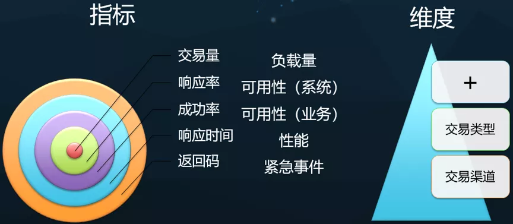
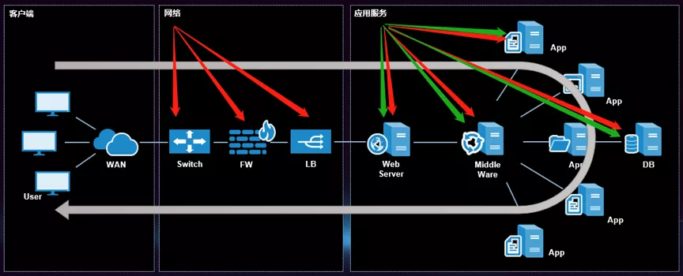

# NPM、APM、BPM，谁能真正实现全链路业务性能监控？

天旦Netis [运维帮](javascript:void(0);) *2020-06-19*

保障业务平稳运行，及时排除业务故障是应用运维部门的工作使命。某银行应用部门接到客户投诉，多位客户在使用APP转账时出现交易失败。问题在哪里？到底是网络有问题？还是转账系统有问题？还是安全方面有问题？为了看清转账交易整个流程每个环节的性能表现，以业务为中心、端到端部署的全链路性能监控需求由此产生。

 

随着AIOps的普及，性能监控领域的产品呈现井喷。有人说，网络性能监控产品也可以监测应用层性能？有人说agent流派的apm性能监控也能实现全链路？不同流派、不同说法提供了太多监控选择方案。那么，究竟哪种说法是实现全链路业务性能监控的优质方案？本文将选择三种最热的方案，进行分析对比。

 

## 方案一：用NPMD类产品做全链路业务性能监控

### 网络性能监控NPMD

在Gartner NPMD魔力象限报告中，是这样定义NPMD的：

NPMD工具允许IT运维通过网络数据来了解应用性能、网络以及基础设施组件的情况。同时，NPMD工具还可以深入了解终端用户体验的质量。部署NPMD产品的目的，不仅仅是对网络流量以及基础设施进行监测并提供针对宕机/运行不佳情况下的解决方案，还能够识别出性能优化的时机。这些功能是通过诊断、分析以及根本原因分析能力来实现的，进而对当今复杂的IT环境实现补充监测。

 

NPMD类的产品为网络部门专门设计，是专业的网络性能监控和分析产品，其监控的核心在网络运行质量，核心监控指标包括：TCP、UDP、SYN、RST、网络时延、应用响应时延等。NPMD类产品通过监测网络性能指标的稳定性，做到迅速判断故障是否发生在网络层面。因此，网络运维管理人员是NPMD类产品的主要使用者。

 

### 业务性能监控 BPM

业务性能监控类产品是为应用运维部门设计的，其核心使命在于帮助应用运维人员掌握业务应用的运行情况，一旦业务出现问题，能够快速定位分析故障，恢复生产。因此，他们不但需要了解应用性能指标，如：业务响应率、业务成功率、业务响应时间、返回码等；也需要更高层次地以业务为视角，掌握监控一些业务维度的指标，诸如业务量、交易金额等，并能区分交易类型与交易渠道等维度。这些指标往往需要从业务的网络节点与应用节点中钻取。

 

**NPMD类产品能不能做业务性能监控？不能。**

****

再高级的NPMD类产品都是为网络运维而设计的，不能用于专业的应用运维工作

 

NPMD类产品不能做业务性能监控的根本原因在于其核心使用者的定位错误。NPMD类产品为网络部门而设计，其使用者是网络运维工程师。尽管有些产品具备部分应用层分析能力，但其分析能力较弱，针对Http协议的分析，只能分析Uri、参数以及Headers，对部分强调安全性的Web站点来说，连业务类型都无法区分。对应用部门而言，这些对于网络运维的附加值无法满足业务视角的专业需求。

 

## 方案二：用APM类产品做全链路业务性能监控

 

### 传统应用性能监控APM

所谓APM，即Application Performance Management。从字面意思就可以看出，APM强调的是应用节点的性能管理和监控。说的简单点，就是更关注自有代码的性能。APM是可以提供业务指标的。APM的技术特点是以代理程序的方式来嵌入到自有代码的应用节点中，获得相关业务指标，这类方式即业内所说的Agent方式。由于需要嵌入到自有代码中，所以在一定程度上是要消耗性能的，同时要考虑系统的兼容性、稳定性，以及系统的支持程度。主流APM类产品以支持Java平台为主，C/C++平台需要定制开发，其他语言平台也存在不同程度定制的情况。APM除了能看到应用性能指标之外，还能看到代码之间的调用关系和调用时延，从开发角度具有更大的价值。

 **APM类产品能不能做全链路业务性能监控？不能。**

****

APM类产品拥有代码级的监控能力，但无法覆盖应用运维需要理解的网络节点

 

传统APM的监控覆盖范围包括业务层的应用节点，因此它可以提供部分业务指标，实现应用性能监控。然而，由于使用插码的方式，用APM监控部分业务会对系统产生影响。例如在银行业的双十一、证券的牛市、保险的开门红等超大业务量场景下，APM会占用系统资源，造成系统不稳定，APM自身监控能力会受到影响。因此，如果你仅关注应用层性能，且业务压力不大，传统APM类产品是个不错的可选方案。 

但从实现全链路性能监控的角度，由于传统APM类产品的监控无法覆盖网络节点，对于非自有代码，譬如业务线上的负载均衡，传统APM类产品不具备监控能力。 

 

## 方案三：用APM类+NPMD类产品做全链路业务性能监控

 

目前有部分监控厂商提出，可以用部署APM类产品搭配NPMD类产品实现全链路业务性能监控。让我们根据监控体系视图来探讨这种方案的可行性。

APM类+NPMD类产品，只有打通和关联网络与应用的监控指标才能实现全链路

 

上文提到，传统APM产品因其监控范围仅覆盖业务的应用节点，能够实现应用监控和代码监控，但无法产生网络指标。

 

网络性能监控NPMD，主要监控的是网络层面的性能指标，很难通过网络指标关联业务。譬如，我们通常用业务的UUID来对应一笔业务，而不能通过URI或TCP定义业务。

 

从理论上讲，如果能从NPMD类产品以及APM类产品各自监测的维度中找到互为交集的指标，就可以打通两者的监控视角。但依据市场上现有的技术与产品似乎暂且缺乏成熟的技术手段。因此，对于NPMD+APM可以实现全链路性能监控的说法，可落地性还不够成熟。

 

### 业务性能监控BPM

与传统APM以应用为中心不同，BPM是以业务为导向的性能监控流派。目前，主流的业务性能监控BPM产品通过旁路镜像技术采集网络流量进行性能监控与分析，可同时覆盖网络节点与应用节点，实现端到端的全链路业务性能监控。核心的监控指标包括：交易量、响应率、成功率、响应时间和返回码等业务指标，并可进一步区分业务的交易类型和交易渠道。

业务性能监控BPM的关注的指标

基于网络流量的BPM产品强调全报文解析能力，即可以完整查看请求数据（包含请求头、请求参数以及格式化后的请求体数据）和响应数据（包含响应头、响应参数以及格式化后的响应体数据），利用对业务的理解，对业务进行请求和响应的关联，实时洞察网络与应用的运行情况。基于网络流量的BPM产品关联网络与业务视角，拥有对业务运行全方位的监控视角因而被应用部门广泛使用。

基于网络流量的BPM可以关联网络与业务，实现真正的全链路业务性能监控

 

由于采用的是网络流量分析技术，BPM可以同时覆盖应用节点与网络节点，真正实现以业务为导向的全链路性能监控。无感知，无侵入，即刻落地，对业务无影响。如图所示，BPM覆盖的范围是网络节点和应用节点，通过分析节点前后流量，评估节点的时间消耗，进而评估全路径节点的业务性能，最终实现全链路业务性能监控。

红色代表BPM vs 绿色代表传统APM

 

**如果选择BPM，想要做好全链路业务性能监控，还需要做好哪些工作？**

简单来说，有两方面的工作必须落实到位：

一是业务流量的高质量导流；

二是对业务报文和互访关系的明确梳理。

**如上述两点落实到位，BPM是全链路业务性能监控的第一优选方案。**