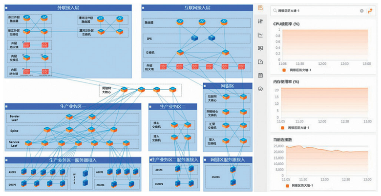
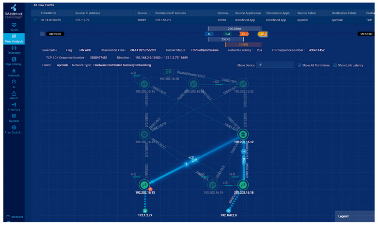
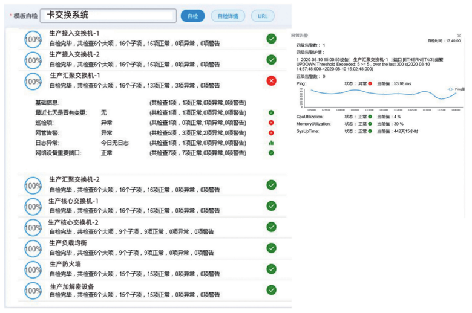

# 交通银行数据中心网络运维数字化转型探索

*已剪辑自: https://www.mpaypass.com.cn/news/202010/27114716.html*

交通银行数据中心自2006年成立至今，始终为交通银行提供高质量的IT服务，支撑着交通银行的业务范围从国内拓展到全球，经营模式从传统线下转向线下线上一体化。在这14年里，数据中心的网络规模不断扩大，从最初的单中心逐渐延伸到了三地四中心运营；使用的网络技术也从传统的交换路由、负载均衡、防火墙逐步发展到软件定义网络、网络服务虚拟化等各类新兴技术。如何高质量、高效率地运维庞杂的网络环境，已经成为网络运维人员的必答题。

2019年起，交通银行数据中心启动了智能数据中心建设，开启了运维工作智能化转型的序幕。在此背景下，网络部依托大数据、远程遥测等技术建成了网络运维数据中台，唤醒了海量的网络运维数据，并在此基础上结合自动化、可视化、智能化等运维手段和清单革命等先进的运维管理理念，迈出了网络运维的数字化转型之路。

## 运维转型始于数据

网络运维数字化转型的基础是建设网络运维数据中台，完成运维大数据治理。我们用两年时间进行了网络运维数据的梳理和分类，并根据各类网络运维数据的特点，针对性地搭建网络运维大数据平台，逐步完成了网络运维数据的治理工作。目前，网络运维数据分为网络资源与配置数据、性能数据、流量数据、日志数据和运维流程数据五类。数据中台已存有设备、专线、IP地址、域名等10类网络资源与配置数据84万余条，关联关系44万余条。同时，数据中台每分钟还接受性能、流量、日志等增量数据，平均每分钟入库性能数据2万余条，流量指标数据90万余条，运行日志数据200万条。此外，通过与数据中心配置管理数据库和流程平台的对接，各类应用、设备的配置数据和变更、事件等流程数据也能够实时进入数据中台。

在网络运维数据基座的有力支撑下，网络部已完成四大运维场景的数字化转型：一是将传统手工绘制的网络拓扑图升级到了网络拓扑可视化；二是将传统表格式的网络资源管理升级到了应用级的网络资源可视化；三是将传统的网络定点抓包分析升级到了应用级的网络流量可视化；四是将传统的经验式故障定位升级到了清单化的自动检查定位。这些场景的数字化转型帮助网络运维人员提高了网络运维管理的质效。

## 网络拓扑可视化

“每个公司都会有一个神一样的网络工程师，整个网络拓扑、每个IP网段、各个技术细节他都了然于胸，这个人不能休假，不能生病，更不能关机，否则一旦遇到复杂问题，其他人会手足无措。”这是一位网络运维老兵的感慨，也是所有运维工作者的心声。如何实现网络拓扑图的实时自动更新，如何使故障排查抢修不再仅仅依靠某个人或某几个人，如何使运维经验能够相互间有效传递？我们通过网络数据治理工作，理顺了网络资源相互间的关系，完成了网络区域拓扑可视化，解决了这个难题。同时，我们通过定期抓取和比对设备配置备份、表项等数据，实现了70%以上网络信息的自动化采集和关联，结合定期人工校验，确保了信息的准确性。网络拓扑可视化能够将复杂的网络架构模块化、层次化地展现给运维人员，帮助运维人员直观认知网络环境，快速洞悉运行状态。

## 应用视角的网络资源可视化

网络是一张四通八达的公路网，将各个计算、存储节点互联起来。当其承载的应用发生异常时，究竟涉及哪些网络节点，相互关联的其他IT资源又有哪些，状态及性能情况怎样，如何快速定位复杂的故障原因，运维人员往往无的放矢。2020年，我们理顺了网络资源与各类IT资源、应用节点间的关联关系，实现了应用级网络配置信息的直观展现。应用级可视化能够从应用的视角直观地展现应用节点与直连交换机的关联关系，应用使用的广域网线路、负载均衡、HTTPS加解密等各类网络资源，以及应用内部交互途经的网络设备等各类信息，如图1所示，是网络运维人员与系统、应用、设备等运维团队的沟通桥梁。特别在生产抢修场景中，应用级可视化能够帮助运维人员快速了解故障应用涉及的网络资源，针对性地组织排查，是提升排障质效的关键工具。

图1应用视角的网络资源可视化

## 化繁为简的网络流量可视化

一直以来，网络环境总是以一种“黑盒”形象出现在系统、应用等运维人员面前。流量分析数据量大、流量分析网络部署成本高、流量监控工具使用复杂，都是造成应用级流量分析难以落地的重要原因。然而，随着远程遥测、边缘智能等技术的不断发展，我们尝试逐步突破原有瓶颈,探索建设全网流量可视化工具。

交换机的封装远程端口镜像（ERSPAN）提供了一种折中的解决方案，该方案通过交换机直接将流量数据收敛至TCP链接级，虽然降低了一部分流量分析的颗粒度，但大大提升了流量分析实现的性价比。工具能够产生全网的TCP流量全景视图，展示数据流走向、时延等信息，如图2所示，帮助网络运维人员快速洞察全网服务质量，识别异常流量，辅助故障定界。

图2局域网流量链接级可视化

## 清单革命后的网络自动化检查

《清单革命》讲述了一个复杂任务如何细分拆解，并在短时间内通过团队协作精准完成的方法，作者是美国白宫顾问阿图·葛文德。显然，大型数据中心的应急抢修工作也属于这个范畴。根据清单革命的理念，结合网络运维数据中台、动态基线、日志频率识别等大数据和人工智能技术，网络部首先实现了各种网络资源的自动化检查。已实现的网络资源包括各种设备、线路、端口、域名、虚拟服务等10类。在此基础上，运维人员可以按照实际的排障场景，按需将网络资源排列组合为网络区域自检、应用系统关联网络资源自检等。在实际使用过程中，网络自动化检查模块能够在5分钟内完成一个网络区域或者一套应用系统所涉及网络资源的自动化检查，高亮显示运行状态、容量、日志等各类异常，如图3所示，帮助网络运维人员在紧急事件发生后快速找到疑似的故障点，提升排障效率。

图3应用系统相关网络资源的自动化检查

交通银行数据中心网络运维的数字化转型之路已经起步，可以预见，随着越来越多的应用场景将被挖掘、研发和部署。网络运维数字化转型的成果将会为数据中心业务系统的保障能力带来质的飞跃，支撑金融科技高速发展。

（本文作者皆就职于交通银行数据中心）

