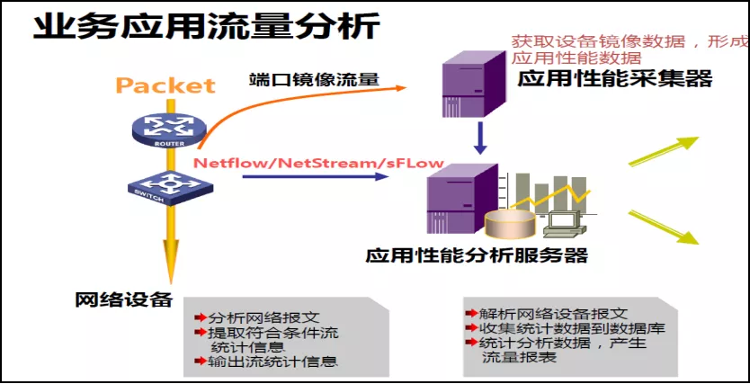
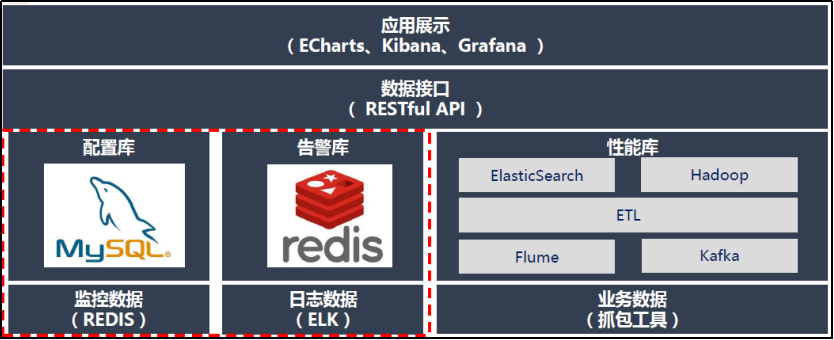
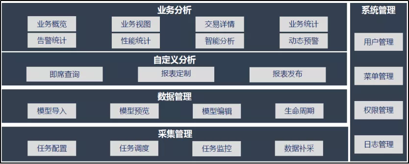
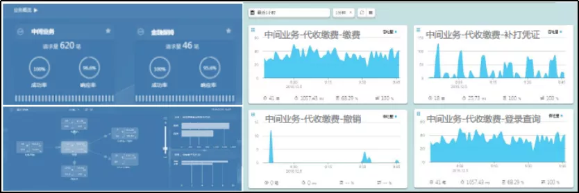
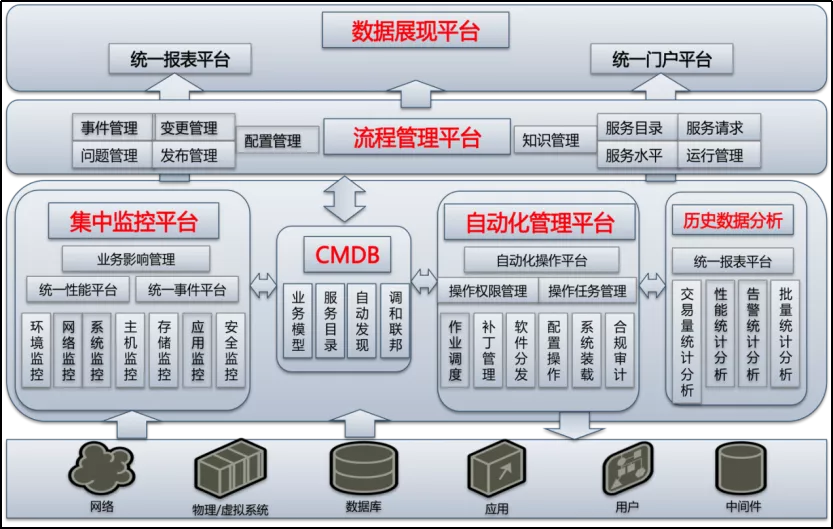

# 某农商银行IT智能运维一体化建设研究与实践

原创 twt社区 [twt企业IT社区](javascript:void(0);) *2021-10-25*

***【导读】**某农商银行不断学习借鉴前沿的运维管理技术理念，并结合银行信息科技发展现状，研究并实践出一条符合中小金融机构的智能运维一体化发展路线，并在此基础上不断实践完善。本文此进行了分享。*

***【作者】闪电麦坤** 银行系统架构师*

某农商银行高度重视信息化的建设与发展，不断引入新的信息科技技术和理念，逐步促进银行服务的形态和内容更新，在服务理念、经营模式等多个方面实现转型升级。伴随而来的是某农商银行科技信息系统规模的不断扩大，虚拟化、大数据、智能化等新技术的不断应用，导致IT运维管理的规模和复杂程度不断增加。为了提高某农商银行运维管理能力，增强运维管理效率，实现对信息科技系统运行的全方位管控，某农商银行不断学习借鉴前沿的运维管理技术理念，并结合银行信息科技发展现状，研究并实践出一条符合中小金融机构的智能运维一体化发展路线，并在此基础上不断实践完善。

## 建设背景

伴随着某农商银行信息科技的迅猛发展，早期分散式、粗粒度、低效率的IT运维管理模式已经难以满足现有规模大、多层级、全覆盖的运维管理需求，迫切需要通过管理和技术手段来提升运维能力。近年来提出的AIOps表达了智能运维一体化的先进理念，并在大型的金融和互联网机构形成了一些成功的应用案例，但是作为中小金融机构，从IT规模、人员配备、投资预算各方面都难以支撑商业大型一体化运维管理平台的实施与应用，所以某农商银行必须走一条符合自身条件、可行可控，并能够迭代发展的AIOps建设之路。

### （一）建设思路

1、流程驱动运维：借鉴ITIL运维流程标准，定制适合某农商银行实际的运维管理流程平台；

3、工具驱动运维：采用运维开发模式，实现运维任务的自动化、工具化、可视化；

3、数据驱动运维：基于大数据采集、存储、分析技术，对运维数据进行全面挖掘和分析，实现数据驱动运维；

4、平台驱动运维：通过建立统一运维平台，整合贯通CMDB、流程平台、监控平台、作业平台、数据分析处理平台，形成智能运维一体化解决方案。

### （二）实现路径

按照以上建设思路，结合某农商银行的实际情况，将智能运维一体化建设的实现路径划分为五个阶段的演进过程。

阶段一，可视化运维

通过对原有监控平台的基础功能发掘扩展，并结合**BPC（旁路式业务性能监控）**、Web拨测、统一日志分析审计系统等技术，实现监控平台全方位展示业务健康状态指标。

阶段二，标准化运维

制定体系化的运维管理制度、规范运维管理流程，并结合CMDB配置平台，实现资产和运维管理的标准化。

阶段三，自动化运维

采用自动化运维工具和统一作业平台，通过运维流程编排、自定义脚本开发，实现批量巡检、补丁升级、安全加固等不同场景的自动化维护。

阶段四，数字化运维

通过将所有运维和监控所采集的数据在大数据平台上进行转换、清洗和管理，实现数字化建模，用于支撑运维场景优化、故障原因分析和智能决策。

阶段五，统一运维管理平台

通过搭建统一运维管理平台，整合CMDB、流程平台、作业平台、大数据平台等组件功能，实现各个组件之间的数据共享和联动，最终实现智能运维一体化建设。

### 阶段一：运维可视化建设

运维可视化建设的总体目标，一是实现某农商银行科技信息系统运行状态的多维度展现，二是实现对业务系统故障的精确告警，三是实现运行数据的采集，同时提供接口为后期的大数据平台提供数据支撑。为实现上述目标，某农商银行采用了商用智能监控管理中心、开源监控平台、BPC旁路流量分析系统和日志分析审计系统相结合的方式。

#### （一）监控平台的实施及扩展

智能监控管理中心是下一代业务智能管理平台。它以统一的风格提供与网络、主机相关的各类管理、控制、监控功能，同时以开放的、组件化的架构向其承载业务提供分布式、分级式交互管理。智能监控管理中心是某农商银行进行网络和主机监控的统一平台。

某农商银行初期通过智能管理中心实现了对数据中心网络、主机的基础硬件、系统容量、性能等基础指标的监控和告警功能，但是针对业务系统、批量作业、应用日志的监控告警还需通过人工操作进行。为了实现可视化管理，并能够做到业务系统故障能够及时准确的在监控平台上统一展现，同时各项数据能够进行统一收集存储，某农商银行对智能管理中心进行了定制化改造，通过整合监控平台、应用系统日志、操作系统日志，并结合自定义脚本程序等方法，实现了对数据中心基础硬件环境和业务系统的统一监控管理。所有服务器操作系统采用Syslog协议将系统错误、应用告警、跑批告警信息等 E rror级别信息，通过监控脚本发送至I告警平台，Info级别信息，发送至日志审计。已知业务告警均为脚本触发，触发级别为3(Error)，经过和告警平台商定，根据大屏告警关键字为"JTGL"，实现所有告警都会被记录，并实现有关键字的告警会有额外提示。

#### （二）网络流量智能分析系统

通过智能管理中心，我们实现了对操作系统、数据库、中间件等IT基础环境的统一监控能力，但是无法通过应用系统的实际业务应用情况对事件进行判断和预警，为此我们引入了BPC产品来进行可视化管理的补充。

BPC（Business Performance Center）产品基于先进的协议解码技术，将网络真实数据作为客观实时的数据源，经处理后，呈现出高价值的业务可用数据源，BPC对网络真实数据的解读准确率可以达到100%，并自动发现业务访问与依赖关系。此外，还可应用于实时风险透视，大大强化了金融企业的风险检测能力。

某农商银行采取对数据中心核心网络节点实时流量进行镜像，将镜像流量导入BPC平台，并针对特定业务的交易数据流进行分析处理。实现对流量、应用、节点、会话四大类数十种预制报表的自动生成，并支持Netflow、Netstream、Sflow等多种性能数据格式。使用特定处理的数据能够建立告警基线，实现异常流量自动告警。并能够实现对故障原因的分析预判和准确定位。整体架构如下图所示：

#### （三）日志集中管理系统

各类网络设备、操作系统、数据库、中间件及应用系统日志的集中处理，能够准确分析 某农商银行IT系统的安全、性能、容量、及软件缺陷，并为优化改进提供可靠依据。为此某农商银行同时进行了日志分析系统的建设。通过采购日志分析审计设备，实现了对网络、主机及应用系统日志的统一收集分析，并能够以定制报表形式可视化输出。

通过一体化监控平台、BPC网络流量分析系统、日志分析审计系统的建设，某农商银行形成了立体的运维可视化系统。通过这些手段，目前已经能够做到系统故障的自动化精确告警，大大提高了运维管理效率，并形成了大量的运维数据，为后期的大数据平台提供了数据来源，为数字化运维奠定基础。

### 阶段二：标准化运维建设

为保障运维工作的质量和效率，应制定完善、切实可行的运维管理制度和规范，确定各项运维活动的标准流程和相关职责，使运维人员在制度和流程的规范和约束下协同操作。标准化运维建设的第一步就是建立起适合某农商银行实际运维情况的管理制度和规范，结合此规范进行运维流程的梳理和开发。

某农商银行在运维流程平台建立的过程中，充分借鉴了“ITIL v3”IT服务管理标准，结合 某农商银行IT系统现状和科技人员结构，对流程进行了定制改造，使之更符合某农商银行现阶段的运维管理需要。同时，为了使流程平台具有开放的定制能力和可扩展能力， 某农商银行基于JAVA框架进行了平台的自主开发，现已完成事件管理、变更管理、发布管理、资源环境管理、机房管理等基础流程开发，并在实际工作中得到了充分应用。

在完成流程平台建设的基础上，某农商银行进一步进行了配置管理平台的建设。通过长期的摸索和探讨，某农商银行定位CMDB主要提供两个核心能力的场景，一是自动化运维场景；二是数据化运维场景，这也是我们设计的面向应用的IT资源的核心框架。传统的CMDB往往都是面向资源和设备的，但是站在更高的视角来看，脱离了应用和业务，其实设备并没有独立存在的价值，所以在建设CMDB时，采用基于最底层的基础资源视角来向更上层的应用和业务进行建设。根据以上建设思路，某农商银行对各种配置管理产品和软件进行了评估测试，确定采用开源软件、自主定义资源模型、CI元素的方式进行CMDB建设，逐步建成一套核心IT资源图谱，能够和监控平台、流程平台、作业平台等进行联动，并能够资源自动发现、自动更新，最终成为整个IT运维基础平台的核心纽带，贯穿整个运维管理过程。

### 阶段三：自动化运维建设

对自动化运维体系的需求，是随着业务的增长、对运维效率和质量的要求不断提高而产生的。某农商银行前期服务器的安装、软件部署、服务发布和监控都是通过手动方式来完成的，需要运维人员登录到服务器上，一台一台去管理和维护。这种非并发的线性工作方式是制约效率的最大障碍。同时，因为手动的操作方式过于依赖运维人员的执行顺序和操作步骤，稍有不慎即可能导致服务器配置不一致，也就是同一组服务器的配置上出现差异。有时候，这种差异是很难直接检查出来的。随着业务的发展，服务器数量越来越多，某农商银行开始转向使用脚本工具。确实提升了效率和工程质量，但这个方式仍然有很多问题。第一是脚本的非标准化的问题。不同运维人员写的脚本在所用的编程语言、编码风格和健壮性方面存在巨大差异，同时这些脚本的版本管理也是一个挑战。第二是脚本的传承问题，人员的离职和工作交接，都会导致脚本无法很好地在运维人员之间传承和再利用。所以对构建自动化运维体系的要求变得越来越迫切。通过自动化运维体系来实现标准化和提高工程效率，是唯一正确的选择。某农商银行根据目前IT运维管理的主要工作内容，将自动化运维管理分成两部分，一是日常维护任务的自动化管理，二是数据备份恢复的自动化管理。

日常运维任务的自动化管理某农商银行选用Ansible自动化运维工具来实现，并配合 Ansible tower 图形管理工具进行可视化管理。Ansible基于Python开发，集合了众多运维工具（Puppet、Chef、Func、Fabric）的优点，实现了批量系统配置、批量程序部署、批量运行命令等功能。Ansible不需要在远程主机上安装Client/Agents，因为它们是基于SSH来和远程主机通讯的，所以它不会对生产系统带来任何安全和性能方面的影响，符合金融行业对系统安全稳定性的高要求。

目前某农商银行已经实现按照应用系统划分的自动化管理群组，根据不同应用系统的运维管理任务进行了自动化脚本编排，完成了从整体任务（自动化巡检、补丁更新、策略下发）到局部任务（应用系统定制脚本运行、批量检测）等多维度的自动化运维管理策略，大大提高了运维管理效率。

在自动化备份管理方面，某农商银行已经建立完成集中备份管理平台，通过集中备份管理软件实现数据库、应用程序、文件及操作系统的自动备份。同时，某农商银行通过脚本编排实现了自动化的数据库恢复演练场景，定期对数据库备份文件进行恢复测试，验证备份的有效性。

### 阶段四：数字化运维建设

数字化运维的目标是建立一个基于主流大数据架构的业务系统大数据分析平台。平台具备开放的采集和数据管理能力，将数据统一整合，支持数据的灵活展现和统计；同时，利用机器学习算法，依据大数据分析模型，实现业务系统告警的预测、安全事件分析、 交易量预测分析等场景。

基于九商现有环境，可从集中监控平台、BPC平台和日志分析系统收集全网业务系统数据，集中整合加工，建立业务系统大数据分析平台。建设目标为，一是提供业务概览、业务统计等展现功能支撑银行监督与决策；二是提供告警预测、交易预测等大数据分析能力辅助运维人员进行业务监控以及故障处理；三是提供用户管理、菜单管理、权限管理等系统功能支撑系统管理员进行系统的日常维护。

#### （一）技术架构

某农商银行数字化运维体系计划整体采用开源组件整合建设，基于Hadoop大数据系统，结合Kafka、ElasticSearch等组件形成整套的数据收集、整理、分析平台。实现以业务数据、监控数据为主，其它数据按需接入的可定制化数据分析系统。

#### （二）功能架构

数字化运维系统整体分为四层：

第一层为数据采集层：通过配置采集任务，对不同数据源的数据按照编排调度进行统一采集管理；

第二层为数据管理层：根据实际业务需求进行数据整理和建模；

第三层为自定义分析层：根据已整理的结构化和非结构化数据进行我报表定制和发布；

第四层为业务分析层：在此层将会根据某农商银行的实际业务需求进行各个维度和功能的展示和应用。

下图为某农商银行中间业务系统的业务数据分析展示情况：

### 阶段五：统一运维管理平台建设

在完成以上运维管理建设任务的基础上，下一个任务就是完成运维管理平台的建设。根据某农商银行科技信息系统发展的现状，平台建设的目标定位在一个能够整合现有运维管理工具，以CMDB作为底层支撑，各组件有机联动的中轻量级平台。最终目的是提供更清晰的运维管理流程和任务，更精准全面的监控手段，更智能的预警分析能力。

某农商银行统一运维管理平台功能架构将按照下图进行设计实施：

IT运维管理框架从逻辑结构上划分为五个平台和一个中心配置库，分别是数据展现平台，流程管理平台，集中监控平台，自动化管理平台，历史数据分析平台以及CMDB配置管理核心库。

1、监控平台：构建整个IT监控架构，兼顾网络、主机和业务系统，实现集中事件管理。

2、流程平台：整合并标准化运维的日常工作，将日常的工作规范，并透明化。

3、展现及报表平台：建设统一报表平台和统一门户平台将有效增强数据利用和展示效果。

4、自动化操作平台：完成对整个IT操作的集中管控和自动化。

5、统一报表平台：集中存放历史数据，提供后期统一分析及规划。

6、配置管理数据库：记录完整的、准确的IT环境中各组件的信息和彼此间的关联关系，作为唯一、可信的数据源，为周边系统提供支撑数据。

## 总结

在移动化、大数据、云计算、人工智能等新技术的推动下，IT技术架构悄然变迁，从传统“IOE架构”走向“互联网架构”。互联网架构所涉及的云计算、敏捷开放、微服务等元素成倍剧增，使得运维压力越来越大。这样的趋势下，运维管理模式从ITIL向DevOps演化，运维管理工具也发生了从ITOM、ITOA到AIOps的颠覆性变革。某农商银行科技团队将本着“科技驱动业务、科技驱动服务、科技驱动风控”的理念，兼顾历史与未来需求，满足运行稳定与敏捷发展需要，不断强化自身能力，向智能运维一体化方向不断努力，走出一条符合中小金融机构特色的运维管理之路。