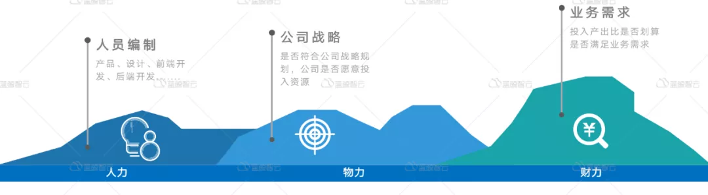

# 智能监控时代-监控建设之道

总是带来惊喜的 [蓝鲸](javascript:void(0);) *2021-06-15 17:00*

在正式阅读本文之前，我们先思考一个问题-几乎每个IT公司都有一套自己的运维监控系统，每家公司的运维都在做监控系统，而似乎每家都在面临一个问题，监控系统不好用，不能解决实际的监控问题，有没有更好的监控系统呢？答案是有的，本文将为您揭晓谜底。

什么是监控-凡事预则立不预则废

 

  运维曰：**监控，业务之大事，死生之地，存亡之道，不可不察也。**

  监控的建设，不亚于一场战争的准备，无论是使用监控的用户，还是建设监控的人员，都是面临着监控是否**好用、好使**的现实挑战。因此，我们必须充分认识并理解**监控**。

  **监控(Monitoring)**，顾名思义，一是**监测**，二是**控制**，重点在第一个字眼“**监**”上，即监测、预防的意思。在计算机运维领域，特指对目标状态进行数据采样，从而判断其运行状态的一种方式，通常我们会关注以下监控数据。

  在本文中，我们重点探讨后4种监控，因APM属于特定领域监控，此处不详细展开论述。那么，既然用户关心如此多的监控数据，如何建设符合业务需求的监控呢？是不是存在一款监控系统，就完全能够满足用户的监控需求呢？

监控建设的现状-千里之行始于足下

  

  监控平台的建设，是一个长期的过程，而非一蹴而就。总体而言，有四种玩法，一是**基于开源监控平台搭建**，二是**使用商业平台搭建**，三是**二次开发开源产品**，四是**完全自主研发**。而每种玩法，均有自己的特点和其局限。

  1.基于开源监控软件搭建监控平台，可选Nagios，Cacti，Ganglia，Zabbix，Graphite，Prometheus，TIGK(Telegraf、InfluxDB、Grafana、Kapacitor)等，通常只需要将开源软件部署起来，然后丰富采集数据即可。其特点是开源，社区解决方案众多，可以自由定制。

  2.基于商业软件搭建监控平台，在监控的商业领域，以前基本都是国外公司的天下，如IBM，HP，卓豪等，但随着本土基础设施厂商的崛起，国产厂商奋发图强，出现了一些优秀的商业监控软件，如云智慧，监控易，OneAPM等，以及一些专有场景的监控软件。其特点是只要花钱，就可以实现相应的监控服务，免去了监控构建的重复摸索，适合于监控场景较复杂，缺少人力，又急需监控解决方案的项目。

  3.基于开源软件二次开发搭建监控平台，开源软件本身具备完备的功能，如提供API，提供数据查询接口，可以通过API进行管控等，如基于Zabbix、Prometheus、Open-falcon等的二次开发，可以实现完备的监控功能和友好的管理功能。其特点是可以按需扩展监控采集源，按需集成，自由定制，不满足于已有软件提供的功能，可以按场景灵活定制，建议在“花钱买服务不能解决问题”的情况下而为之。

  4.基于自主研发，从零开始构建监控平台，这是一个庞大的工程，对技术和工程管理都是个不小的挑战。为何需要自主从头开始研发一个监控系统，原因可能有以下几个，1.市面监控软件无法满足其业务需求，功能上不够用，性能上不满足，管理上不足以支撑其业务和组织架构的发展；2.生态上无法满足业务发展需求；3.基于开源软件二次开发版权存在风险，受制于他人；4.业务需要，管理层支持，技术人员充足，天时地利人和均具备。其特点是开发周期长，目标期望与现实差距，开发速度和业务发展速度能否及时跟进，稍有不慎就有软件项目失控风险，考验的是项目管理水平和工程实现能力。

  从上面四种方式来看，其实现成本从低到高，从易到难，而具体采用什么方式，需要根据实际情况定夺，那么，主要取决于什么呢？人力、物力、财力，还和公司所处的阶段有密切关系。

  如公司刚起步，追求速度和成本，则花半天时间搭建一个开源监控系统，则不失为明智选择，具体选择哪款开源软件，则可以选择自己最熟悉的，使用人群最多的。而公司已初具规模，业务需求较多，选择商业监控软件和基于开源二次开发，则可以根据具体业务需求进行详细评估，规则是，花多少成本，换取多少收益，还需考虑收益是长期的，还是短期的。

  当公司发展到一定规模，其组织架构和业务需求，决定了软件架构需求，因此此时的监控系统，也必须具备这种能力，因此这个时候，建设基础设施不仅仅是业务需求和产品能力那问题，而是战略规划紧密关联的问题，所以选择完全自主开发，还是选择商业、开源优良产品二次开发，均是可选方向，取决于技术储备和组织的执行力,天时地利人和缺一不可。

  诚如“孙子曰：**凡用兵之法，驰车千驷，革车千乘，带甲十万，千里馈粮，则内外之费，宾客之用，胶漆之材，车甲之奉，日费千金，然后十万之师举矣**。”，对应监控的自主开发，需要项目，产品，设计，开发，测试，运维，运营等多种人员共同参与，然后历经数月，出demo，测试验证，经过一个又一个的迭代，然后十万服务器可监控之。自主开发耗费人力物力财力，犹如一场战争的准备，不可轻举妄动，要详细周密的规划方可行动。

监控建设的挑战-吾将上下而求索

  在第2节中，我们探讨了监控建设方案选型问题，那么，除了上面提到的问题，我们在建设过程中还会有哪些问题呢？

**1.系统关键指标缺失**

  监控建设从来都是一个持续的过程，没有一劳永逸的解决方案。在持续不断的监控运维中，我们不断去丰富和完善相关监控，常见的系统和应用层面的监控指标如下所示。

  从上图中我们可以看到，监控的具体使用用户对监控指标的采集是非常宽泛的，不管是市面哪款监控系统，其提供的默认监控指标，可能是无法满足实际的场景需求。随着监控系统的持续运营和业务不断发展，采集更多监控指标的需求会越来越迫切，因此，我们希望监控系统能够提供自由扩充和灵活定制的能力。

**2.功能扩展困难重重**

  在持续的监控系统建设过程中，我们根据实际需求不断地完善采集指标。因此，监控平台是不是原生支持多种采集方式，可能会限制我们能力的发挥，比如监控网络、存储等硬件设备，我们就必须使用SNMP协议来获取监控指标数据，这应该是平台自带的一个基本能力。如果还要我们自己去从零实现，就相当于写了一个小型的监控软件。因此，这个监控系统应该提供扩展能力，要么是代码开源，要么是接口开放，我们可以根据实际需求去扩展模块和组件，从而达到我们业务不断发展的需求。

  监控指标的不断扩充，指标数据需要存储的数据量也会越来越大，此时，对监控系统的QPS，就有非常高的要求。监控系统能否支持高并发的请求，直接就决定了这个监控系统能否使用。试想，如果一个监控系统三天两头出问题，那么用户可能就会流失，甚至是放弃这个监控系统的使用，转而去寻求更好的解决方案。

  监控用户的使用过程中，对监控平台的期望SLA可能是100%，而实际能达到的SLA可能是99.9%(每年停机约9小时)。随着业务和技术的不断发展，监控用户对监控系统的要求也越来越高，SLA能不能再继续提高呢？

  实际上，SLA的提高1个9，对系统的挑战都是非常大的，比如我们的架构是否支持，架构设计是否合理，架构有没有冗余，能不能支持水平横向扩容，存不存在单点故障，服务器资源是否足够，系统的并发是否是一条直线，等等众多的因素，直接决定了我们提供的监控系统SLA能否再继续提高。理想情况是，架构有冗余，当链路出现故障时，能够自动切换，能够有备机顶替；当容量出现不足时，能够加服务器就扩容，而能够自动负载均衡。

  所以，我们在设计监控系统的时候，一定要学习互联网架构中的高并发，高可用，分布式架构设计方案。此后，无论是增加功能模块，或者是系统的整体升级，有了架构上的保障，可以做到按需进行升级扩展，而不用担心系统可用性问题，升级变更扩展对用户都是无感知的。

**3.系统可靠性毫无保障**

  当监控的主机规模达到5000设备，1万设备的时候，一般监控系统会出现瓶颈，系统的QPS持续增长，能否支撑7*24小时、365天稳定运行，是一个非常大的挑战，可以说，监控系统从来都是一个高并发系统，同时，也是一个大数据库系统，比如日增5T，10T，50T的数据，并且要求详细历史数据，保存周期需要7天，30天，甚至是1年，而趋势数据(将历史数据进行归档，如按小时的max,min,avg存储)则要求保留1年，2年或者是更久，那么监控系统的数据可能达到PB数据级别，其数据处理之道，和海量的大数据处理系统，有异曲同工之妙，**采集->清洗->分析->入库->使用**。

  **数据上报延迟**，大致的原因有三个，一是采集器出现的问题，无法按照既定的周期采集到数据，或因原始数据不存在，或因采集器达到本身性能上限问题；二是监控系统的清洗，处理分析环节出现堵塞，表现为采集上报正常，数据未入库；三是数据处理后，不得正常入库，即为监控的数据库存在问题，表现为数据写入慢，查询慢，超过数据库的上限。这3种情况，不论是哪种情况，对用户来说，都是不可用的。

  **不误报，不漏报，不延迟**，这是对监控系统的基本要求。误报就是数据处理出现问题，让用户降低对监控的信任感，如果长期存在误报情况，那么用户就会失去对监控的信任，逐步抛弃此监控系统。漏报就是本该发出的告警而没有发送出来，这种情况就更严重了，严重影响了用户的正常使用，严重降低了用户的预期，宛如晚点的飞机，不能准时达到目的地。延迟就是告警现在产生，明天才收到，这个情况说明监控系统已处于不可用状态。在本该故障的时候，告警收不到，在故障结束时，告警发出来，用户会完全不信任这个监控系统。如果监控系统连告警这个基本事情都做不好，那么算不上一个合格的监控系统，用户会将这个监控系统当做一个噪音对待。

  当我们把数据上报，告警问题都解决后，系统能够正常工作，又会面临新的问题。用户反馈，能不能将告警做得更智能一点呢？试想一下，告警模块正常工作，用户每天收到1000条告警，甚至收到10000条告警，用户也会疯掉，这简直就是告警“轰炸机”，过多的告警，成为了噪音，干扰正常判断。因此，告警能否收敛的问题，成为了头等大事。

  **告警收敛**，是指将多条策略相同、目标范围不同的告警进行合并发送，按照一定的规则进行收敛的一种告警发送方式。比如，我们一个云区域的网络故障，会造成该区域下所有设备不可达，那么ping不可达告警，则会逐条发送，如果该区域下1000条机器，是发送1条告警好呢？还是1000条好呢？相信绝大多数正常人会只想接收1条重要告警即可。告警收敛，将告警极大提高告警的精确性，真正让我们做到运筹帷幄之中而不慌乱，不至于让我们天天神经紧张，天天处于狼来了的局面，因为过多的告警，有温水煮青蛙效应，让我们会逐步失去对告警的敏感度，逐渐会因为过多的告警而完全不关注告警。

  有了告警收敛，是不是就可以高枕无忧了呢？不，我们还需要故障关联 ，故障自动分析，为什么需要这个功能呢？试想，一个机架掉电，引起了15台设备全部宕机，从而引发了一系列故障，如API超时，HTTP拨测失败，DB连接数增长，那么能否找到root-cause呢？能否提供一条重要告警帮我们自动分析故障的根因呢？此时，故障关联和故障自动分析，显得格外重要。所以，监控系统，必须具备故障关联分析的能力，为我们的运维决策提供更准确的信息。

  此外，监控系统能否对当前环境的性能进行分析，对系统容量分析，也将是一个重要能力，如对趋势预测，什么时候我们应该对业务进行扩容服务器，什么时候应该进行缩容服务器，当前的性能是否足够，是否还有优化的空间。而监控系统，因为有数据存在，是完全可以提供这一系列数据作为重要依据的。

**4.技术落后于业务发展**

  随着业务不断发展，组织架构会根据业务形态进行调整，不同人员，需要对应不同的权限，需要划分更多角色，如超级管理员，分级管理员，普通管理员，普通用户，甚至于针对菜单按钮级别更细粒度权限管控需求。如果监控系统一开始没有考虑到这些需求，则很难应对业务的增长需求。随着业务的发展，公司为了降低成本，可以将一些常规事项外包出去，此时，对权限的分级控制显得格外重要。在这个时候，监控系统不再是一个孤立的系统，必须和统一用户登录认证系统集成，实现配置，查询分离，才能够满足组织的业务发展。

  随着业务不断发展，业务对监控系统提出了更高要求，比如要求“微秒级监控数据采样”，要求“秒级告警”，要求监控系统提供100%可靠信息，根据监控系统提供的系统容量指标数据，对业务应用的目标服务器、容器进行扩容或者缩容。监控系统作为一个底层依赖系统，此时将发挥更大价值。

监控建设的实践-纸上得来终觉浅

  在建设监控系统的时候，我们清楚以上的问题所在，那么，我们是如何解决以上这些问题的呢？下面，我们来详细看看具体的实践。

**1.降低使用门槛-开箱即用**

  对于服务器设备，系统初始化后，默认就安装了Agent，无需任何配置，就可以采集到主机监控数据，如在CMDB中配置了进程信息，则会采集进程状态数据。

  其中进程指标基本的如下所示

**2.和告警风暴说再见**

  当主机默认接入后，即可自动添加默认告警策略，如达到阈值，即可产生告警，如下所示，是一些默认告警策略。

  为了防止告警过多对用户造成干扰 ，我们使用了四大锦囊法宝，确保用户收到的告警是有效的。

  **锦囊一-告警收敛**。如下所示的事件中，可以看到收敛规则有效减少了告警事件收敛，产生的事件和通知比例1:100,甚至更高。从设计上原生支持的告警收敛功能，有效阻止了告警风暴产生。

  **锦囊二-告警抑制**。通常，由于用户不同的实际需求，会对同一告警内容配置不同的阈值。比如配置磁盘空间使用率告警，有80%预警，90%警告，95%严重，那么这3条策略如何工作呢？假如当前磁盘空间使用率已经达到96%，是产生3条告警通知吗？实际情况中，如果监控系统产生了3条告警，那这个监控系统就会被用户认为是智障了。所以，对于同纬度的策略，我们只会发送告警级别的告警，即只会产生95%严重级别的告警通知。

  **锦囊三-告警汇总**。既使我们的监控系统已经有了告警收敛，告警抑制这两大功能，我们依然不能解决同一时间发送大量告警问题，比如多条告警规则同时满足，那么还是可能产生告警洪水风暴问题。因此，对于告警汇总功能，实在是有必要。对于同一时候涌入的大量告警，对于同维度的告警进行汇总，对于不同策略，则进行合并告警。有了告警汇总功能，我们就可以放心接收告警了。

  **锦囊四-告警分析**。通过对历史告警数据的挖掘分析，我们还可以找到异常告警，以便更好的分析原始数据和告警阈值，从而为告警配置和无阈值告警提供更好的数据支撑。

**3.功能扩展容易-即插即用**

**4.用户权限控制-按需授权**

  按监控提供的功能进行查看和管理两种基本的划分，一般来说有如下几个用户场景：

- 告警通知的接收者：如运维，开发，测试，产品等。适用申请查看类和屏蔽类操作。
- 监控的配置者：如运维。适用于申请查看+管理类操作。
- 监控平台的管理者：适用于全局的功能。

**5.自动化筑基石-效率优先**

  有别于其他的监控系统，定义采集，直接在系统中就可以完成，无需使用其他第三方控制系统或者登录服务器部署。所有的配置都能够在界面上完成，包括插件编写，我们只需要打开页面制作插件即可。

   动态采集目标，当模块中的主机有增加或减少的时候，可以自动下发插件到目标机器，而无法人工部署采集插件。

  同理，告警策略中的目标范围也是自动匹配，而不用对新增加的主机或模块进行策略编辑，范围自动生效。

监控建设的总结-身经百战忆往昔

  在监控平台的建设过程中，经过不断实践，不断总结经验，监控平台建设的功能会逐步成熟，但是，如果只把监控平台当做核心目标来建设，会遇到非监控本身的问题，比如怎么将发布和监控结合，如何在发布期间屏蔽告警。如何让监控联动CMDB，怎么打通监控系统和运维自动化系统，怎么打通监控与流水线发布系统，怎么打通监控和运维的各个环节？这个问题，不是独立的一个监控系统能解决的，而是需要一个可扩展的可定制的运维平台才能解决的。

  回顾监控体系的建设，我们总结如下的经验：

1.确定目标，搞清楚需求，请不要盲目行动，仔细分析业务需求，然后选择相应的监控方案，指定清晰的业务需求规划和项目规划，弄清楚是需要一个烟囱式监控系统还是一个互通有无的运维平台体系。

2.尽量使用成熟稳定的开源平台，如考虑使用Zabbix、Pormetheus等，如果监控规模过大，可能会存在性能和其他使用方面问题。这里，笔者推荐选择使用蓝鲸[5]这样成熟稳定的平台，则可以很好的解决容量和性能问题，因为蓝鲸平台是天然支持海量并发场景，能够水平扩容，遇到了容量不够的问题，也只需要扩容对应的服务模块即可。

3.伴随着业务不断的发展和技术的不断迭代更新，监控系统也会不断优化总结，迭代更新。因此，没有一劳永逸的方案，只有不断的动态发展平衡。

4.要从软件设计者的角度去做监控系统，面对监控需求，从现象到本质去更好的满足使用场景，而不是仅仅作为一个工具，因为监控和运维是密切关联的，是需要从数据生产到消费，再到分析关联，为运维的目标-“提效、提质、提能"而添砖加瓦。

   因此，运维曰：**监控，业务之大事，死生之地，存亡之道，不可不察也**。

体验地址

**如需下载体验，可点击下方 监控日志套餐 下载按钮。**

**监控日志套餐需在基础套餐上运行。
**

**蓝鲸社区版V6.0.3正式版**

- 基础套餐：[点击下载](https://bk.tencent.com/download/)

- 监控日志套餐：[点击下载](https://bk.tencent.com/download/)

- 容器管理套餐**：**[点击下载](https://bk.tencent.com/download/)

- 持续集成套餐：敬请期待

  

**部署福利活动：**[点击跳转](https://bk.tencent.com/s-mart/community/question/2059)

 2021年运维开发挑战赛

点击上方图片参与报名，挑战万元大奖

**腾讯蓝鲸智云招募合作伙伴**

合作共赢，是腾讯文化中重要的一部分。腾讯蓝鲸智云团队计划在全国范围内，大力发展生态体系，寻找优质的合作伙伴，共创运维领域的新局面。我们希望为解决方案供应商、集成商、服务商、应用软件开发商、咨询机构等提供更多的增值服务。

招募详情，请点击访问腾讯蓝鲸智云官网：

[http://bk.tencent.com](http://bk.tencent.com/)

