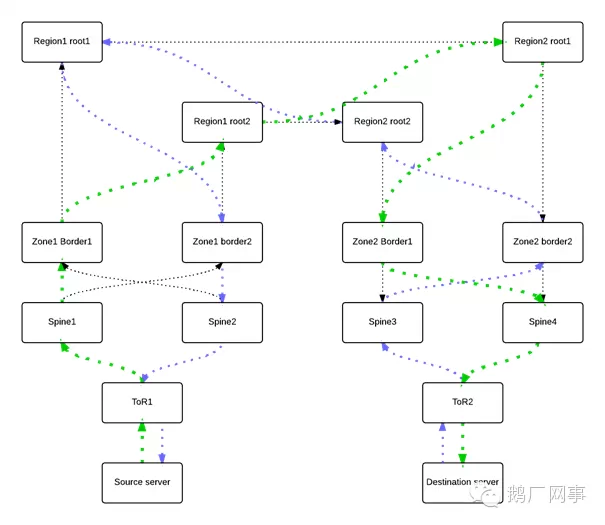

# 可视化网络路径探测HashTrace

丘子隽 [鹅厂网事](javascript:void(0);) *2014-11-23*

## 引子

长期以来，探究网络质量和探索网络路径是广大网络工作者监控网络的必备工作，ping用于探究网络质量和traceroute用于探索路径。对于探测结果似乎也不是那么靠谱——有很多人都有过经历业务有明显的网络方面影响，但ping和traceroute可能是OK的。这种网络问题的处理往往也是最令运营者头疼的地方，也许是到了寻找一个更佳工具的时候了。

## 挑战

作为内行，大家也都造现在的网络设计讲究双节点冗余保护——几乎每一过一个hop都有2台或2个以上的冗余节点，在路由上形成非常复杂的ECMP（假设端到端路径中有n个hop均是2台节点，那么端到端ECMP一共有2^n个），传统的ping和traceroute在这种场景中有几个缺陷：

- ping和traceroute的执行是命令行方式，返回结果也是命令行环境的字符串形式，解读起来不够直观，特别是traceroute需要一定的网络功底；

- 网络设备在ECMP转发时，由于不同链路转发延时的区别，如果对于一个会话的数据包在所有ECMP路径上轮询转发，会导致jitter，网络体验会非常差，所以网络设备会将每个会话的所有数据包都发往其中一条路径，会话和路径的确立是通过hash计算来完成的，每一次ping和traceroute都是一次会话，因此每次ping和traceroute都只能探测其中一条可能路径，其余路径是无法被探测到的，也许你想到了多次ping和traceroute，但依然不一定可以探测所有路径，traceroute的解读甚至有可能是环路或者伪路径，此外由于hash算法的核心是hash因子，包括5元组、3元组甚至1元组，每次执行ping和traceroute不能保证和业务会话的hash因子一致，因此一个很有可能的情况是ping和traceroute探测到的是路径1，并不是业务实际路径——路径2，这就是为什么业务有故障，而ping/traceroute是正常的根源；

- 网络通信是双向的，网络设备的hash在两个方向是独立计算的，因此一个很现实的结果就是一个A<->B会话在A->B方向选择的是路径1，在B->A方向可能是路径2，而ping和traceroute都是单向探测，如果需要双向探测，那就需要在两个方向分别执行ping和traceroute，如果需要探测双向路径质量，就需要在两个方向执行ping和traceroute，操作复杂；

- 只能探测L3链路，如果是存在前面几期提到的L2 ECMP或者MPLS TE隧道，traceroute无法反馈L2 ECMP结果和MPLS TE隧道信息，这些信息我们称为物理路径。

我们面临的挑战是，业务最需要的是一个执行1次、可以探测业务实际双向物理路径质量、输出直观的网络路径探测工具。

## 对策和方案

为了探测所有可能的ECMP，Paris Trace出现了，它可以发现并探测端到端的ECMP各个冗余节点。巴黎Trace的原理是将网络看做一个黑盒，通过不断调整traceroute会话中的hash因子以遍历转发路径上所有设备可能的hash结果。但巴黎Trace并不能很好地应对挑战：

- 它的输出依然是字符串方式的，还是很不直观；

- 它可以探测出所有路径，但并不能告诉我们业务实际路径是哪个；

- 它不具备ping的功能，也不能告诉我们反向路径是哪一条；

- 对于L2 ECMP场景和MPLS TE隧道也无法探测。

应该说巴黎Trace可能更适合在互联网上探测，因为网络细节不在我们掌握的互联网是一个黑盒。如果是在一个网络细节都在我们掌握的内部网络中，我们是不是可以做的更多呢？这就是我们今天要探讨的话题，在更加可知的内部网络中完成我们的挑战：业务只需要执行1次、双向实际物理路径图形化显示、双向实际物理路径质量报告——可视化网络路径探测HashTrace。原理也比较简单，内网拓扑是规划的，对于任意两点间的路径也是规划的，路由协议也是按照规划的方式计算任意两点间的路径，如果计算路径不在规划之内，那说明路由协议计算出了问题，可以使用上一期“网络自动化监控”的方法发现并修改，因此当路由协议计算结果符合规划的时候，我们可以将网络转发中更符合业务了解路径质量的信息挖掘出来。

图1：内网中从源到目的单向转发路径示意

如图1展示了一个Source到Destination在内部网络中的实际物理路径，包含ToR到Spine到园区边界再到区域根，绿色路径经过沿途各hop设备在多路径之间实际hash后的转发路径（Sping和Zone Border之间存在L2 ECMP，Zone1 Border和Zone2 Border之间是MPLS TE隧道）。这个图是手工绘制的，如果这个图能够让一个网管系统来自动、实时地画内网端到端路径，同时告诉大家每段链路的转发路径，这个系统就有点像电影中的场景了，就是HashTrace要实现的功能——一个多层画布叠加的网络状况显示系统：

1. 系统提供实时的输入界面，输入信息包括源和目的主机信息（可以是Host name和NIC name的组合，也可以是IP地址，一个管理良好的运维数据库是一定可以做到Host name-Nic Name与IP地址的双向查找的），应用信息（协议号，如TCP/UDP，及源端口、目的端口）；
2. 系统预先根据全网运行的LLDP协议发现全网拓扑，实现整个图的最底层的公共画布；
3. 第二层画布的绘制通过实时查找路由来完成，系统从源开始检查匹配目的IP地址的路由配置，查到只能匹配网关路由，而网关正好是ToR1，系统已经可以描绘出Source Server->ToR1这部分箭头图形了；
4. 第二层画布会继续沿着每一条路由的hop进行绘制，系统再从ToR1的路由表上检查匹配目的IP地址的路由，查到有2条等价ECMP了，next-hop分别是Spine1和Spine2，具体是选择Spine1还是Spine2呢？
5. 这就是第三层画布的工作——绘制hash后的实际路径，一直以来hash被认为实时性太强，是很难被网管的？这里要介绍一下神器——ToR厂商提供的hash函数，网管可以读取每一台设备所采用的hash算法（包括函数和因子，根据输入因子可以计算出选择第几个next-hop），HashTrace可以在后台模拟ToR1进行hash计算了，假设根据步骤1输入的5元组信息计算出来是选择了Spine1，系统可以画出第三层画布的绿色箭头，表示hash结果，hash结果可以通过sFLow/NetFlow检验；
6. 后面几个hop绘制工作基本相似，逐渐地系统绘制到了ToR2，系统在ToR2上查到匹配目的IP的路由是类型是direct或connected，恭喜系统，系统可以准备跳出这个循环了，再检查目的IP对应的ARP条目、MAC地址表，找到物理端口，和目的主机保存在数据库中的信息比对一下，至此HashTrace绘制出了一条端到端单向的地图——包括各hop节点信息、候选ECMP信息、实际转发信息；
7. 在第三层画布绘制过程中涉及到了hash，路由hash的结果出了可以得到具体的next-hop和egress port（转发出方向端口），假如egress port是LACP形成的虚拟聚合端口，此时又涉及到L2 ECMP，需要再次利用设备上L2 hash函数计算L2 ECMP结果，可以得到新的egress port不再是虚拟聚合端口，而是物理端口，此时就可以不用继续hash计算了，还有一种情况是路由hash结果egress port是MPLS TE隧道端口1（通过PCEP控制器根据全局信息计算所得），此时HashTrace就会向PCEP控制器所要MPLS TE隧道端口1的底层物理转发路径，这就是HashTrace得到物理转发路径的方法；
8. 前面7个步骤都是用于描绘转发物理路径，确定物理路径上的每一条链路，端到端转发质量也变得唾手可得，我们将ping探测端到端转发质量的问题化解为探测每段链路的质量，对于每条物理链路利用率、丢包统计、延时信息，当前的网管都是可以获得的，HashTrace将这些信息转化成流量箭头的粗细，用于提示哪段路径可能是重载，哪段可能是轻载的，从而得出端到端转发路径的质量，运营同事可以根据直观的图示判断哪条链路最有可能是丢包的元凶。

这个系统全程会展示每hop设备的device name，ingress/egress Port Name，以及Port的IP地址。双向路径显示是HashTrace的一大特色，只需要在系统中将source/destination信息对换一下，就可以找到反向路径，如图2所示，蓝色为反向路径，绿色为正向路径：

图2：HashTrace可以同时绘制出双向转发路径

HashTrace并不是替代巴黎Trace，HashTrace的适应场景主要在于可控的内网，而巴黎Trace可以探测任何网络特别是互联网的链路质量，尽管结果不是那么直观，巴黎Trace在内网也可以利用HashTrace的结果更有针对性。

## 意义

HashTrace实际上展示了利用现有网管系统能够获取的信息，稍作处理，可以挖掘出帮助运维的好工具，甚至可以帮助我们调整不同hop设备上的hash算法，以实现更佳的业务体验。继上一篇“从MH370看网络自动化监控”，HashTrace离网络用户更近，用户可以简单操作、清晰掌握其流量在内网的运行状况和质量，甚至可以根据这种流量做业务模型调优，减少对高峰期网络带宽的占用等等有意思的事情，这套系统也可以和DWDM网管结合，查看更为底层的光传输质量，总之，当前的网管可挖掘的地方还有很多，鹅厂期待与您携手。