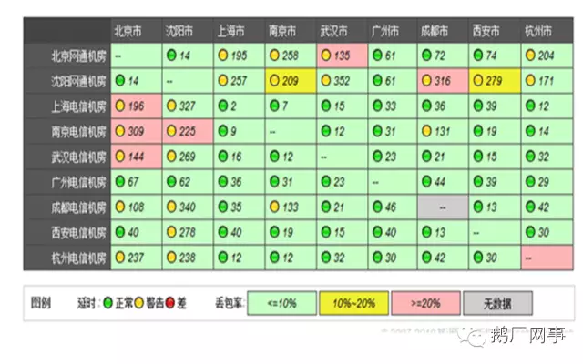
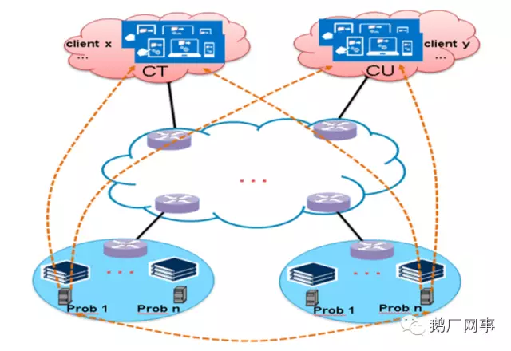
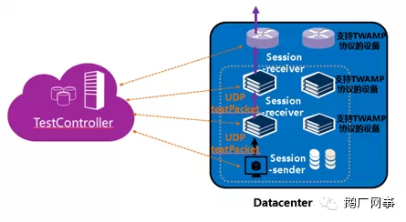
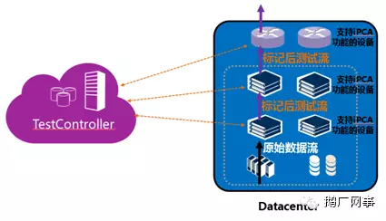

# 浅谈端到端质量检测和故障诊断

何维兵 [鹅厂网事](javascript:void(0);) *2015-01-10*

“鹅厂网事”由深圳市腾讯计算机系统有限公司技术工程事业群网络平台部运营，我们希望与业界各位志同道合的伙伴交流切磋最新的网络、服务器行业动态信息，同时分享腾讯在网络与服务器领域，规划、运营、研发、服务等层面的实战干货，期待与您的共同成长。
网络平台部以构建敏捷、弹性、低成本的业界领先海量互联网云计算服务平台，为支撑腾讯公司业务持续发展，为业务建立竞争优势、构建行业健康生态而持续贡献价值！

------

> 小编：常常听到业务同学和小网工在网络的丢包上面你来我往，业务同学表示万分之三的丢包不能接受，小网工摸着胸口说，这个世界上不丢包的网络是不存在的，眼中闪着晶莹。那么我们如何走在业务的前面，提前就更好的监控有关网络的质量呢，今天就请到了wayne同学，和大家分享一下，有关网络质量检测的故事。

某日，网工小A接到业务运维小B申告其某某业务连接成功率指标下降，询问网络侧是否正常呢？小A通常是一顿狂ping海trace，N久后毫无底气的得出结论：我测试ping正常哦，貌似没有问题；随后反问：业务侧是否正常呢？然后，小B晕倒，卒！

此情此景，各位网络管理员是否感触甚深，恰如“**锄禾日当午，不如运维苦；丢了3个包，一查一下午**”呢！

随着互联时代的飞速发展，互联网公司各种业务层出不穷，相对应的基础网络也呈现出规模越来越大、结构越来越复杂的现象。如此复杂的网络环境和业务逻辑之下，当端到端的用户业务体验异常出现时，运维人员很难在短时间内快速判断是业务系统的问题，还是基础网络引起的问题，更不用说快速定位具体的问题及原因了。如何主动监控端到端业务质量情况，准确掌握一条特定业务流的全路径转发情况以实现端到端网络故障的快速精准诊断，已经成为当前广大运维人员面临的首要难题，也是当今网络运维领域急需解决的问题。

谈到端到端的问题，是一个很宽泛的话题，涉及应用程序、服务器、网络设备，路径冗长，不同的人对这个话题也有不同的解读。本文将从网络设备的视角，结合当前业界的一些技术，谈一下个人对端到端质量监控和故障诊断的一些浅见，不妥之处还请海涵。

## 当前的主流做法

当前比较容易实现的端到端测试的主要方法是，基于探针的测试，即在服务器侧和用户侧部署探针，探针之间进行ping测，或进行特定的应用连接测试，结果上报至服务器进行分析统计；市场上也有类似这样的专业第三方提供专业的质量测试服务；如下图：

但这种方法有很大的局限性，一方面只能基于固定的探测对象，探测基数有限，无法模拟真实的故障用户；另一方面，对于网络来说透明，无法判别网络上各个节点、各条链路的质量情况；再次，这种方案仅能实现质量监控，无法提供准确的诊断辅助功能；

## 业界的一些新尝试

为解决上述问题，业界也在不断尝试一些新的解决方案。IETF 制定的TWAMP (RFC5357，A Two-Way Active Measurement Protocol)和OWAMP(RFC4656，A One-way Active Measurement Protocol )，以及华为公司提出的iPCA(网络包守恒算法，Packet Conservation Algorithmfor Internet) 就是其中的代表。

### TWAMP 解决方案

IETF制定的TWAMP协议，定义了两组协议：一组用于建立性能测试会话，叫做TWAMP控制协议，用于协商和启动性能测量会话；另一组为测试协议，用于性能测试UDP流量的传送和接收。其核心思路就是在测试的源端发送携带seq及timestamp的UDP测试包，通过分析接收端收到的报文的seq、timestamp来评估对应端到端路径上的丢包、时延等网络质量。

这个思路是不是跟我们平时故障处理过程中使用的分析抓包文件中的数据流很相像呢？其原理图如下：

去年某大型移动通讯设备供应商即基于TWAMP协议，在其IP网络与RAN移动网络产品线中开发了IPPM功能。然而，此方案在实际部署中需要网络设备在软件上支持，另外测试对象也相对固定和单一，对于多路径的全程监测也存在一定难度。

### 2.iPCA解决方案

iPCA(Packet ConservationAlgorithm for Internet，网络包守恒算法)是华为公司提出的一种基于直接测量方式检测网络质量状况的管道监控和诊断技术。它包括两部分：测量控制服务器和敏捷交换机。测量控制服务器接收用户对目标业务流进行质量检测的请求，通知敏捷交换机进行检测，收集各个敏捷交换机的统计信息，计算并形成报告。

其核心思路就是利用IPv4报文头中至今唯一保留的Flags字段的第0位，对目标业务流进行染色标记，然后借助专用的硬件在各个连接点上对标记的数据包进行分析，从而得出数据包在各个连接点上的质量情况，如是否丢了包等。这个思路是否和我们平时在设备上各个端口做基于acl的流统计相似呢？

其原理图如下：

近期，某设备供应商已在其企业级解决方案中引入了iPCA技术。由于其具备灵活的编程能力，可以对任意自定义的业务流进行跟踪、监控，对故障的诊断也能做到一目了然，精确到点。其应用前景还是比较可观的，唯一的问题是该技术目前没有形成标准，在兼容性以及数据中心级大规模环境中的应用上都有待完善。

## 未来的发展方向

上述两种解决方案，都借鉴了一些SDN的集中控制、分布处理的思路，一定程度上解决了端到端质量监控分析和故障诊断的部分问题。但都需要对现有网络进行较大的改造，实施成本相对较大；同时在灵活性、扩展性、兼容性上也都存在不少缺陷，网络维护者喝着咖啡处理故障的愿望似乎又渺茫了！

万能的SDN能否给我们带来希望呢？个人的答案是：可以有。理由是OpenFlow中引入了流表的counter计数功能，只要我们基于转发路径上各个设备的counter计数，在controller上开发出相应的flow的定制、跟踪、分析功能，就能在端到端的全路径上看到完整的flow的转发情况，从而在故障时快速做出准确的故障诊断。下图为流转发表中某一个特定流的主要字段信息：

| Match Fields | Priority | Counters | Instructions | Timeouts | Cookie | Flags |
| ------------ | -------- | -------- | ------------ | -------- | ------ | ----- |
|              |          |          |              |          |        |       |

当前各大互联网巨头已纷纷开始实践各自的SDN网络，但对于SDN网络的运营管理，仍然有较大的探索空间，这里也欢迎业界对此话题有兴趣的朋友与我们互动交流。我们相信，随着SDN真正的规模应用一步一步临近，彻底解放运维人员的日子也终将来临，我们期待着那一天的早日到来！

> 小编：Wayne同学不仅讲述了网络质量检测的前世今生，还对未来进行了展望，到这里，小编终于可以帮小网工同学擦擦泪水，看，前面多么的光明，奔跑吧，少年！BTW，同学们快给文章投个票吧。