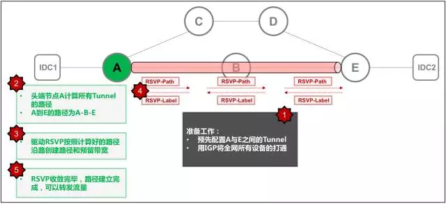

# 「科技·TEG」无人驾驶的智能网络 - 腾讯智能广域网发展背后的故事

terranhuang [腾讯TEG科技云端](javascript:void(0);) *2017-07-04*

## 背景

腾讯是一个业务类型非常丰富的互联网公司，这些业务部署在全球不同地理位置的几十个数据中心里面，有一张专用的广域网将这些数据中心互联起来以提供长途带宽服务，**我们称这张广域网为DCI（Data Center Interconnect），本文将以技术视角简述腾讯广域网这些年的发展。**

图一：广域网示意图

广域网以一个城市为一个网络节点，每个节点由若干网络设备（路由器/交换机）组成，节点之间通过长途专线连接起来，上层是控制系统与监控平台。所以，由设备、链路、控制系统、监控平台这四大组件构成了完整的广域网系统，以承载跨地域数据中心间的流量。

## 第一代广域网 — 起步阶段

十多年前，腾讯开始在多个城市建设数据中心，也开始搭建多数据中心间互通的广域网（DCI），称之为第一代广域网。当时的网络场景和架构都比较简单，只需要将几个地方的数据中心通过运营商提供的长途专线连接起来即可。我们使用最传统的商用路由器搭建了一张IP网络，通过BGP协议传递路由，从而打通数据中心间的流量。

 第一代广域网在网络技术应用上也非常简单，控制流量走向使用的最传统的SPF（最短路径优先）的算法，我们把从运营商租赁来的不同的专线根据带宽、时延等因素设置不同的开销值，流量发起点根据对网络拓扑的掌控情况，把去往相同目的地的所有流量按照一样的规则统一发送到开销最小的链路上，并且没有任何SLA，只做尽力而为的转发。

 

随着业务的发展，这张广域网的规模和流量快速增长，我们在运营这张网络的过程中，也遇到越来越大的挑战，主要集中在以下几个方面：

1. 对网络拥塞显得无能为力，由于IP网络是一个Best-effort特点的网络，面对部分链路拥塞，并没有能力通过技术手段来调度流量去减缓拥塞。
2. 对所有业务一视同仁，没有精细化、差异化的服务，当故障和拥塞发生时，一损俱损，随机丢包。

3. 网络整体利用率很难优化，经常出现某些链路长期高负载甚至拥塞，有些链路长期闲置。这个非常具有讽刺意味，明明有闲置的链路资源，却无法帮助那些繁忙的链路来承载部分流量压力。
4. 随着网络节点越来越多，网络结构的规划难度越来越大，导致运营复杂度越来越高。

面对这些挑战，我们意识到原来的老路已经很难走下去了，我们必须使用新的方法来解决这些问题。

## 第二代广域网 — 分布式流量工程时代

在2011年前后，面对广域网运营中的诸多挑战和新型业务（开放平台等）的新诉求，我们开始构建腾讯的第二代广域网。在设计这张网络的时候，我们定下了三个关键目标：

1. **多业务承载能力**：这张广域网需要具备同时承载不同类型业务的能力，在一张物理广域网上面可以虚拟出多张虚拟网络，给不同业务同时提供流量调度服务且完全隔离。在投入使用初期，该网络承载了自营业务、开放平台业务、企业IT业务等，而在共有云业务蓬勃发展的今天，也已经为越来越多的我们公有云上的客户提供VPC Peer等网络服务。
2. **差异化服务能力**：这张广域网要有能力识别不同重要级别的流量，并针对这些流量提供差异化的服务，我们将流量分为金、银、铜三个等级，不同等级的流量会获得不同级别的服务，包括时延、质量、拥塞情况下的保障服务等，同时进行差异化的成本核算，协助业务根据自身应用逻辑上的特点更好的去使用广域网资源。
3. **流量自动化调度能力**：这张广域网需要动态感知到每条广域链路上的流量负载情况，并根据提前设定好的调度策略实时调度流量路径，避免网络拥塞，即把所有广域链路当成一整个资源池，有能力让闲置链路去帮助繁忙链路承担部分压力。当然，往往闲置链路都是开销比较大的链路，哪些流量可以调度到这些链路上来承载，这跟流量等级和差异化服务是强相关的。我们需要制定严密的调度策略，保证高等级流量永远可以获取质量更好的服务。

 

为了到达上述业务目标，我们经过了较长时间的论证和测试，最终选定了MPLS TE（Multi-Protocol Label Switching Traffic Engineering）这套技术体系。MPLS TE解决了传统网络的诸多问题和弊端，提供了更灵活与智能的流量调度能力，使其技术本身非常复杂。当时在国内是大规模广域网上的首例应用，勇敢的迈出这一步，也承担了非常大的压力，但回过头来看，可以称之为腾讯智能广域网的第一步，为后面的演进做了重要的积累。

图二：MPLS TE技术体系

MPLS TE技术体系一改上一代传统IP网络的“Hop-by-Hop”与“Best-Effort”转发模式，采用“Source-Routing”与“SLA-Oriented”的模式，使网络可以实时感知到流量负载并自动调度，这其中的差异重点描述如下：

**1.“Hop-by-Hop”与“Source-Routing”：**传统IP网络转发数据包的时候，都是根据目的IP进行Hop-by-Hop的转发，每一跳的网络节点都是自行决定数据包转发到哪条链路上，目的仅仅是保证可达性，当网络和流量模型复杂到一定程度的时候，整体上的流量组织是无序的，且较难管理。MPLS TE网络的“Source-Routing”的特点，使流量的起始端（需求者）根据网络的拓扑和资源占用情况一开始就决定流量路径需要经过哪些节点和链路，并通过信令协议RSVP沿着已经计算好路径建立转发隧道并沿途预留带宽资源，这个机制就把复杂网络中所有节点各自为政的转发模式，转变成由需求驱动的一组端到端转发路径（MPLS隧道）的集合，并且这些路径的管理性是非常便捷的。

**2.“Best-Effort”与 “SLA-Oriented”：**传统IP网络的每一跳网络节点，都会根据IP路由表尽力而为的转发流量，而从来不会考虑各个链路是否能够承受这么多的流量，所以当流量大小超过链路带宽时，只有丢包，所以称之为“Best-Effort”。MPLS TE网络，由于已经把所有转发需求抽象成端到端的一条条隧道，这些隧道的建立过程本身就是SLA的建立过程。每条隧道都有自己的带宽需求，在创建的时候，都会考虑沿途的节点和链路的剩余资源是否能满足这个带宽需求，如果可以满足则路径创建成功，如果不能满足则会选择其他路径，所以这个“SLA-Oriented”机制就保证了全网所有用于承载流量的隧道最终都可以获得自己需要的带宽，而不再是甩锅式的把同一个目的地的流量一股脑的全部丢给最近的下一跳，也不考虑是否会发生拥塞。

 

MPLS TE的技术应用让广域网可以感知到流量需求和负载情况，很大程度提高的整网利用率，以及保证在故障场景下，将繁忙链路上的流量自动迁移到相对空闲的链路上。但是，广域链路永远都是昂贵且稀缺的资源，在流量爆发式增长的大背景下，扩容速度总是跟不上流量增长速度，使得很多链路长期处于热点的状态。面对这个挑战，我们采用了将流量分类，并提供差异化的服务，当网络故障导致拥塞的时候，可以保证重点流量仍然保留在最优的路径上转发，非重点流量被调整到绕行链路上。这个基于差异化服务的调度策略如下：

图三：MPLS TE差异化服务与流量调度

1.我们将整网流量分为“金”、“银”、“铜”三个级别，并用IP/MPLS报文头内的特殊字段进行标识，业务调用我们提供的API在数据中心网络内给不同流量进行自动打标，以便当这些流量送到广域网上的时候，可以被识别出来是什么级别的流量。

\2. 在广域网，任意两个有通信需求的节点之间，都会创建3种类型的隧道，即“金隧道”、“银隧道”、“铜隧道”，用于承载不同标记的流量，并且每种类型的隧道都创建了等价的4条（两点之间一共12条隧道），金流量在4条金隧道内做负载均衡的转发，即每条金隧道承载1/4的金流量，银和铜流量也同理。

\3. 这任意两点间的12条隧道的路径，都是由头端节点（流量发起端）来计算并且创建的，带宽充足的情况下，这12条隧道都会走最短路径。当出现流量突发或部分链路故障等情况，原有路径的带宽不足以承载12条隧道的全部流量的时候，头端节点可以感知到这个变化，并通过重新计算这12条隧道的路径，将流量搬离热点链路，并且每种级别流量的搬迁颗粒度都是1/4。

 

小节一下，第二代广域网于6~7年前在国内首创采用大规模End-to-End MPLS TE技术，提供了“多业务承载”、“差异化服务”、“精细化调度”等诸多核心能力，为公司这些年的高速增长在基础架构环节做出了重要贡献。我们几年前落地的这个广域网能力，放到几年后的今天，也是在国内同行位于领先位置的，这个主要源于大胆的创新和试错精神。End-to-End MPLS TE应属当代网络界复杂度最高的技术体系，导致国内很少有大规模商用，网络设计者大都会认为这个技术体系太复杂，大规模部署会遇到很多问题，故很少会去尝试。所以，破除刻板印象显得尤为重要，我们用实践和历史证明了再复杂的技术都可能被处理的很好，从而迸发出惊人的能力。

## 第三代广域网 — 集中控制的无人驾驶时代

虽然第二代广域网行业领先且给业务带来非凡的价值，但我们并没有停止思考后续的优化和演进策略。随着广域流量的持续大规模增长、网络行业技术趋势的发展、网络运营经验的积累，我们很快又找到了新的挑战和发力点。在2013年前后，我们开始着手第三代广域网的设计研发工作，需要解决的挑战点如下：

**1.全局最优：**网络中所有隧道的路径，都是由头端节点根据自己的需求计算出来，然后通过RSVP协议去沿路抢占带宽资源，而不会关心其他节点发起的隧道是否有资源可用，整网的带宽资源遵循“先到先得”的规则进行分配。所以，针对每个头端节点，可以做到本地发起的隧道是在全网剩余资源条件下的最优，但站在全局的角度，很难达到全网整体利用率最优。如图四，头端节点分布式计算路径，A-D计算的路径为A-B-D，已经占用了沿途绝大部分带宽，导致A-B与B-D无法申请到带宽，只因没有全局视野；如果具备全局视野，可以将A-D的路径调整到A-C-D，这样可以满足所有需求。

图四：分布式路径计算的缺陷

**2. 成本与容量：**第二代广域网使用MPLS TE技术体系来达到业务目标，这套复杂的技术体系无论在控制平面还是转发平面对商用大型路由器的依赖都非常高，而路由器无论是在每比特成本的控制和容量提升的演进方面，都很难满足我们流量增长的趋势。

面对以上两个挑战，我们引入了SDN（Software Defined Network）的思路来解决问题：

1. 取消各个头端节点计算隧道路径的权限，全网的路径计算工作由一套上层系统（SDN Controller）来统一完成，Controller将计算好的路径分布式的下发给各个头端节点，以达到全局最优。

2. 取消RSVP信令协议抢占资源建立路径的机制，在转发平面采用Segment Routing的转发模式，控制器将路径信息转化成“Label Stack”下发给头端节点，头端节点将 “Label Stack”封装在数据包外层发送出去，沿途各个节点仅根据“Label Stack” 做“傻瓜式”转发。

3. 整体演进思路上，都是将原来路由器上复杂的协议栈和功能抽离出来，上收到上层软件平台，一方面降低对路由器的要求以控制成本和选择更简单更大容量的设备，另一方面以全局视角整体审视网络负载情况进行全局优化。

 

第三代广域网SDN体系架构基本的工作原理，可通过下图中的例子进行说明，流程如下：

图五：广域网Segment Routing转发模式

1. Controller通过网络节点（路由器）提供的API将全网的拓扑信息上收，并通过预先设定好的规则，给全网的每一条链路都分配一个唯一的Label，并把这个Label的信配置在所有节点上。如图五，各条链路获得的Label值为10001~10006。
2. Controller同时从网络节点把整网的流量负载信息全量上收，根据核心算法和调度策略进行全网路径的集中计算，保证所有流量都有足够的带宽，并能达到全网整体利用率的最优。

3. Controller计算出A到E的金、银、铜三种路径分别为A-E、A-B-E、A-C-D-E，并且自动翻译成Label Stack下发给节点A。节点A根据控制器下发的Label Stack生成本地金、银、铜路径的转发表项以承载流量。
4. 以A到E的铜牌流量转发为例：

   1. 流量送到A上之后，A识别出是铜流量，则会将报文头部封装一个Label Stack（10004、10005、10006），并发往C；
   2. C收到后，Pop最外层Label 10004，看到第二层Label 10005，转发给D；
   3. D收到后，Pop最外层Label 10005，看到第三层Label 10006，转发给E；

   4. E收到后，Pop最外层Label 10006，完成全路径的的转发，将最原始的IP报文转发给下游网络。
5. 5.可以从上面的工作原来看出，这一整套SDN技术体系大幅度简化了网络节点的复杂度，使网络节点不需要计算、不需要通过复杂的协议进行协商、不需要构建复杂的转发表项，尤其是中间节点完全不需要感知任何跟IP业务相关的内容，看到所有数据包都只做一个Pop Label再根据下一层Label转发出去的简单动作。

图六：广域网SDN体系结构

通过SDN技术架构，我们开始将这些由路由器组成的网络节点慢慢替换成容量更大、成本更低、逻辑更简单的硬件设备，把控制平面全部上收到Controller，在保证容量可持续性发展的同时，也能够更容易的对Controller上的核心算法、新特性、调度策略进行快速迭代和演进。

## 总结

用汽车导航来做一个类比式的总结：

- **第一代广域网：**最早的汽车导航（或早期非智能导航）时代，导航拥有本地静态地图，按照最短路径优先的原则，输出路径仅保证可达性，从不考虑交通拥堵、红绿灯、限行等情况。
- **第二代广域网：**互联网导航时代，开始可以通过互联网的能力感知到交通流量负载情况，并可以综合考虑诸多因素（高速优先、距离最短、时间最短、红绿灯最少等）进行计算选路，极大的优化了人们的出行体验。但各大导航自行计算、人们也按照自己的意愿随意选择是否执行方案，最终也很难达到全局交通的最高效率。
- **第三代广域网：**无人驾驶时代，全局统一的导航平台，根据与出行者签订的SLA，集中计算所有路径，并将路径直接下发到所有交通工具，自动按照规划路径行驶并送达目的地，实现无人驾驶的同时，达到全局交通效率最优。

 腾讯三代广域网经过了十多年演进，在支撑了公司业务飞速发展的同时，也一直在国内同行处于最领先的位置。可以预期的是，面对云计算、物联网、人工智能带来的业务革新，广域网会持续遇到新的挑战，我们也将满怀期待的迎接挑战，用科技的力量去支持我们的业务发展，持续打造我们的行业影响力。
