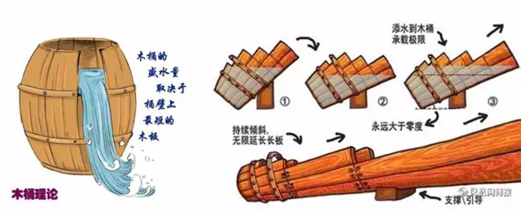
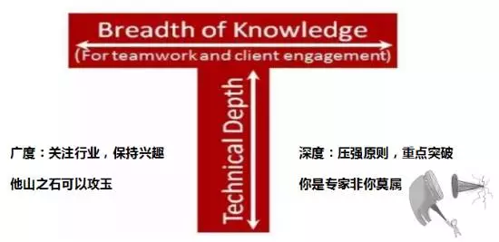
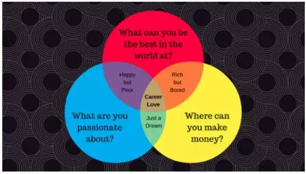
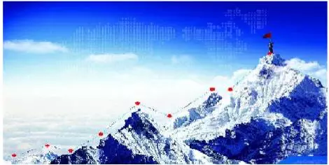
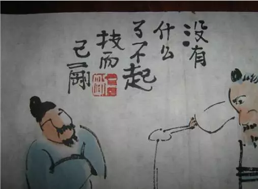

# 【人物·李典林】专家架构师的修炼之术

李典林 [腾讯TEG科技云端](javascript:void(0);) *2017-09-13*

## 个人简介

**Ensoli（李典林）：**腾讯数据中心专家架构师，主要从事数据中心的规划设计、新技术研究等，致力于大规模高效节能绿色数据中心的设计实现。在模块数据中心方法论、T-block/MDC、高压直流、市电直供技术、整机柜服务器、绿色电池等方面有较多研究及实践经验，主导过多个大规模数据中心项目的规划设计及建设。

我们是腾讯内部很特殊的一个群体，在软件公司里边搞硬件的，或者说别人是修房子给人住的，但我们是修数据中心给机器住的，运营着公司几十万台服务器网络设备，还要求这些设备在365天里都不能有一秒钟停电停冷的持续稳定运行，是业务部门身后默默服务的坚强后腰可靠伙伴。

要分享些高效学习的方法论？这个题目有点高大上，咱只会讲点技术宅的些许匠人经历。

## 如何适应传统行业进入互联网

平台体系 VS 野蛮生长，主动，熟悉周边，出活，担当

我是从传统世界五百强公司来到腾讯这种互联网公司，明显的感觉就是节奏会快很多，而且管理会更为宽松和自由，有些野蛮生长的样子，大家各自忙，没有太多时间来指导或者给新人安排工作，这种情况下就需要大家有很好的主动性，熟悉周边的情况，并自己去找活做。当然可以从一些小项目做起，通过这些项目慢慢熟悉做事的方法并认识更多同事和资源等，经过一定的项目积累之后就能出活、有绩效，自己在解决问题的过程中也得到了锻炼和成长，慢慢胜任了这些任务，甚至开始主导一些重大创新项目，培养了更多的自信和个人能力等，相应也培养了更多的担当和责任等。

## 如何立足牛人林立的腾讯

1. 学习他人补齐短板
2. 发挥长处体现价值

随着腾讯的知名度以及行业影响力越来越大，能进入腾讯的多是百里挑一的优秀选手，这种情况下部分新人开始可能就会有一些压力，那么如何在牛人林立的腾讯里边站稳脚跟并凸显出来呢，很简单的办法就是学习他人的优点不断提升自己，并发挥自己的长处打造独特的竞争力，在腾讯这种多元化大舞台的公司后者尤其重要，很多时候你的专长和独一无二就是很大亮点和优势了，甚至是个人品牌或者机会。

## 如何打造品牌并脱颖而出

在TEG的技术岗，会比较推崇“T字型”人才，希望大家有非常扎实非常深厚的技术功底，同时还有广博的知识面或者架构思考能力，这也是架构师或者产品经理功力的很好体现。因此在专业技术方面，通过压强原则持续学习重点突破，快速成为某一领域内的资深专家，同时能持续关注行业的一些变化和创新等，保持持久的学习和兴趣，不断培养知识面的广度和深度，甚至将其他领域的技术创新性的应用到所在研究领域，往往很多时候创新和突破会来自这种边缘和交叉学科，可谓他山之石可以攻玉也。

此外，多写文章，多做分享也是打造品牌和脱颖而出的很好办法，在写文章做分享的过程中也是梳理总结甚至提炼升华的过程，日积月累下来，就有了专业品牌和影响力。

## 兴趣是最好的老师

从担心，到参与，到胜任，到主导，爱上这行

都说兴趣是最好的老师，这也是主动学习和被动学习的差异所在，如果你的兴趣爱好和所从事的职业还能有很好的匹配性，那潜心钻研乐在其中就更为完美了，当然如果一开始匹配度不高也没关系，比如大家刚进入陌生领域都是会比较有压力和担心做不好，这种情况下可以参与其中尝试着去了解熟悉，然后通过引导和学习等逐步胜任了这个工作，甚至主导项目或者独立承担项目，会越来越有成长和成就感，也许就慢慢爱上了这个职业。

## 不断创新，用于打破传统

创新理想有多大，腾讯舞台就有多大，去改变行业，甚至改变世界

腾讯是个非常鼓励创新的企业，在这里可以和行业里边最聪明和人才一起工作，而且提供了一个很好的支持创新的土壤和平台，可以说理想有多大舞台就有多大，在这里支持不断创新，鼓励打破传统，去改变行业，甚至改变世界，很多时候互联网充当了门外的“野蛮人”的角色，去变革一些陈旧的事务，创造很多新的机会，促进整个社会的进步。

## 坚持，一万小时定律

大家都很熟悉“卖油翁”的故事，“无他，唯手熟尔”说的就是一万小时定律，日积月累坚持并深入下去，自然就成为这个领域的专家，当然前提是需要有深入思考并不断成长，在不断发现问题和解决问题过程中逐步就成长为高手了，等到问题只有你才能解决的时候基本就成为专家了。

## 平衡生活和工作，多看，多想，多运动

最后，互联网行业人少事情多工作量会比较大，适当休息和运动是保持身心健康和持续热情的良好办法，百思不得其解的时候跳出来也许还会豁然开朗。多看、多想和运动等，可以很好平衡工作和生活，保持一个良性循环，健康快乐每一天。