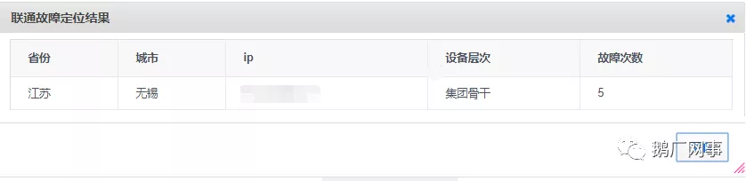

# 腾讯&运营商网络智能运营实践

吕鹏 [鹅厂网事](javascript:void(0);) *2019-07-01*

## 前言

互联网已经日益进入到人们的日常生活中，像支付、打车、外卖等，互联网的稳定性越发显得重要，作为承载互联网的运营商基础网络，任何一条线路故障都有可能对用户产生严重影响，当前互联网故障传统处理方式是需要逐段排查定位，在运营商数百T级别的链路中，即使一个常见的链路显性故障通常定位也需要4+小时，若遇到单个端口或是转发异常等隐性故障定位时间甚至高达20+小时。

当前国内几大运营商均采用属地化管理模式，发现异常向机房属地运营商报障后，运营商内部会从市公司->省公司->集团公司逐级升级传单，这就造成一方面由于处理线条较长，另一方面反复的沟通，整体效率会比较差。腾讯数据统计发现有70%故障来源于运营商网络，因此，如何快速定位和处理运营商网络故障就是摆在运营同学面前的一个课题。

本文是腾讯在日常运营排障实践中与广东联通一起探索出通过**“AI故障快速定位”+“工单物流化”**来实现故障快速定位，实现信息高效传递，并已经初见成效，与各位分享。

## AI故障快速定位

### 快速定位背景

为加速全程全网质量故障定位效率，提升用户使用腾讯业务体验，腾讯与广东联通联合启动“云网联动大数据质量态势感知系统”项目(Cloud&Network-IntegrationBig-data Situation Awareness system简称CBA项目),该项目双方建立联合技术团队，共同研讨将多级探测，质差发现，多源信息联动定位，透明化呈现与联通网络及响应特性相结合，在进一步提升运营商敏捷响应能力的同时，提升腾讯业务的使用感知。

 

### 快速定位方案

针对困扰业界的软件、芯片类较为隐蔽的网络故障，腾讯在几年前已经在数据中心内部网络采用多级FULLMESH探测监控方法来应对，该探测方式不同于传统采用少数监控探测流进行故障发现的探测机制，采用了多级不同层面使用大量不同源目的数据对来监控，可以保证每条故障链路都可以随机承载到大量监控探测流，当某条骨干链路或端口出现故障时，所有异常流会被系统自动收集，并经过AI大数据运营推算出该节点，故障点提交给处理工具后，可以自动实现故障隔离。（大数据定位示意图见图1）

图1 大数据定位示意图

通过上述方式，腾讯内部机房网络可以实现快速发现并自动收集信息、自动告警及建单，对故障点智能分析，根据分析结果配合自动化工具，故障从发现到处理完成可在数分钟完成，极大提升了故障发现、定位和处理的效率（实现分钟级故障定位）。

CBA项目也基于上述方法在运营商基础网络内进行FULLMESH探测，同时结合运营商网络特性，联动运营商节点地址库、网管数据等海量源数据，打造新版智能化分析内核，快速定位到运营商故障的节点设备及接口，缩短人工定位时间。

 

### CBA项目实现逻辑

图2 项目架构设计示意图

### 快速定位功能及效果输出

腾讯侧监控到互联网质量问题后，通过底层数据同步到联通CBA系统计算出故障点见图3,综过4-5月需要定位的故障单，定位时间均在10分钟以内，省层故障定位准确率在93.3%，已经较好的解决了运营定位时间长的问题，并持续完善优化。

图3 大数据定位结果示例

### 快速定位案例

2019年6月20日16：10分左右腾讯监控到北京联通BGP出口到全国质量异常，腾讯触发工单后根据系统自动定位出【北京联通骨干设备】有异常（见图4），同步系统派单到联通集团层面进行处理，根据定位结果腾讯快速决策将流量调动到异地出口，业务快速恢复。国内其他云持续受影响。最终故障确认61.49.xxx.xxx这一跳设备链路存在质量异常造成丢包。

图4 北京联通故障定位结果显示

图5 北京联通故障腾讯调度后恢复情况

## 工单物流化

### 背景

运营商故障发生后，用户传统的报障方式通过人工邮件和电话来进行信息传递，但由于故障处理需要收集信息且结合进展频繁快速更新反馈，传统邮件和电话已经触及天花板难以快速准确的描述清楚问题。为此，腾讯与运营商启动“工单物流化”项目

 

### 方案

大家刚经历了618购物节，购物后，买的心仪物品都在快递的路上，坐等愉快的收件，对我们普通用户而言，我根本不需要知道是怎么分拣货物，怎么运货，只需要知道目前到哪里了，预计还要多久可以送达（见图6）

图6 物流送达的过程

同理跟业务报障何其相似，业务同学根本不需要知道网络问题是怎么处理，业务需要实时知道处理的进度，预计什么时候能够处理完，故提出工单物流化理论，通过与运营商进行系统对接方式，将三方联接起来，让业务查询工单进度就像看快递传送过程那么简单，同时通过自动化收集故障处理信息、系统自动建单、实时同步处理进度大大提升处理的效率。

###  物流化流程设计

Step1 腾讯业务报障：业务通过内部快速入口进行报障。

Step2 腾讯工单系统报障：网络工单系统会根据场景（比如质量、专线、出口）自动收集故障信息以结构化形式通过接口给到运营商。

Step3 运营商系统受理：收到腾讯报障后系统秒级生成工单号。

Step4 腾讯工单系统查询进度：腾讯按分钟轮询运营商接口，拉取运营商处理进度。

Step5 腾讯网络机器人反馈进度：腾讯通过机器人将每一个进度实时推送给业务同学。

图7 物流化流程示意图

### 物流化功能及效果输出

针对实际运营100+工单进行分析2019年4-5月较2018年同期处理历时整体下降40%+。

图8 物流化功能示意图

## 总结

整个项目的成功完成，得益于腾讯与运营商的深度紧密合作，特别感谢广东联通网络运营部CBA项目组、中国联通腾讯保障中心，感谢电信集团、江苏电信、电信保障中心在系统对接项目大力支持，才得以虽然经历重重坎坷，最终达成预期目标。从实际数据可以看到，通过“AI故障快速定位”+“工单物流化”已经将网络故障定位从数小时缩短到数分钟，更为准确快速的实现报障过程中信息的传递，下一步，腾讯将继续与运营商一起深度合作，在互联网故障定位和处理方面精耕细作，以提升腾讯用户体验为目标，持续打磨和完善，切实降低互联网故障对用户的影响。