# 瞧瞧，腾讯网络运营的“大白”

刘昱点 [鹅厂网事](javascript:void(0);) *2020-07-28*

**腾讯全球网络运营中心**，作为腾讯公司全球数据中心以及骨干网络的建设与运营者，**管理着数十万的网络设备，上百万的配置信息与数以亿计的网络数据资源**，支撑着云、微信、金融、游戏、视频等海量业务的快速发展。

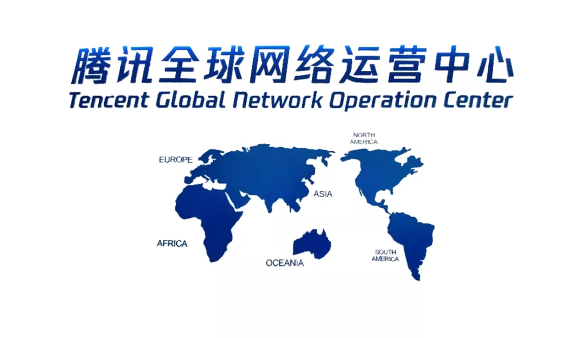

为了守护好公司庞大业务，各条线的网络运营鹅们分工协作紧密配合：资源鹅最先做好资源准备，并时刻监控资源使用状况，对网络容量风险点提前预警；建设鹅凌晨出没进行变更，对设备配置进行大量的调整和修改，以提升网络性能；值班鹅7*24小时在线，对每一次故障查找原因，对每一次业务反馈的问题争分夺秒反馈，以尽可能快速处理；数据鹅忙着分析运营环节产生的所有数据，以进行深入分层优化等等。

然而，虽然忙碌而有序，但**日常工作中鹅们面临的挑战与压力越来越大**，面向业务的网络咨询量，从五年前的月均不足千单到当前月均数万单；变更、故障、资源、配置和设备等各个层面运营审计有数以亿级的信息要核对和校验，这些工作用常规人工分析和审计的方法已经难以很好的支撑。虽然运营鹅们打造的NetOps平台（腾讯网络运营以自动化运营为核心，集网络变更、故障处理、运营巡检、数据分析为一体的网络运维中台）可以将庞大的数据在后台进行了多维度多层面的计算，并且生成运营所需的数据，但**这些信息如何高效的呈现并交互给运营鹅们进行快速处理是个难题**，如果采用传统网管系统来实现，则存在开发重载、后期调整不够灵活、周期长等问题，不能完全发挥出数据化运营的价值。

因此，运营鹅们**一直在寻找一个能帮助鹅们实现高效运营的信息交互平台。**

**一切随着“机器人”的出现，为我们带来了新思路。**

## 初识

**机器人是指企业微信群聊中配置的群机器人**，是企业微信于2019年年中推出的功能。用户可以通过脚本编程实现所需的自动化功能，并经由机器人推送自动化操作结果或数据至群聊中，机器人也支持回调功能，通过与机器人对话，从机器人服务端获取数据，实现信息交互。

我们想这个现身在群聊中的机器人，是不是可以一端连接着NetOps数据中台，一端连接着现实的运营场景；是不是可以把它打造成像《超能陆战队》里无所不能的“大白”，或可以助力快速发现运营隐患、或可以完成数据分析建模、或可以从海量数据中快速查询配置、或可以管理项目、甚至可以通过机器人执行自动变更。

 

**带着对机器人的期许，我们进行了落地方案的评估。**Netops通过流程引擎和任务中心的交互，实现业务逻辑部署和自动化流程触发；而机器人作为前端服务，负责拉取自动化流程中的结果数据或中间信息，主动推送至运营群，也可以执行或传递指令进行数据查询或自动化流程，即实现回调任务。机器人的所有功能运营鹅们都可以通过简单的Python应用开发来轻松实现定制符合每个业务自己的流程逻辑和数据展现形式。

评估的结论是**机器人的方案理论上可以满足运营鹅们的需求**。

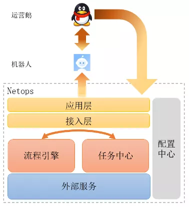

**带着这个目标，运营鹅们开始了第一个运营机器人---“大白”的尝试。**

## 尝鲜

值班鹅最大的困扰就是，每天会收到大量的来自业务的咨询和报障请求，实际上真正是网络故障原因的很少，大多是业务需要确认是否是网络故障导致的业务异常。当然，的确存在有网络故障时，业务的咨询和报障量将有数量级的增长。因此，一方面要面对业务的频繁咨询，另一方面要快速发现和处理现网故障，顺势，**诺克机器人成了我们第一个试点的大白**。

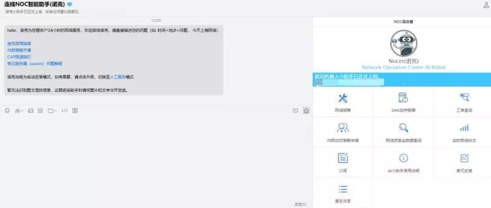

**诺克通过自然语言处理精准理解业务需求，并进行大数据现网挖掘，提供网络故障咨询与定位，故障申报与追踪等功能。**诺克通过智能语义分析，基于AI对现网海量数据进行整理分析、智能查询汇报、以秒级速度进行信息整理输出，使网络运营告别了人工回复的低效率时代；无论私聊或群聊，只要@他，就可以随时随地召唤出来。

试点近一年，网络诺克AI机器人累计解决业务3w+次咨询，闭环率提升已经至80%，极大提升了业务咨询的响应和自助处理的体验，大大提高了故障与咨询的处理效率，诺克机器人俨然成为了值班鹅的最佳智能网络运维助手。

投石问路，**诺克运营机器人的巨大成功，建立了运营鹅们的信心**，明确了其他运营场景实现目标，各个场景的运营鹅们纷纷从网络工程师拓展变身为开发人员，将“熟能生巧”变成了“事半功倍”，加入到网络运营机器人的开发进程中。

**一系列的运营机器人“大白”们应运而生。**

## 开花

### 资源监控机器人

兵马未动粮草先行，**资源供给是网络运营链条最早的一环**，由于网络资源交付链条长，往往需要半年甚至一年的时间才能准备好，而业务流量却随着任何一个功能发布或热点事件而有着较大的变化，如何在扩容慢的条件下实现对业务需求的快速满足？这就需要实时监控跟踪数百个出口和数千条专线流量变化情况，制定流量调度和业务调整方案，传统的方法都要人工进行数据收集并最快按周进行分析汇总，通过资源机器人则轻松实现每天对全网资源的监控和管理，将峰值流量和当前容量进行比对，以分析是否有拥塞风险，及时发现流量异常出口和专线，**极大地提升了资源的运营效率和事件处理的质量**。

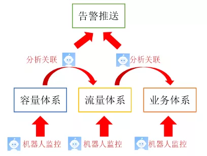

### 巡检机器人

**巡检是运营中基础的一环，就是确保运营的配置和状态与预期一致**，发现潜在的隐患和风险。因为多个运营领域（如QoS、日志、线路、设备等）都在进行了大量的巡检，因此，多个领域的巡检机器人都在尝试投入运营。

为提高日常线路抖动快速跟踪报障效率，运营鹅们推出线路中断告警机器人，实时获取线路状态或光衰数据，一旦数据变化超过阈值，将第一时间推送中断告警，并提醒相关负责人跟进，极大节省了由于线路中断定位及对外报障产生的时间成本，为故障恢复争取时间；同时，机器人还会自动进行网络质量波动关联，智能分析质量波动原因及相应影响线路。

设备状态的巡检助手将自动对基础网络设备的状态进行巡检；路由巡检小助手自动比对两台相同配置的设备路由信息，并自动推送异常；对于特定网络或配置，如防火墙、QOS、日志信息等，小助手们也不会放过，逐一配备机器人进行巡检。

有了机器人的参与，**巡检工作变的更加得心应手，并且覆盖了日常运营的方方面面，更好的支撑了运营自动化**。

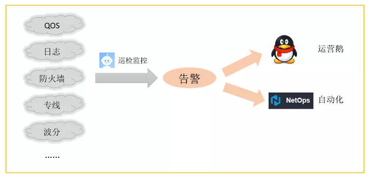

### 数据机器人

**自动化、智能化是网络运营未来的目标，为解决每日亿万次的数据统计分析问题，数据鹅开始训练机器人大数据处理与数据建模功能**；数据来源于NetOps平台底层数据仓库中或API，依托python或SQL强大的数据统计分析能力，经过自动化的数据获取，清洗规约、汇总、建模、可视化等过程，将原本人工操作的大量数据“交接”给机器人，从此上班的第一件事不再是埋头统计报表数据，而是询问机器人统计分析结果，并不断思考内在的分析策略与优化逻辑，分析数据中的异常现象，将有限的精力投入在更具价值的事情当中；

**数据机器人将每日采集的现网配置，同配置数据库内记录进行比对**，若有异常，就推送告警数据至管理员；同时，机器人还将查看每日变化的资源信息，既有概览的配置审计日报，又可以主动@机器人查询明细变化及原因。机器人也会“暖心”将当日获得的资源基础数据作为应用层数据存储在数仓中，以便其他自动化进程或机器人前来调用，或进行长期资源增长情况跟踪，助力数据复用，同时将审计需求都轻松解决。

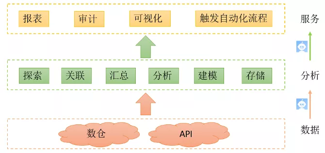

以NDB配置项为例，由于腾讯网络规模庞大，网络的复杂性也呈指数上升，设备、线路、出口、连接关系等等，都是网络运营中重要的数据配置项，每一个信息的错误，都可能会产生意想不到的影响，甚至会造成网络故障或公司损失；因此，对这些数据资源的准确性审计也变得异常重要，针对庞大NDB信息量的审计，交给机器人的确非常合适。

### 故障分析机器人

面对每天全网各地大量的监控告警及事件处理工单，人工要统计分析需要耗费大量的人力，周期也比较长，无法满足快速的分析需求，通过打造故障分析机器人，每天对所有的故障和工单信息自动汇总，分类别统计关键故障处理指标，自动分析未达标指标背后的主要原因。相应运营鹅会根据机器人的数据分析进一步深入优化流程和调优工具，**机器人帮助故障负责鹅快速高质量地完成前期的数据统计，提升了故障分析的效率**，也帮助更快决策优化故障处理过程及恢复故障时长的机制和方法，从而不断通过故障数据分析来提升故障处理的能力。

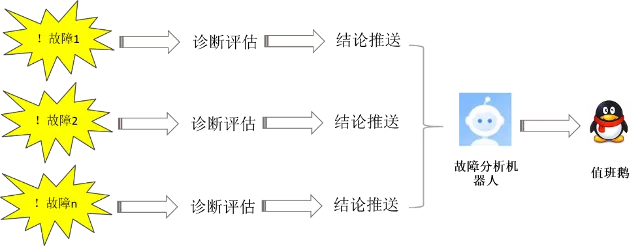

### 特定场景变更机器人

为提升网络变更质量，针对一些操作简单、变更量大、方案成熟的部分特定变更场景，运营鹅们将标准化的命令被植入机器人中，并配置好相应的账号及权限，当需要进行网络变更操作时，只需@变更机器人来进行；完成变更后，机器人也将自动检查现网配置，和预期进行比对，反馈至变更群内。**全程无需人工操作与干预，这样的机器人，大大缓解变更鹅们压力，并提升变更效率及成功率**。

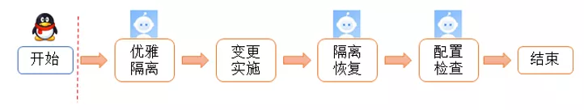

### 机器人管家

每个机器人在网络自动化运营中发挥着不可替代的重要作用，机器人本身的运营也成了网络运营中不可或缺的一环，随着机器人的增多，如何防止某个机器人“偷懒”或“罢工”也是运营鹅们要开始关注的事情了，为此，“机器人管家”应运而生。

为了保障机器人更稳定的运行，除了为机器人运行提供更加稳定的“工作环境”外，机器人本身在日常运行中也将受到“机器人管家”的管理和监督。“机器人管家”主动对其他机器人发起@探测，若被探测机器人没有在指定时间内回复指定内容，则监控机器人将发送该机器人运行异常告警至开发者及管理员，以及时修复。**机器人管家管理着所有“运营机器人”的在职状态以及工作状态，并根据运营状态对其进行打分，形成机器人自动化运营体系。**

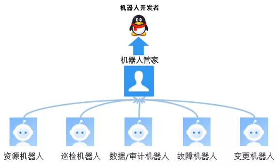

## 收获

截止目前，网络运营在智能值班、网络告警、故障监控、变更管理、质量流量监控、配置与资产审计、建设与运营安全等方方面面**已经发布了数十个机器人，机器人功能共计近百项，对上百个运营维度进行数据统计和审计，发现数百个异常隐患情况；运营鹅对每个隐患都及时进行了跟进，规避了数百起故障的发生。**

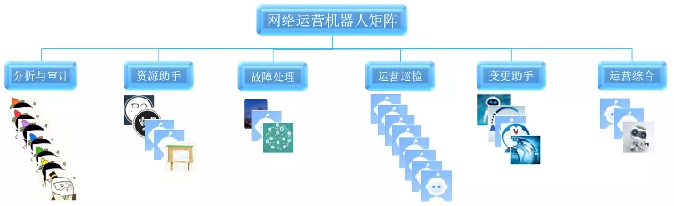

在机器人运营的过程中，**运营鹅们发现通运营机器人不但实现了各个领域从原始数据->汇总信息->异常预警->审计报告各层信息纵向快速打通，还实现了架构、资源、建设、值班等不同运营鹅团队间横向信息快速同步**，每个机器人审计群内都有各个团队的负责鹅，一旦出现非预期的异常信息或隐患预警，各个团队的鹅便会从自身负责的领域查起，集中并行排查，实现快速定位原因，确认问题点后，各团队联合起来从流程、机制和工具来优化，形成整个场景自动化的联动闭环，避免后续类似问题发生，从而实现了在纵向信息流打通的基础上，也实现了团队间横向高效的联动和协作。

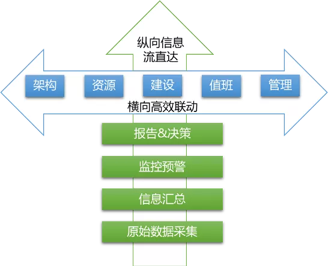

未来更多的运营机器人将会继续在细分运营领域持续产生，让更多的数据信息能快速提炼和传递，同时机器人运营本身作为运营自动化的一部分，也**会逐步从“看”的分析决策向“做”的动作指令领域拓展，其后续的发展也将进一步推动着腾讯网络运营自动化和智能化的进程，整体提升运营平台的自动化能力。**

**机器人已成为腾讯全球网络运营中密不可分的一部分，真正成为了运营鹅的贴心“大白”。**