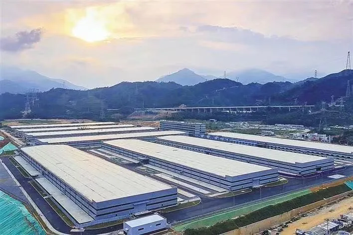
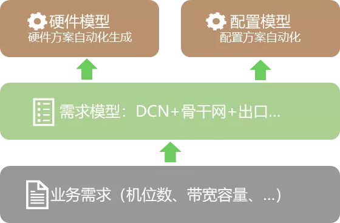
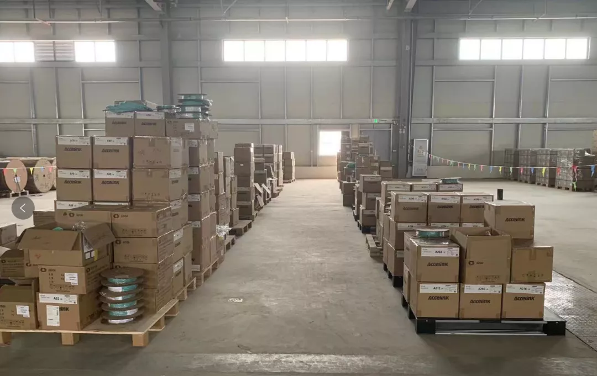
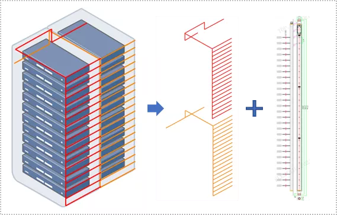
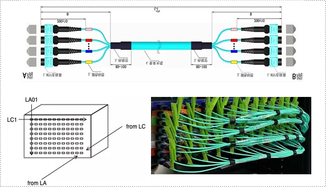
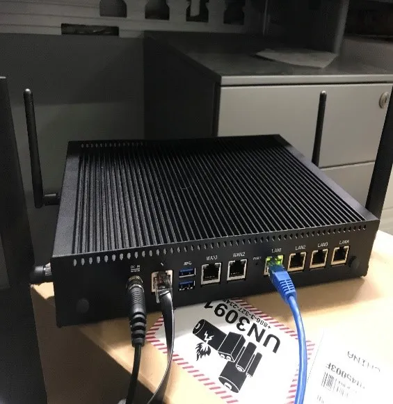
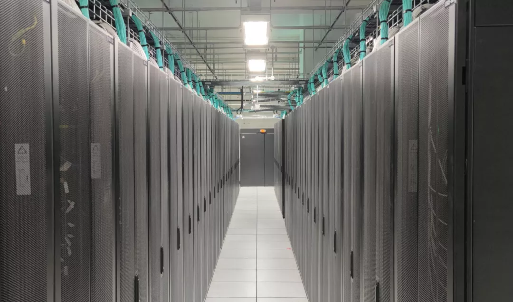

# 园区网络建设的创新和实践

原创 胡啸、马超 [鹅厂网事](javascript:void(0);) *2021-08-20*

## 前言

园区网络由于并发建设量大、架构复杂度高、采购周期长、外部资源风险高等原因，通常需要4-6个月时间才能完成整体的建设交付，无法满足业务快速部署的需求。

为了提升网络建设效率，满足业务快速部署，同时降低网络交付成本，腾讯网络交付团队通过各种创新方案实现2个月的新园区网络交付能力，整体交付效率提升了一倍。大幅度的建设效率提升如何实现，其中又有哪些“玄机”？本文结合园区网络建设的痛点与关键环节，介绍了腾讯在提升园区网络建设效率方面的那些“黑武器”。

腾讯超大规模数据中心园区

## 网络方案：基于模型自动生成

通过底层系统能力的建设和自动化方案落地，最大程度减少园区网络规划阶段的人力和时间投入，提升网络规划、方案配置生成的效率。

- **架构方案自动化：**通过建立园区网络的需求模型，只需完成标准化的需求输入（例如新园区规划机位数、出口带宽、是否新建城市等），系统基于规则自动化评估出所需建设的架构版本、网络模块和带宽需求。无需人工线下讨论和对齐方案；
- **硬件方案自动化：**基于网络设备的物料能力、关联配套关系和互联规则，抽象出硬件模型的设计元素，实现网络硬件结构化建模，同时开发出一套通用算法，实现园区网络硬件方案100%自动化生成，无需架构师和网工人工介入；
- **配置方案自动化：**通过建立可扩展、结构化和面向对象的Tencent YANG Model配置模型，结合硬件模型的方案输入，实现DCN白盒、商用网络设备配置自动化生成。

## 资源管理：备货池+按箱出入库

新园区网络建设，涉及数百台网络设备及上万条线缆需要同步到货。正常物料生产+在途货期至少需要1个月以上，到达现场后还需要进行资产的出入库才能领用，资源是否及时到位直接关系到网络的最终交付。

- **提前启动：**在园区基建阶段就完成网络规划和方案确认，提前申请专线资源，整体介入提前3个月到半年；
- **备货机制：**需求预测定期滚动，根据精确的备货模型及算法，搭建备货资源池提前储备所需物料。规划完成后直接匹配物料清单快速搬迁至机房，提单到到货仅需一周时间，到货周期压缩80%；
- **现场出入库优化：**出入库的时间主要消耗在找物料和按件扫码，通过将按部件SN改为按整箱扫码，物料出入库效率提升一倍以上。

超大园区备货仓库

## 现场实施：工程效率提升

现场的工程实施主要包括网络设备上架和线缆布放，大量任务完全依赖施工队人工完成，实施的工期和质量通常取决于施工人数和熟练度。

建设团队按照标准化、集成化思路，通过新材料引入和施工工艺提升，包括预置结构件与上联正交布线等解决方案，大幅提高工程实施效率和后续的可维护性，以一个标准公有云模块为例，整体实施时间可以压缩三分之一以上。

- **预置结构件：**通过将现场大量的网络互连线缆转变为结构件形态，由物料供应商在出厂前就预置完成，将现场部署方式由布线实施转变为结构件实施。

- **正交布线方式：**将网络设备互连场景按空间切割，引入正交布线，布线面板两端分别面向不同场景，通过正交方式+集束线缆+颜色标签进行互联，降低现场布线工程量和出错率，同时适配不同的网络架构场景。

## 配置调试：SDWAN+ZTP部署

新园区网络配置调试，首先依赖ISP专线资源到位打通园区网络，否则网络设备无法通过带外进行远程管理和配置下发。而外部专线资源由于受制于ISP运营商，风险较高，到位时间相对不可控，通常成为网络建设交付的瓶颈。

为了规避专线资源到位风险，建设交付团队通过SDWAN接入设备，在新建园区专线资源不具备、无远程带外管理的环境下，利用ISP无线4G/5G信号建立VPN通道，将园区管理网核心与内部网络打通，实现在园区内具备远程带外管理能力的机制，从而摆脱对运营商专线资源的依赖。

SDWAN结合瓦力远程部署系统，在园区带外打通环境下，网络设备可远程下发配置，无须现场人工操作，提升设备配置调试效率；同时满足离线的设备校验与验收，实现了精细化的设备管理。

- **设备上架检测：**实现100%的设备上架准确率，解决现场部署时上错设备问题；
- **设备硬件收集：**自动发现设备固资号和SN关系，规避人工收集信息出错风险；
- **OS升级和配置下发：**实现网络设备OS自动化升级和配置加载。

## 项目管理：自动化跟进

新园区网络建设，涉及多个上下游和周边团队、子流程类型多且复杂，精细化管理难度高，很难做到面面俱到。建设团队通过建立一套端到端自动化建设流程以及配套项目管理工具，帮助PM在多项目、多任务并行情况下，提升每个环节进度的把控能力，避免人工跟进的遗留与疏忽，提高信息沟通与风险管理的效率。

- **自动化建设系统：**实现从需求下发到验收结项的建设全流程打通，支持项目的有序建设和交付，并持续提高整体自动化率，减少人工介入；
- **项目SLA和自动催办：**系统基于规则自动生成交付每个环节SLA和项目里程碑计划，PM可以根据项目紧急程度自定义调整；针对快超期和已超期环节，系统自动对负责人进行提醒，并创建pending工单，用于持续跟进和后续分析优化；
- **现场实施跟进：**基于netops平台，支持自定义最优的现场施工工序流程以及相关SLA，现场可通过手机端实时反馈进度、问题和风险，解决现场施工管理的难题。

Netops平台自定义流程界面

## 结语

园区网络的建设交付是一个系统化工程，依赖多个专业团队之间的紧密合作，通过构建系统自动化能力、合理规划资源、创新部署模式和自动化建设流程，整体大幅提升了园区网络交付效率，满足业务快速部署上线的需求。

