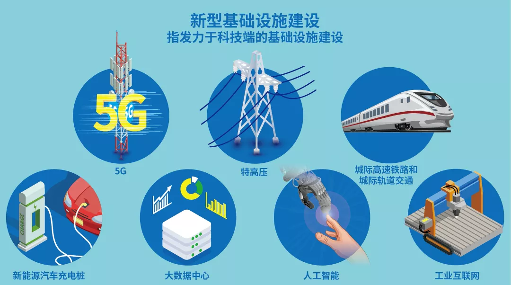
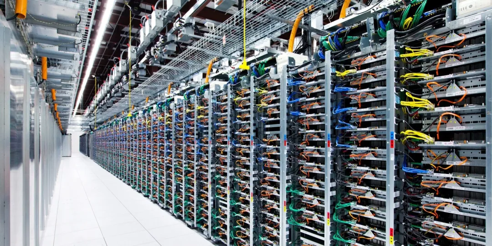
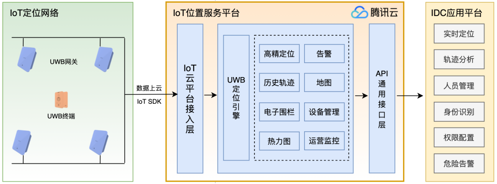
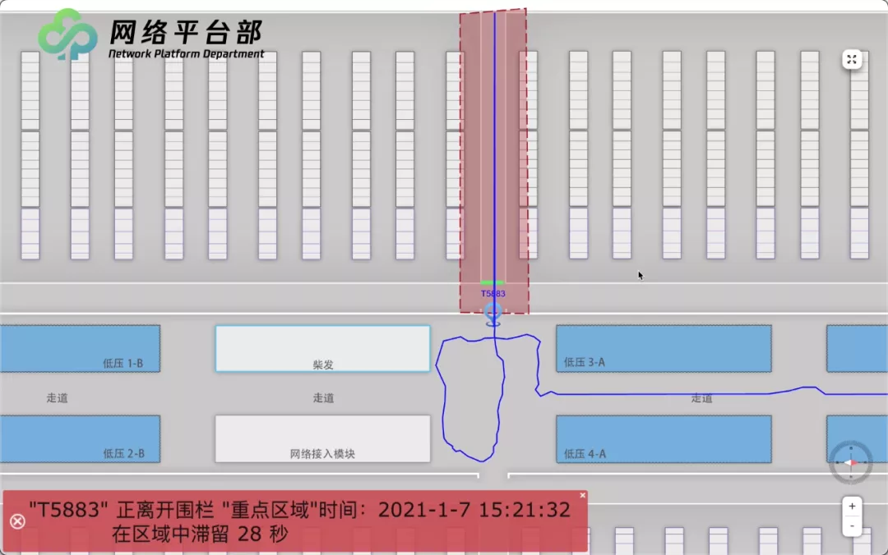
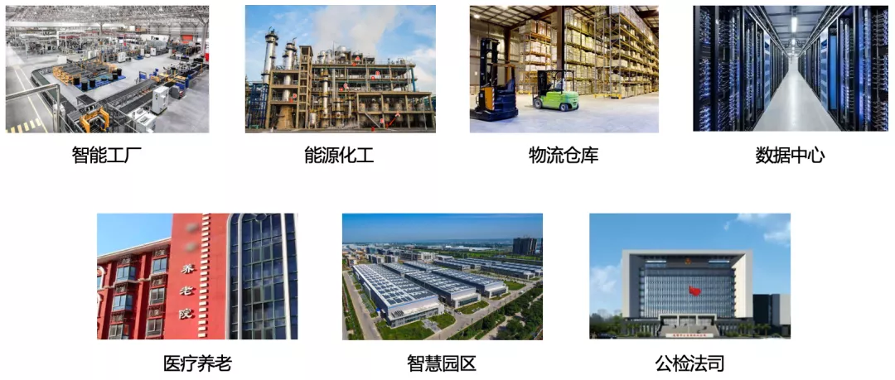

# 数据中心基于UWB的人员定位&追踪方案实践

原创 刘恒进、付子耕 [鹅厂网事](javascript:void(0);) *2021-09-01*

## 前言

嗨，大家好，我是鹅厂的物联网工程师小Q，又和大家见面啦。相信大家还记得[《实验室的光模块都去哪里了？》](http://mp.weixin.qq.com/s?__biz=MzA3ODgyNzcwMw==&mid=2649023770&idx=1&sn=1964e36820b73e719065f227aa4be83f&chksm=87ac9cc2b0db15d4f73db630e891f18b861e05dbe2cd7dd1dac173ca70d21e207f14e93f10d6&scene=21#wechat_redirect)那篇文章里，我利用云化RFID资产管理系统，解决了实验室光模块盘点的难题。在那之后，我对物联网定位技术又有了进一步探索和实践，这还要从一次参观说起。

前两个月，小Q受邀参观了腾讯数据中心，看着一排排的机架和数以百万计的服务器，我在被震撼之余也陷入了思考。要知道，数据中心（IDC）中百万量级的服务器支撑着公司的各项业务，其运营管理可容不得一点马虎。可IDC场地和设备的运营涉及企业员工、合作厂商、物业、保洁等各类人员的参与，因此如何管控IDC内的人员，了解他们的活动，实现智能、安全、高效的运营和工作调配，可是个不小的挑战。

小Q当时就想：“可不可以用物联网高精度定位技术，实现数据中心人员的定位和追踪呢？”于是我和团队闭关一个月，**研发了基于云化UWB高精度定位的数据中心智能管控解决方案**，可以对IDC内不同类型的工作人员进行**身份鉴别、高精定位、活动追踪、异常告警**。目前该方案已在腾讯IDC正式上线，实现了IDC的智能管控，效果杠杠的。

如果你不懂UWB高精度定位技术是什么，也不要着急，下面就跟着小Q一起看看方案设计和实践效果吧！

## 一、数据中心 ——“新基建”

首先，小Q想先介绍一下数据中心对于“新基建”的重要性。作为“新基建”的算力基础设施，数据中心承担着海量数据存储和计算的重任，强力支撑着企业、组织和个人的各项业务。而近年来，我国数据中心以20%以上的年增长率扩大着数量和规模，显然已进入建设的爆发期。因此，如何通过智能化管理的方式提升数据中心的运营能效，以保持其稳定性、可用性，对于企业和组织至关重要。

图1 数据中心是“新基建”的七大领域之一

## 二、数据中心管控需求 —— 智能、降本、高效

来到腾讯数据中心参观，看着机房中承载的百万量级的服务器，小Q备受震撼。不过小Q知道发展与挑战并存，如何**智能、降本、高效**地管控IDC，是其安全和稳定运营的关键。

数据中心里除了有企业内部员工，还有合作厂商、维修、运输、物业、保洁等外部人员，每个人对于不同区域的访问权限也不同，所以数据中心需要对各类人员进行身份鉴别和活动数据追踪（如实时定位、停留时间、活动轨迹等），从而实现关键区域非法入侵、异常轨迹、超时滞留等安全隐患的事前告警，并记录完整运动轨迹以便回溯，加快排查安全隐患。

此外，规模庞大的数据中心还需要借助高精度定位开展作业，通过可视化的位置平台实时获知作业人员的位置分布，能有效提高工作调配、权限分配、人员协同、例行巡检等事务的效率，降低时间和人力成本。

图2 IDC承载着百万量级的服务器

小Q当时眉头一紧：“看来想要智能、降本、提效地管控IDC，不是件容易的事。基于门禁、Wi-Fi、蓝牙等技术的本地系统定位精度低，稳定性和可靠性也不高，解决不了获取IDC人员实时位置和活动轨迹的痛点，这可怎么办呢？”

突然，小Q想到了UWB（超宽带）定位技术，“对呀！UWB定位技术的精度可达一米内，不如利用UWB技术实现高精度定位，搭配**历史轨迹、电子围栏、热力图、安全告警、滞留统计**等增值功能，实现追踪和告警，并把系统部署上云，打造完整的数据中心智能管控解决方案！”

## 三、基于云化UWB高精度定位的数据中心智能管控解决方案

此方案融合了IoT UWB定位网络的精准定位能力、IoT 位置服务平台的增值能力、IDC应用平台的丰富业务能力，并利用腾讯云强大的云计算服务，为用户提供了具有**快速上云、部署简便、使用简单、定位准确、轨迹完整、安全预警**等特点的一站式系统。下面将从系统架构和应用特点两个方面详细介绍。

### 1、系统架构

云化UWB高精度定位的智能管控系统可分为3个模块，即 IoT UWB定位网络、IoT位置服务平台、IDC应用平台，如下图所示：

图3 云化UWB高精度定位系统架构

**1）IoT UWB定位网络：**部署在数据中心作业现场，主要包含UWB终端（如工卡）和UWB网关两个部分。UWB网关中安装着腾讯云IoT SDK，定位测量数据通过SDK传输给腾讯云上的IoT位置服务平台，实现统一接口、快速上云。

**2）IoT位置服务平台：**部署在腾讯云上，利用腾讯云丰富的组件和能力，保障了平台高效和稳定运行。其接收UWB网关定位测量数据，并据此计算UWB终端的高精度位置坐标，同时提供高精度实时定位、历史轨迹、电子围栏、热力图、安全告警、滞留统计等一系列功能。

**3）IDC应用平台：**部署在腾讯云上，以IoT位置服务平台提供的位置相关基础功能为辅助，实现数据中心内人员监管、物资监管、轨迹分析、实时告警等数字化升级，提升数据中心的运营安全和运营效率。

### 2、方案特点

数据中心云化UWB高精度定位解决方案，具有如下特点：

**1）快速上云：**UWB网关中安装着腾讯云IoT SDK，对定位测量数据传输格式以及UWB网关配置管理等进行了统一，实现了数据的免配置快速上云及云上管理。

**2）部署简便：**UWB定位网络安装流程简单，从POE交换机拉出一根网线到安装点位即可，维护起来也相对简便。同时，无线定位方式对现场环境（如照明、遮挡等）要求较低。

**3）使用简单：**工作人员进入机房工作，仅需佩戴UWB工卡即可，UWB工卡的内置传感器会感知运动状态，并自动触发UWB定位信号的发射，无需人工干预。

**4）定位准确：**UWB发出的纳秒级定位信号，具有极高的时间分辨率和厘米级高精度定位的物理基础，能够精准感知数据中心内部工作人员的实时位置和轨迹等信息。

**5）轨迹完整：**UWB定位基于无线电磁波信号，覆盖全面，几乎没有盲区，能够完整地记录工作人员的全部运动轨迹和停留情况，便于回溯。

**6）安全预警：**通过设置电子围栏，并和人员权限绑定，UWB定位系统能够对违规进出围栏、超时停留、非法入侵等安全隐患及时发出告警通知。

## 四、腾讯数据中心 UWB高精度定位探索应用

为探索和提升IDC运营安全和效率，小Q和团队在腾讯数据中心试点部署了一套云化UWB高精度定位系统，该系统能够为IDC业务系统“腾讯觅踪”提供实时**高精度定位、历史轨迹、电子围栏、滞留统计、安全预警**等功能，助力数据中心数字化升级。

其实，小Q和团队在腾讯数据中心试点探索的过程中，也遇到过一些困难，其中最大的挑战是金属强干扰。机房现场周围分布的成片金属，对电磁波有强反射作用，导致了电磁环境复杂多变。多变的电磁环境使UWB定位系统出现了精度下降、时延增加等问题。为解决金属强干扰难点，我们深入分析现场环境特点、UWB技术特点，通过优化接收机算法、调整定位算法模型以及滤波器参数等，最终缓解了金属强干扰问题，提高了系统性能和用户体验。此外，我们还增加了运营监控指标，提高了排查和解决系统问题的效率。

说了这么多方案设计和实现，下面小Q已经迫不及待地跟大家展示应用效果了，不如以工程师Jeff为例，看看他在IDC机房里的活动是怎么被定位和追踪的。

如下图所示，IDC运营人员会在业务系统上为Jeff注册身份信息、配置区域访问权限，并关联一张UWB工卡。Jeff携带工卡进入机房区域后，UWB定位系统会对其进行身份识别和权限鉴定，并开始厘米级精度的实时定位。同时，他的活动轨迹也会被100%完整追踪，IDC运营人员可在系统上实时观测。当Jeff进入到未被授权的敏感区域时，系统还会触发安全告警，并精准统计Jeff在敏感区域内的停留时间。

图4 腾讯数据中心UWB高精度定位系统效果展示

通过部署云化UWB高精度定位系统，在运营质量上，能够实时定位和及时预警，预计可使发现和处置异常事件的时间缩短60%以上，回溯效率提升60%以上；在运营效率上，减少了传统人盯人模式的人员投入，预计可降低人力成本30%以上，工作效率提升40%以上。

下一步，小Q和团队将围绕数据中心场景进一步增强和丰富UWB高精度定位能力，使其作为“腾讯觅踪”的核心能力，更加深入地参与到数据中心的安全、监管和运营等环节中，助力数据中心数字化和智能化升级，实现更大程度的降本增效。

## 五、UWB高精度定位解决方案****助力更多应用场景

图5 云化UWB高精度定位解决方案的典型应用场景

IoT位置作为数字化升级的基础信息要素，能够深度参与到生产、运输、监管、安全、运营等核心环节中，助力企业客户安全生产和高效运营，实现降本增效。随着产业互联网的深入推进，以云化 UWB高精度定位为代表的位置物联网解决方案将在工业、园区、能源、医疗、养老等各行各业发挥越来越大的商业价值和社会价值。

相信在小Q的讲解下，大家已经了解了UWB高精度定位解决方案的功能、特点和效果。小Q之前在《实验室的光模块都去哪里了？》那篇推文里介绍过可用于盘点物资的“云化RFID资产管理系统”，现在又有了用于追踪人员的“云化UWB高精度定位系统”，可谓物资和人员双管齐下。如果你也有企业物资和人员智能管控的需求，那就快来联系小Q试用产品吧！

联系方式：发送邮件至hengjinliu@tencent.com，或发消息给“鹅厂网事”公众号，小Q会尽快跟您取得联系哦。