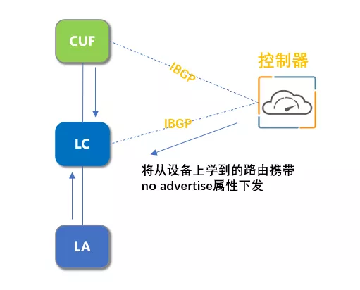

# 腾讯数据中心网络故障快速自愈实践

原创 薛长鑫 [鹅厂网事](javascript:void(0);) *2021-11-10*

## 前言

腾讯云市场规模近几年飞速增长，承载的业务类型覆盖电商、直播、金融、互联网等越来越多的内外部用户核心业务；基础网络作为腾讯云极为重要的基础设施，采用高冗余设计很好的支撑了业务的高速发展，部分架构甚至达到128台设备冗余，像设备宕机，链路中断，协议收敛等常规故障，业务基本无感知。由于部分业务对网络故障非常灵敏，网络设备转发轻微丢包可能会有影响，针对此类场景，我们需要具备全面而准确的快速自愈能力，能又快又准地定位并隔离异常网络设备，以尽可能快的速度恢复业务。

传统商业网络设备本身具备一定的故障自愈能力，例如板卡异常时能够自动离线板卡并上报告警，但通常仍会造成分钟级的质量影响；有时设备转发异常甚至不会有任何显性告警，此类故障通常需要依赖人去从海量设备中找到异常设备并进行隔离恢复，故障影响通常长达数十分钟。

如何能够克服传统商业网络设备的局限去降低网络故障对业务的影响时间，在云网络时代变得越发迫切；今年我们通过底层网络和上层业务在监控诊断层面的协同联动，当前在数据中心网络层面已经能够实现最快20秒内的故障自愈。

故障自愈主要包含三个环节：故障发现、故障诊断、故障恢复

## 一、故障发现：多维监控，业务联动，精准高效

在故障发现环节，腾讯网络主要采用fullmesh-ping 探测，利用海量业务服务器进行分层分级的探测，实时监控全网络质量情况。

Fullmesh-ping做为全局大盘监控，更关注系统的通用性，与业务完全解耦，主要存在以下问题：

1、 较难区分业务服务器操作导致的误报；

2、 部分节点监控粒度不够细，存在漏告可能。

今年，我们和腾讯云存储类业务进行了深入的联动，接入了业务探测和业务关键指标，使得我们在故障发现环节，告警精度、准度和时效性方面大幅提升。

云存储业务定制化探测全网每秒达千万级的探测流，对应每个网络模块达近十万条探测流；业务使用4K字节大包进行探测，由于大包通常会被网络拆分为多个数据包，任何一个分片数据包丢失都会导致丢包，对网络异常的灵敏度会更高；再结合业务关键指标可以确保业务探测告警是一个真实网络故障而非服务器操作导致的误报。通过联动业务监控，我们不但能感知到传统网络探测无法发现的问题，更将故障发现速度提升到了10秒内，准确率达到99%以上。

## 二、故障诊断：智能算法、敏捷轻载、广覆盖

故障诊断对于故障自愈来说是最复杂也最耗时的环节。如今一个数据中心网络集群核心层设备达数百台，如何快速精准找到故障设备对我们带来极大挑战。

早年故障定位全靠专家经验，主要是基于业务报障信息圈定故障范围，查看故障范围内所有网络设备的告警，流量，日志等多种信息，并结合流统等手段来定位故障点，通常需要1-2小时。

3、4年前随着自动化能力的提升，我们将手动操作全都搬到了工具系统上，由工具去并行自动执行多项检测任务，再由人基于工具反馈的信息来进行综合分析。故障定位通常需要30分钟。

当前故障诊断主要采用Erspan、INT+MOD、Netsense、基于异常流Traceroute公共路径+multi KPI这几种方式。我们对这几种技术做了对比分析，Erspan可以准确还原流量沿途经过的设备，且可以实时分析流量在哪个节点出现了异常，但是部署较为重载，效率较差；INT+MOD、Netsense等新技术需要芯片能力的支持，在现网老架构中无法支持，没法全网部署，覆盖率较差；最终我们选择了Traceroute+multi KPI方式。Traceroute方式虽然简单，但不依赖网络设备，可以做到全网覆盖。在方案落地初期我们遇到了采集的路径信息部分缺失的问题，通过引入智能路径补全算法，建立路径信息数据覆盖率，有效率指标，经过持续运营，如今路径信息采集覆盖率和有效率达到95%以上，满足故障诊断需求。

目前基于异常流量路径公共点+multi KPI的方式，我们可以做到2秒内定位到故障点，且定位准确率达到98%以上。

## 三、故障恢复：无损优雅、从容自若

故障恢复业界主流的做法是流量调度或对可疑设备进行快速隔离；数据中心网络故障恢复主要采用设备隔离的方法。设备隔离无外乎关端口、协议、控制路由收发这几种方法；这个环节主要有以下三点需要考虑：

### 1、 通过可行性评估控制隔离风险

在设备隔离前，需要从故障影响程度，网络冗余性，安全性角度对网络容量、网络变更、诊断结果等进行评估，避免多台设备被同时隔离，且隔离不会带来其他影响或恶化。

### 2、 设备隔离操作需要足够平滑

质量监控，故障定位环节还是存在错误可能的，只有保证设备隔离操作本身足够平滑，即使误隔离了设备，也不会对网络质量造成任何影响。腾讯数据中心网络采用多平面设计，且不同层级间正交互联，隔离主要采用控制路由收发的方式，保证隔离操作足够平滑。针对隔离操作本身，我们基于netops平台开发了相应的优雅隔离工具，网络质量异常会自动触发设备隔离。

### 3、 设备隔离操作需要足够快

腾讯自研交换机可以基于GRPC方式，快速下发指令实现设备快速隔离；但当前传统商业设备操作仍只能基于CLI的方式，设备登录，指令下发通常需要耗时5-30秒。针对商业设备的天然缺陷，我们通过控制器，绕过传统CLI方式，实现设备流量的快速调度，秒级隔离。

如图：控制器与全网核心设备提前建立bgp连接，采集每台设备的所有路由信息，带上no-advertise属性发给隔离设备实现设备快速隔离。

## 四、灰度回切：精细灰度，循序渐进

故障设备修复后需要及时回切现网；在设备回切现网时我们最担心的是设备故障没有完全修复，设备回切后对网络质量再次造成影响；为了尽量减少影响，所有设备回切都要等到凌晨变更窗口操作。目前我们上线了灰度回切的功能，设备全流量加载前，我们可以按需迁移部分流量到该设备上，好比将之前故障流迁移到设备上确认是否仍存在异常，再逐步增加流量到设备完全并网。

## 结语

当前这套网络故障自愈方案，20秒的自愈时效已经没有太大优化空间。在我们自研交换机的新架构中，基于Netsense能力的故障自愈方案也逐步完善落地，可以实现秒级网络故障自愈。但是基于监控系统层面的端网协同的自愈方案，做到秒级自愈的时效已经是理论上限。

未来要实现毫秒级的网络故障自愈，需要实现在业务路径调度层面的端网协同才能达到这个目标，这也是我们接下来继续努力的方向。
