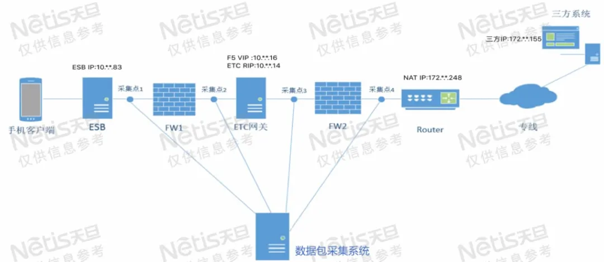
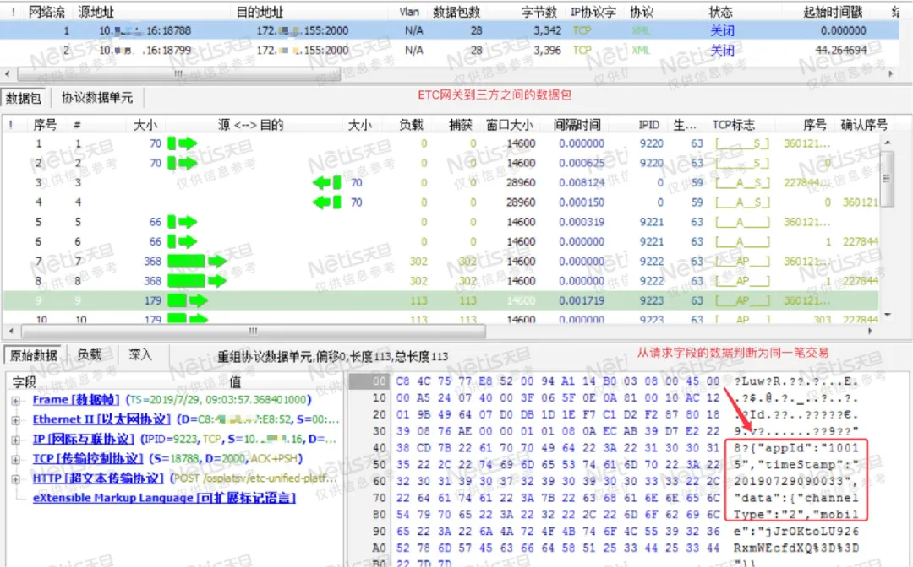

# 运维案例 | 一个DNS解析引发的“血案”

关注我们运维无忧 [运维帮](javascript:void(0);) *10月19日*

面对越来越复杂的网络环境，每天发生着数以万亿的数据交互，一旦出现问题我们就需要快速定位解决问题。那么，我们就必须储备丰富的知识，利用各种工具帮助我们分析问题。有时通过应用日志、网管平台等看起来一切都没有异常，分析起来却一筹莫展，这时就需要使用**数据包分析技术**，来深入探索每一个TCP连接，最终来定位问题。

 

## 什么是数据包分析技术？

 

**数据包分析又**叫**数据包嗅探**，指的是**捕获和解析网络上在线传输数据**的过程，目的是为了更好地了解或定位网络、应用层**运行状态和故障节点**，常见的网络抓包分析工具有**wireshark、dali、tcpdump**等。

 

## 数据包分析的切入点

 

**数据包分析的切入点**很大程度上取决于具体的问题现象，也就是说并没有一个绝对固定不变的流程。

但总体上我们可以用**排除法**判断在哪些层次没有发生问题，快速把分析的重点找到:

- 网络层指标是相对通用化的;
- 多点对比分析常常用于网络设备层设备故障排查;
- 应用层指标则是专用的，应对于各种业务应用;
- 通常我们利用通用的TCP模型，分析其通信过程和具体行为;
- 正常/异常时的对比是分析行为的有效方法。

 

## 基于数据包分析的排障案例

 

### 问题描述

1. **【问题1】**1月28日某行新ETC网关上线， ETC地址10.*.*16在经过防火墙后访问三方系统时，三次握手建立正常，但**发送数据时对方无法收到**，且ETC网关这边收到报错信息为Empty replay for Server。
2. **【问题2】**ETC网关可以正常访问三方系统，但是整个ETC业务**访问过程特别慢大概有10-15s延迟**，严重影响使用。

 

### 逻辑梳理

有了明确的问题，我们在分析时候首先要**了解整个访问的逻辑过程及物理拓扑**，切记这是做数据包分析的**先决条件**，这会涉及到你取数据包的位置，至关重要。

 

**环境描述：**

整个业务在行内访问流程，ESB10.*.*.83先访问ETC网关10.*.*.16:7550，ETC网关再访问三方系统172.*.*.248:2000。路由器上将172.*.*.248映射为172.*.*.155。

 

如下图所示，在采集点1、2、3、4分别部署了数据包捕获点，由数据包采集系统统一管理。

### 问题分析

#### 分析问题1

1）首先因为10.*.*.16是F5的虚拟地址，为了排除F5的影响，在ETC服务器(10.*.*.14)上将出去的路由手动指向防火墙FW2，然后在ETC服务器(10. *.*.14)上发送一个Post请求172. *.*.248:2000，其中172. *.*.248 做NAT后的地址是172. *.*.155。使用tcpdump在10. *.*.14上抓包如下图：

可以看到10.*.*.14与172. *.*.248 三次握手正常建立，10.*.*.14发送了一个Post请求，172. *.*.248也对这个包，进行了确认，但没有发送响应，等到了60s超时后，248主动断开了连接。

 

2）从ETC服务器上可以看到Post请求发了出去，但对方没有收到，所以怀疑可能中间环节把请求丢了，即需要FW2前后的数据包进行比对，故在抓取采集3和采集点4关于ETC网关和三方系统交互的数据包，如下图所示：

从生存时间和MAC地址上可以看到，在同一个TCP流中，11号包是FW2前面的SYN包，12号是FW2后面的SYN包，三次握手之后，17号报是FW2前面的请求，18号是FW2回复的ACK包，60s之后因为连接超时而关闭。

 

从而可以判断出**请求在过防火墙FW2时被丢弃了**，需要检查下防火墙的配置。

 

3）现象是防火墙可以正常放行三次握手，但http层的数据被丢弃。

通过排查和咨询之后确定是由于ETC访问外部的地址用的2000端口，而防火墙ASA会访问外部 tcp 2000端口的流量当成了skinny协议的流量，而实际是http流量，因为两种协议流量的数据结构肯定不相同，所有当TCP三次握手完成后，后面的http应用的包被丢弃。

 

**Skinny协议，**即sccp，是思科专有的VOIP协议，用于连接Cisco VoIP电话到Cisco 呼叫管理服务器。此外通过Wireshark也可以看到2000端口被识别成Cisco-SCCP。

**解****决方法有两种：**

1、**更换目的地址使用的端口号**

2、**只需防火墙将默认的TCP 2000的skinny协议审查取消即可**

​      policy-map global_policy

​      class inspection_default

​      no inspect skinny

 

#### 分析问题2

1）首先根据ETC整个业务访问的流程先分成两段来看，业务一段是ESB<——>ETC网关，业务二段是ETC网关<——>三方系统。

 

先抓取业务二段(采集点3和采集点4)的数据包过滤相关地址，如图所示可以看到从三次握手到服务器应用处理时间间隔都很小，在15s后ETC网关发送FIN主动请求断开连接。

2）同理抓取业务一段(采集点1和采集点2)的数据包过滤相关地址，如图所示可以看到从三次握手和ESB发送请求间隔时间都很短，但从ETC网关发送给ESB的响应间隔了15S左右，怀疑ETC网关在处理响应时比较慢或者发送有延迟。

3）由于在ESB和ETC网关之间有防火墙FW1，为了排除是否由防火墙造成的延迟，在采集点1和采集点2中抓取同一会话进行对比，发现防火墙前后ETC网关响应的间隔时间差值2-3ms，故排除防火墙问题。

4）通过数据包采集系统抓取采集点2和采集点3(两个采集点在同一设备)同一时间段的流量，因为从ESB到ETC网关发送的是XML数据，而从ETC网关到三方系统发送的是http数据，只能根据发送字段的相关信息来把采集点2和采集点3的同一笔交易进行关联，发现ETC网关在同三方系统开始建立三次握手的时间与ESB发送完请求的时间之间刚好差了15s左右。

5）同时测试在ETC网关上telnet 自己的业务端口7550，发现也比较慢。至此，可以判断大概原因是ETC网关建立连接有延迟，后经查证行内系统都需要经过域名反解析，而**ETC网关上配置的主域名服务器解析出了问题**，每次先使用主DNS查询IP地址对应的PTR记录，当超时时间(可能是5s)内还没有收到回复，就会再查询一次，如果第二次超时还没有回复，就会查询备用的DNS服务器。

  

通过抓取ETC网关的数据包也可以验证，每次会先查询主DNS服务器10.*.*10 ，超时时间为5s，连续超时之后再查询备DNS192.*.*.42，返回的信息是No such name。接着才开始和对端建立连接。

**解决方案：在ETC网关服务器上将故障的主DNS服务器摘除，**业务访问回复正常。

## 案例总结

1. 分析数据包问题时最好**多用几个分析软件**，抓住每一个细节，比如wireshark、dali可以配合使用，本案例中wireshark可以把2000端口解析为cisco-sccp协议，可以帮助排查问题。
2. 在抓取数据包时，**宜多不宜少**，多了可以通过过滤条件来导出特定分组，但少了就会忽略掉一些关键信息。
3. **回顾和思考**是快速增长经验的法宝
   - 在现场做故障诊断，往往受到很多外界因素影响；
   - 每个案例分析过后再回顾，一定可以发现并归纳出一些技术、技巧以及思路上的优化方法；
   - 行业化的应用模式具有通用性，特别是金融行业，应用通信模式有很多相似性；
   - 只有类似的Case，没有一模一样的Case，在回顾和思考中深入理解知识点和其应用模式；
   - 在本案例中，**最关键的部分是网络抓包分析系统**，有了它我们才能对每一笔业务在网络中各个阶段进行得心应手的分析。那么构建一套高效的网络抓包分析系统便显得十分必要。
   - 小流量的情况，可以选取开源软件包括wireshark、sinffer等。但如果要长时间、**大流量实时高性能采集且需要留存历史数据包来进行网络故障与性能的分析**，建议使用商用产品实现更加复杂和快速网络故障分析定位。

 

除此以外，还可以使用网络性能监控工具来辅助排障，提升解决问题效率。譬如天旦网络性能管理NPM，天旦NPM采集全网原始流量，建立覆盖数据中心重要链路、关键设备（囊括负载均衡、防火墙等应用交付类的网络设备）与核心服务路径的监控视图，对关键业务的网络行为进行监控、审计与分析，对异常指标实时告警，提前发现问题，快速定位故障，提升运维效率，保障业务畅通。